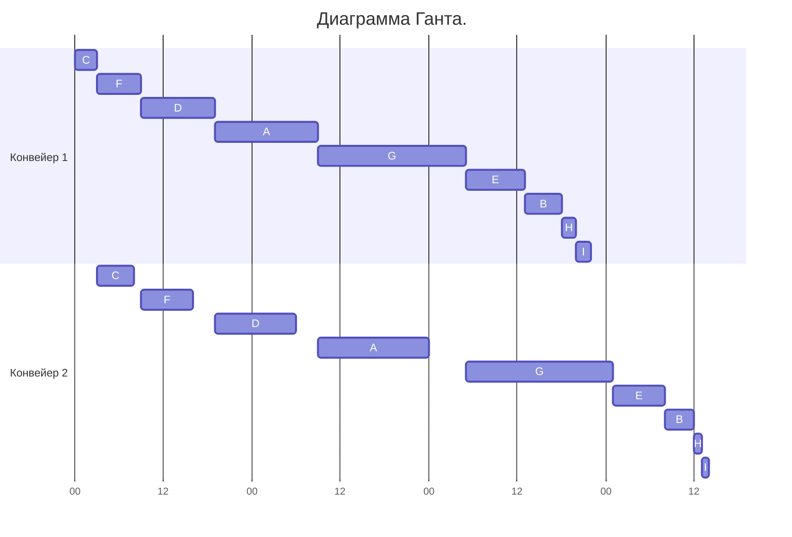

# Задание №5. 
### Вариант 4:
Имеется 9 независимых заданий, каждое из которых состоит из двух последовательных этапов, и 2 исполнителя, исполнитель 1 выполняет только первый этап задания, исполнитель 2 - только второй. Длительность заданий (по этапам): (14, 15), (5, 4), (3, 5), (10, 11), (8, 7), (6, 7), (20, 20), (2, 1), (2, 1)

# Решение
Решаем алгоритмом Джонсона, ответ в виде диаграммы Гранта.

### Присвоим каждому заданию идентификатор для удобства:

| Процесс | 1 этап | 2 этап |
|---------|--------|--------|
| A       | 14     | 15     |
| B       | 5      | 4      |
| C       | 3      | 5      |
| D       | 10     | 11     |
| E       | 8      | 7      |
| F       | 6      | 7      |
| G       | 20     | 20     |
| H       | 2      | 1      |
| I       | 2      | 1      |

### Разбиваем процесы на 2 группы:

|$$a_i <= b_i$$|$$a_i > b_i$$|
|--------------|-------------|
| A,C,D,F,G    | B,E,H,I     |

### Сортируем 2 группы по длительности короткого этапа:

|$$a_i ↓$$|$$b_i ↑$$|
|---------|---------|
|C(3, 5)  |E(8, 7)  |
|F(6, 7)  |B(5, 4)  |
|D(10, 11)|H(2, 1)  |
|A(14, 15)|I(2, 1)  |
|G(20, 20)|-        |

### Строим диаграмму гранта:

Табличный вариант:
| Время |  0-3  |  3-8  |  8-9  |  9-16  | 16-19 | 19-30 | 30-33 | 33-48 | 48-53 | 53-61 | 61-66 | 66-68 | 68-70 | 70-73 | 73-80 | 80-84 | 84-85 | 85-86 |
|-------|-------|-------|-------|--------|-------|-------|-------|-------|-------|-------|-------|-------|-------|-------|-------|-------|-------|-------|
| 1     | C     | F     | F     | D      | D     | A     | A     | G     | G     | E     | B     | H     | I     | -     | -     | -     | -     | -     |
| 2     | -     | C     | -     | F      | -     | D     | -     | A     | -     | G     | G     | G     | G     | G     | E     | B     | H     | I     |

Диаграмма гранта:
 

Ответ: длительность - 86. 