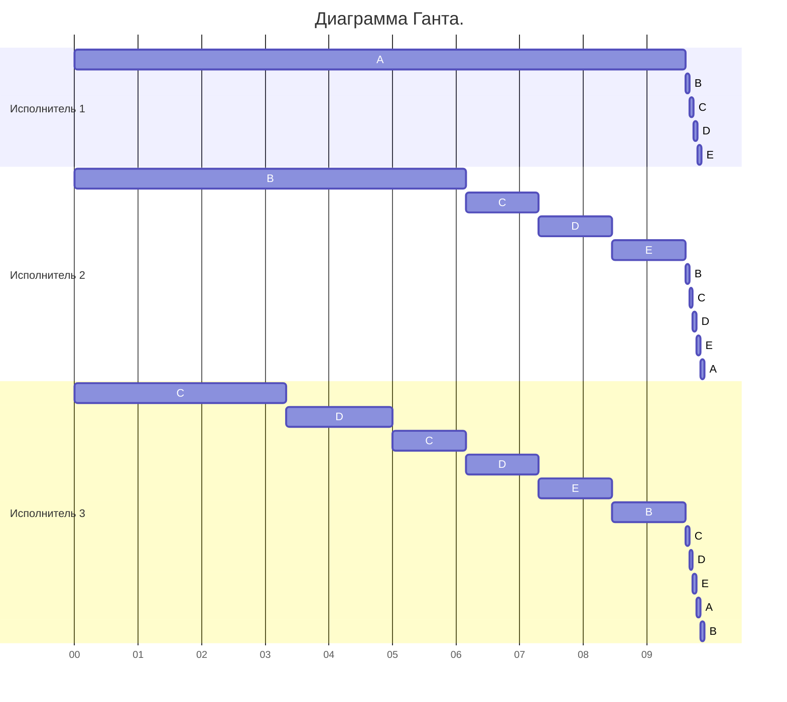

# Задание 6 CatsVSalgos
## Условия
### Исполнители:

| №       | производительность |
|---------|--------------------|
| 1       | 5                  |
| 2       | 4                  |
| 3       | 3                  |

### Задачи:

| Процесс      |  A  |  B  |  C  |  D  |  E  |
|--------------|-----|-----|-----|-----|-----|
| Длительность | 45  | 30  | 20  | 15  | 10  |

# Решение
### Минимально возможная длительность:

$$
t_{min} = \frac{45 + 30 + 20 + 15 + 10}{5 + 4 + 3} = \frac{120}{12} = 10
$$

## Шаг 1
### Приоритеты:
| Процесс | Длительность | Приоритет | Производительность |
|---------|--------------|-----------|--------------------|
| A       | 45           | I         | 5                  |
| B       | 30           | II        | 4                  |
| C       | 20           | III       | 3                  |
| D       | 15           | IV        | -                  |
| E       | 10           | V         | -                  |

### A=B
45 - 5t = 30 - 4t
t = 15

### B=C
30 - 4t = 20 - 3t
t = 10

### C=D

$$
20 - 3t = 15\\
\color{green}{t = 1\frac{2}{3}}
$$

### Итоги 1 шага:

$$
A = 45 - 5 · 1\frac{2}{3} = 36\frac{2}{3}
$$

$$
B = 30 - 4 · 1\frac{2}{3} = 23\frac{1}{3}
$$

$$
C = 20 - 3 · 1\frac{2}{3} = 15
$$

## Шаг 2
### Приоритеты:
| Процесс | Длительность  | Приоритет | Производительность |
|---------|---------------|-----------|--------------------|
| A       |$36\frac{2}{3}$| I         | 5                  |
| B       |$23\frac{1}{3}$| II        | 4                  |
| C       | 15            | III       |$\frac{3}{2}$       |
| D       | 15            | III       |$\frac{3}{2}$       |
| E       | 10            | IV        | -                  |

### A=B

$$
36\frac{2}{3} - 5t = 23\frac{1}{3} - 4t\\
t = 13\frac{1}{3}
$$

### B=CD

$$
23\frac{1}{3} - 4t = 15 - 1,5t\\
\color{green}{t = 3\frac{1}{3}}
$$

### CD=E

$$
15 - 1,5t = 10\\
\color{green}{t = 3\frac{1}{3}}
$$

### Итоги 2 шага:

$$
A = 36\frac{2}{3} - 5 · 3\frac{1}{3} = 20
$$

$$
B = 23\frac{1}{3} - 4 · 3\frac{1}{3} = 10
$$

$$
C = 15 - \frac{3}{2} · 3\frac{1}{3} = 10
$$

$$
D = 15 - \frac{3}{2} · 3\frac{1}{3} = 10
$$

## Шаг 3
### Приоритеты:
| Процесс | Длительность  | Приоритет | Производительность |
|---------|---------------|-----------|--------------------|
| A       | 20            | I         | 5                  |
| B       | 10            | II        | $\frac{3 + 4}{4}$  |
| C       | 10            | II        | $\frac{3 + 4}{4}$  |
| D       | 10            | II        | $\frac{3 + 4}{4}$  |
| E       | 10            | II        | $\frac{3 + 4}{4}$  |

### A=BCDE

$$
20 - 5t = 10
$$

$$
t = 3\frac{1}{13}
$$

### Итоги 2 шага:

$$
A = 20 - 5 · 3\frac{1}{13} = 4\frac{8}{13}
$$

$$
B = 10 - \frac{3 + 4}{4} · 3\frac{1}{13} = 4\frac{8}{13}
$$

$$
C = 10 - \frac{3 + 4}{4} · 3\frac{1}{13} = 4\frac{8}{13}
$$

$$
D = 10 - \frac{3 + 4}{4} · 3\frac{1}{13} = 4\frac{8}{13}
$$

$$
E = 10 - \frac{3 + 4}{4} · 3\frac{1}{13} = 4\frac{8}{13}
$$

## Шаг 4
### A = B = C = D = E

$$
10 - \frac{7}{4} · \frac{40}{13} = 4\frac{8}{13}
$$

$$
\frac{60}{13} : 4 = 1\frac{2}{13}
$$

### Диаграмма гранта:
 

