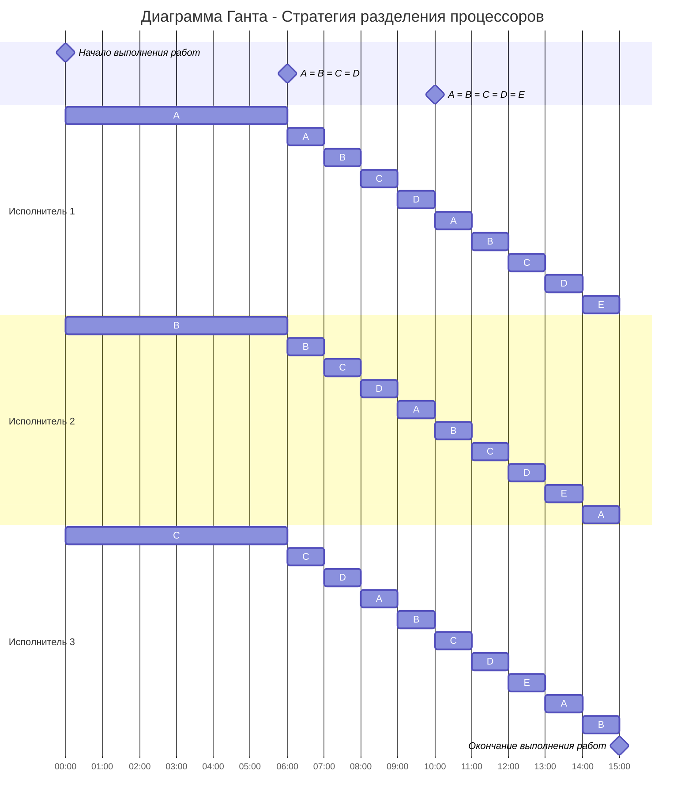

## Оптимальное расписание. Задача о разделении процессоров

### Постановка задачи:
Для выполнения задания необходимо: 
1. Придумать собственные условия задачи разделения процессоров, включающей не менее 5 заданий и не менее 3 исполнителей.
2. Решить задачу с придуманными условиями, в решении отобразить ход выполнения алгоритма с подробными комментариями.
3. В ответе указать длительность полученного расписания.
4. В ответе вывести полученное расписание в виде диаграммы Ганта.

### Условие задачи:

**Существует 5 емокстей следующих размеров:**

A - 60; B - 48; C - 36; D - 24; E - 12. 

**Исполнители:**

$p_1$ - 6, $p_2$ - 4, $p_3$ - 2

## Алгоритм:
Длительность оптимального расписания для *k* исполнителей и *n* заданий можно рассчитать по формуле:

$$
T_{min} = \frac {V_{1} + V_{2} + ... + V_{n}}{P_{1} + P_{2} + ... + P_{k}}
$$

где $V_i$ - объем i-го задания, а $p_j$ - производительность j-го исполнителя. Минимальное время расписания предполагает, что в течении всего времени Tmin все исполнители будут работать непрерывно (без простоев).

Так как время оптимального расписания рассчитано, необходимо определить над какой задачей и в какое время каждый работник будет работать.

Для описания алгоритма построения оптимального расписания введем понятие приоритета задания в определенный момент времени - объем оставшейся части задания, которая в данный момент еще не выполнена. В начальный момент времени приоритет задания соответствует его объему.

**Основная идея алгоритма:** задания с высоким приоритетом выполняет работник с высокой производительностью.

**Шаги алгоритма:**

1. Выбрать задания с самым высоким приоритетом (может быть одно задание или несколько заданий с одинаковым приоритетом), назначить на эти задания одного или несколько самых производительных работников. Если остались свободные работники назначить их на задания со следующим приоритетом.
2. Работники выполняют задания до тех пор, пока не наступит одно из событий:
     - какое-либо задание будет завершено и освободится исполнитель,
     - сравняются приоритеты у каких-то заданий, если до того эти приоритеты были разные, то есть с изменением приоритетов необходимо переназначить работников на задания согласно шагу 1.

## Решение

Рассчитаем минимально необходимое время:

$$
T_{min} = \frac {60+48+36+24+12} {6+4+2} = 15
$$

Расставим приоритеты заданиям и назначим работников в соответствии с приоритетами:

| Процесс          | A     | B     | C     | D     | E     |
| ---------------- | ----- | ----- | ----- | ----- | ----- |
| Оставшееся время | 60    | 48    | 36    | 24    | 12    |
| Приоритет        | I     | II    | III   | IV    | V     |
| Работник         | $p_1$ = 6|$p_2$ = 4| $p_3$ = 2|   -   | -     |

Рассчитаем время, когда сравняются приоритеты, это произойдет в 1 из 3 следующих моментов:

$$60 - 6t_1 = 48 - 4t_1$$
$$48 - 4t_2 = 36 - 2t_2$$
$$36 - 2t_3 = 24$$

Упрощаем выражения и получаем:

$$t_1 = 6$$
$$t_2 = 6$$
$$t_3 = 6$$

Моменты наступают одинаково. Поэтому процессы заканчиваем одновременно через 6 минут:

$$A: 60 - 6 \cdot 6 = 24 $$

$$ B: 48 - 4 \cdot 6 = 24 $$

$$C: 36 - 2 \cdot 6 = 24$$

Составляем новую таблицу:

| Процесс          | A      | B      | C      | D     | E     |
| ---------------- | -----  | -----  | -----  | ----- | ----- |
| Оставшееся время | 24     | 24     | 24     | 24    | 12    |
| Приоритет        |  I     |  I     |  I     |  I    |  II   |
| Работник         |$p_1$, $p_2$, $p_3$|$p_1$, $p_2$, $p_3$|$p_1$, $p_2$, $p_3$|$p_1$, $p_2$, $p_3$|   -   |

Рассчитаем минимально необходимое время:

$$ 
T_{min} = \frac {24+24+24+24+12} {6+4+2} = 9
$$

Поскольку у заданий A, B, C, D равный приоритет, то мы назначаем на них всех работников. Поскольку работники $p_1$, $p_2$, $p_3$ не могут выполнять одновременно задания вместе, то будем их постоянно чередовать.

Общая производительность для этих четырех заданий будет равна:

$$
P_{4} = \frac{6+4+2}{4} = 3
$$

где 4 - число выполняемых заданий

Определим время, когда у задач изменятся приоритеты, это произойдет когда оставшаяся длительность процессов А, В, С и D сраняются с E:

$$
24 - \frac {12t}{4}  = 12
$$

Получаем:

$$
t = 4
$$

Рассчитаем оставшееся время:

$$
A, B, C, D : 24 - 4 \cdot 3 = 12
$$

Составляем новую таблицу:

| Процесс          | A      | B      | C      | D      | E      |
| ---------------- | -----  | -----  | -----  | -----  | ------ |
| Оставшееся время | 12     | 12     | 12     | 12     | 12     |
| Приоритет        |  I     |  I     |  I     |  I     |  I     |
| Работник         |$p_1$, $p_2$, $p_3$|$p_1$, $p_2$, $p_3$|$p_1$, $p_2$, $p_3$|$p_1$, $p_2$, $p_3$|$p_1$, $p_2$, $p_3$|

Рассчитаем минимально необходимое время:

$$
T_{min} = \frac {12+12+12+12+12} {6+4+2} = 5
$$

Поскольку у всех заданий равный приоритет, то мы назначаем на них всех работников. Сами задания закончатся одновременно.

$$12 - \frac{6+4+2}{5}t = 0$$
$$t = 5$$

Необходимо поделить кол-во оставшегося времени на кол-во заданий, чтобы получить время, потраченное каждым отдельным работником на каждое отдельное задание. Получаем:

$$
\frac{5}{5} = 1
$$

### Ответ:
Длительность полученного расписания = 15 минут.

### Диаграмма Ганта 

