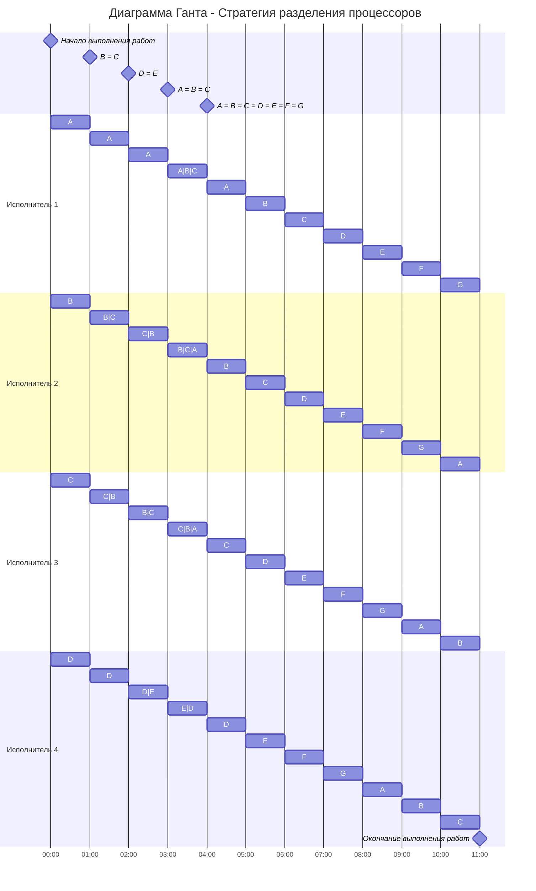

## Задание 6
### Придумать условия задачи разделения процессоров (исполнителей 3+, заданий 5+) и решить соответствующую задачу.
#### Условие задачи:
Имеется 7 независимых заданий и 4 исполнителя, исполнитель 1 с производительностью 8, исполнитель 2 с производительностью 4, исполнитель 3 с производительностью 3 и исполнитель 4 с производительностью 2.
Длительность заданий составляет 46, 33, 32, 23, 19, 17, 17.

| Задания      |  A  |  B  |  C  |  D  |  E  |  F  |  G  |
|:-------------|:---:|:---:|:---:|:---:|:---:|:---:|:---:|
| Длительность |  46 |  33 |  32 |  23 |  19 |  17 |  17 |

| Исполнители         |  1  |  2  |  3  |  4  |
|:-------------------|:---:|:---:|:---:|:---:|
| Производительность(p)  |  8  |  4  |  3  |  2  |

Рассчитаем длительность оптимального расписания:

$$  
t_{min} = \frac {46+33+32+23+19+17+17}{8+4+3+2}  = \frac {187}{17} = 11
$$  

Определим приоритеты задач: 
|  A  |  B  |  C  |  D  |  E  |  F  |  G  |
|:---:|:---:|:---:|:---:|:---:|:---:|:---:|
|  46 |  33 |  32 |  23 |  19 |  17 |  17 |
|  I  |  II  |  III  |  IV  |  V  |  V  |  V  |

Основная идея алгоритма: задания с высоким приоритетом выполняет работник с высокой производительностью, поэтому исполнителя c $p_1 = 8$ отправляем на задачу **A**, второго исполнителя, у которого $p_2 = 4$, на задачу **B**, а исполнителей с $p_3 = 3$ и $p_4 = 2$ на задачи **C** и **D** соответственно.

Так они работают до тех пор, пока не наступит одно из событий:
- какое-либо задание будет завершено и освободится исполнитель,
- сравняются приоритеты у каких-то заданий, если до того эти приоритеты были разные, то есть с изменением приоритетов необходимо переназначить работников на задания

Проверим, когда наступят следующие моменты:

**A = B**, когда:

$$
46 - 8t = 33 -4t
$$

$$
4t = 13
$$

$$
t = 3,25
$$

**B = C**, когда:

$$
33 - 4t = 32 - 3t
$$

$$
t = 1
$$

**C = D**, когда:

$$
32 - 3t = 23 - 2t
$$

$$
t = 9
$$

**D = E**, когда:

$$
23 - 2t = 19
$$

$$
t = 2
$$

Приоритеты задач **B** и **C** сравняются через 1 промежуток времени. 
Значит, необходимо снова определить приоритеты задач через t = 1.

 
|  A  |  B  |  C  |  D  |  E  |  F  |  G  |
|:---:|:---:|:---:|:---:|:---:|:---:|:---:|
|  38 |  29 |  29 |  21 |  19 |  17 |  17 |
| I | **II** | **II** | III | IV | IV | IV |

Задача **A** остается приоритетной, поэтому туда снова отправляем первого исполнителя, а второй и третий исполнители одновременно возьмут задачи **B** и **С**, и производительность у них будет $\frac {p_2+p_3}{2} = 3,5$, а исполнитель 4 продолжит работать над задачаей **D**.

Проверим, когда наступят следующие моменты:

**A = BС**, когда:

$$
38 - 8t = 29 - 3,5t
$$

$$
4,5t = 9
$$

$$
t = 2
$$

**BС = D**, когда:

$$
29 - 3,5t = 21 - 2t
$$

$$
1,5t = 8
$$

$$
t = 5,33
$$

**D = E**, когда:

$$
21 - 2t = 19
$$

$$
t = 1
$$

Приоритеты задач **D** и **E** сравняются через 1 промежуток времени. 

Снова определем приоритеты задач:
|  A  |  B  |  C  |  D  |  E  |  F  |  G  |
|:---:|:---:|:---:|:---:|:---:|:---:|:---:|
|  30 |  25,5 |  25,5 |  19 |  19 |  17 |  17 |
| I | II | II | **III** | **III** | IV | IV |

Задача **A** по прежнему остается приоритетной, поэтому над ней продолжает работать первый исполнитель, второй и третий исполнители продолжают работать над задачами **B** и **С** с производитльностью $\frac {p_2+p_3}{2} = 3,5$, а исполнитель 4 берет  **D** и **E** одновременно с производительностью $\frac {p_4}{2} = 1$.

Проверим, когда наступят следующие моменты:

**A = BС**, когда:

$$
30 - 8t = 25,5 - 3,5t
$$

$$
4,5t = 4,5
$$

$$
t = 1
$$

**BС = DE**, когда:

$$
25,5 - 3,5t = 19 - t
$$

$$
2,5t = 6,5
$$

$$
t = 2,6
$$

**DE = FG**, когда:

$$
19 - t = 17
$$

$$
t = 2
$$

Приоритеты задач **A** и **BC** сравняются через 1 промежуток времени. 
Значит, необходимо снова определить приоритеты задач.
|  A  |  B  |  C  |  D  |  E  |  F  |  G  |
|:---:|:---:|:---:|:---:|:---:|:---:|:---:|
|  22 |  22 |  22 |  18 |  18 |  17 |  17 |
| **I** | **I** | **I** | II | II | III | III |

Задачи **A**, **B** и **C** теперь становятся самыми приоритетными, поэтому на них необходимо отрпавить трех самых результативных исполнителей.
Их производительномть будет равна $\frac {p_1+p_2+p_3}{3} = \frac {8+4+3}{3} = 5 $, а исполнитель 4 берет также **D** и **E** одновременно с производительностью $\frac {p_4}{2} = 1$.
Проверим, когда наступят следующие моменты:

**ABС = DE**, когда:

$$
22 - 5t = 18 - t
$$

$$
4t = 4
$$

$$
t = 1
$$

**DE = FG**, когда:

$$
18 - t = 17
$$

$$
t = 2,6
$$

В обоих случая $t=1$, значит спустя еще 1 промежуток времени длительность и приорететы всех задач сравняются.
|  A  |  B  |  C  |  D  |  E  |  F  |  G  |
|:---:|:---:|:---:|:---:|:---:|:---:|:---:|
|  17 |  17 |  17 |  17 |  17 |  17 |  17 |
| **I** | **I** | **I** | **I** | **I** | **I** | **I** |

В такой ситуации мы отпрявляем всех исполнителей на решение всех задач на оставшиеся 7 промежутков времени и получим следующую диаграмму:

