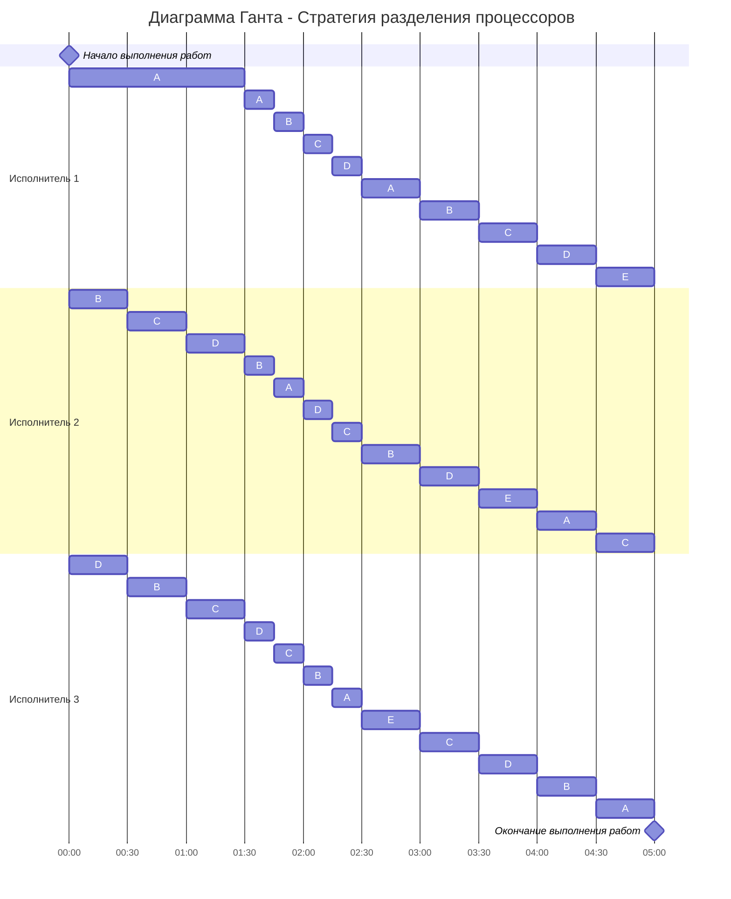

# Задание №6

## Оптимальное расписание. Стратегия разделения процессоров

## Решение
### 1. Условия задачи
Составить расписание минимальной длительности с прерываниями для системы из пяти заданий A, B, C, D, E длительности 18, 12, 12, 12, 6 и трёх исполнителей с производительностью 6, 4, 2. Ответ дать в виде диаграммы Ганта.

| Задания      |  A  |  B  |  C  |  D  |  E  |
|:-------------|:---:|:---:|:---:|:---:|:---:|
| Длительность |  18 |  12 |  12 |  12 |  6  |

| Исполнители        |  1  |  2  |  3  |
|:-------------------|:---:|:---:|:---:|
| Производительность |  6  |  4  |  2  |

### 2. Шаг 1: Расчет минимального времени
Посчитаем длительность оптимального расписания для $3$ исполнителей и $5$ заданий по формуле:

$$  
T_{min} = \frac {V_1 + V_2 + ... + V_n}{p_1 + p_2 + ... + p_k}  =  \frac {18 + 12 + 12 + 12 + 6}{6 + 4 + 2} = 5
$$  

Таким образом, минимальное время выполнения всех задач — **5 единиц времени**.

### 3. Шаг 2: Определение приоритетов и распределение задач

Для описания алгоритма построения оптимального расписания введем понятие **приоритета задания** в определенный момент времени - объем оставшейся части задания, которая в данный момент еще не выполнена. В начальный момент времени приоритет задания соответствует его объему. 
#### Алгоритм:
1. Выбрать задания с самым высоким приоритетом (может быть одно задание или несколько заданий с одинаковым приоритетом), назначить на эти задания одного или несколько самых производительных работников. Если остались свободные работники назначить их на задания со следующим приоритетом.
2. Работники выполняют задания до тех пор, пока не наступит одно из событий:
- какое-либо задание будет завершено и освободится исполнитель,
- сравняются приоритеты у каких-то заданий, если до того эти приоритеты были разные, то есть с изменением приоритетов необходимо переназначить работников на задания согласно шагу 1.

| Задание      |  A  |  B  |  C  |  D  |  E  |
|:-------------|:---:|:---:|:---:|:---:|:---:|
| Длительность |  18 |  12 |  12 |  12 |  6  |
| Приоритет    |  II |  II |  II |  II | III |
| Исполнитель  |  1  |2 и 3|2 и 3|2 и 3|  -  |

**Основная идея алгоритма**: задания с высоким приоритетом выполняет работник с высокой производительностью.

Изначально задача A = 18 имеет самый большой объем. Назначим на нее самого производительного исполнителя (p1 с производительностью 6). Оставшихся исполнителей (p2 и p3 с производительностью 4 и 2) назначим на задачи с равными обьемами (B = 12, C = 12, D = 12).

### 4. Шаг 3: Перераспределение задач
Вычислим время когда какое-либо задание будет завершено и освободится исполнитель или сравняются приоритеты у каких-то заданий.
***BCD = A***:

$$
12 - 2t = 18 - 6t
$$

$$
t = 1.5
$$

***A = E***:

$$
18 - 6t = 6
$$

$$
t = 2
$$

Объемы задач A, B, C, D сравнятся спустя 1.5 единиц времени. 
##### После 1.5 единиц времени:

| Задание      |  A  |  B  |  C  |  D  |  E  |
|:-------------|:---:|:---:|:---:|:---:|:---:|
| Длительность |  9  |  9  |  9  |  9  |  6  |
| Приоритет    |  I  |  I  |  I  |  I  |  II |
| Исполнитель  |1, 2, 3|1, 2, 3|1, 2, 3|1, 2, 3|  -  |

Вычислим следующую точку перераспределения:
***ABCD = E***:

$$
9 - 3t = 6
$$

$$
t = 1
$$
Объемы задач A, B, C, D, E сравнятся спустя 1 единицу времени. 
##### После 2.5 единиц времени:

| Задание      |  A  |  B  |  C  |  D  |  E  |
|:-------------|:---:|:---:|:---:|:---:|:---:|
| Длительность |  6  |  6  |  6  |  6  |  6  |
| Приоритет    |  I  |  I  |  I  |  I  |  I  |
| Исполнитель  |1, 2, 3|1, 2, 3|1, 2, 3|1, 2, 3|1, 2, 3|

***ABCDE = 0***:

$$
6 - \frac{6 + 4 + 2}{5}*t = 0
$$

$$
t = 2.5
$$

Все задачи завершатся еще через 2.5 единиц времени. 

### 5. Диаграмма Ганта

Оптимальное расписание:

