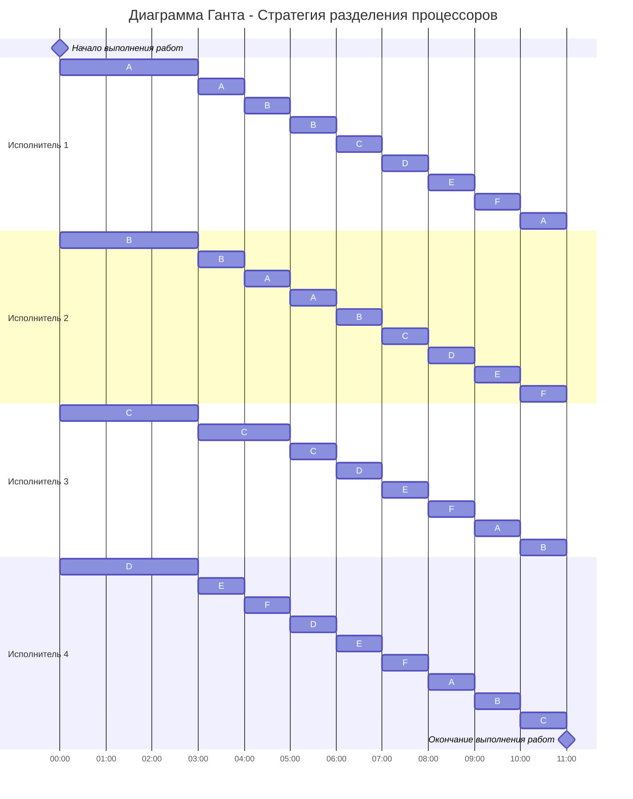

# Задание №6. 
Придумать условия задачи разделения процессоров (исполнителей 3+, заданий 5+) и решить соответствующую задачу.
Название команды: noname 
**Состав команды**: 
Долгих Юлия 
Осока Варвара
Шперкин Савва 

4 исполнителя 6 процессов
Условие задачи:
Существует шесть ёмкостей, объёмом 41, 35, 23, 17, 14, 13. За какое минимальное время они опустошатся при помощи четырёх насосов. Мощности насосов соответственно равны 6, 4, 2, 1.

| Задания      |  A  |  B  |  C  |  D  |  E  |  F  |
|:-------------|:---:|:---:|:---:|:---:|:--:|:--:|
| Длительность |41|35|23|17|14|13|

| Исполнители        |  1  |  2  |  3  |  4  |
|:-------------------|:---:|:---:|:---:|:---:|
| Производительность |6|4|2|1|

## 1 этап.
Необходимо посчитать минимальное возможное время, для этого надо сложить объёмы всех ёмкостей и поделить на сумму производительностей насосов.

$$
\frac{41+35+23+17+14+13}{6 + 4 + 2 + 1} = 11
$$

11 секунд - минимальное время, за которое возможно закончить работу.

## 2 этап.
Ёмкости уже отсортированы по объёму (приоритету). Назначаем самого мощного исполнителя на самую большую работу (ёмкость). Второго по мощности на вторую по объёму и т.д.

A = B?

$$
41 - 6t = 35 - 4t 
$$

$$
6 = 2t
$$

$$
t = 3
$$

Через 3 секунды в ёмкостях будет:
| Задания      |  A  |  B  |  C  |  D  |  E  |  F  |
|:-------------|:---:|:---:|:---:|:---:|:--:|:--:|
| Длительность |23|23|17|14|14|13|

## 3 этап.

Ёмкости A и B сравнялись, а также C и D сравнялись. Так как A и B имеют самый большой приоритет и равны, направим на них два самых мощных насоса, третий на C и последний на D и E, так как они тоже равны.

A = B = C?

$$
23 - \frac {6+4}{2}t = 17 - 2t 
$$

$$
6 = 3t
$$

$$
t = 2
$$

C = D = E = F?

$$
17 - 2t = 14 - \frac {t}{2}
$$

$$
3 = 1,5t
$$

$$
t = 2
$$

Через 2 секунды в ёмкостях будет:
| Задания      |  A  |  B  |  C  |  D  |  E  |  F  |
|:-------------|:---:|:---:|:---:|:---:|:--:|:--:|
| Длительность |13|13|13|13|13|13|

## 4 этап.
Все ёмкости сравнялись, необходимо запустить 4 насоса по кругу. Вся вода будет выкачана через 6 секунд.

