Аксенов, Шустер
# Решение задачи

## Постановка задачи

Количество заданий произвольно; все задания имеют одинаковую длительность; задания зависимы, причём граф зависимостей не должен содержать транзитивных рёбер; запрещены прерывания при выполнении заданий; количество работников строго 2; работники универсальны; производительность работников, размеры оплаты из труда и т.д. не учитываются. Требуется построить расписание выполнения всех заданий для заданного количества исполнителей в кратчайшие сроки.

## Таблица зависимостей

| Предшествующее задание | L | L | M | J | I | I | K | K | K | G | G | H | H | C | D | E | E | F |
|------------------------|---|---|---|---|---|---|---|---|---|---|---|---|---|---|---|---|---|---|
| Последующее задание    | J | K | K | G | G | H | I | H | F | C | D | E | F | A | A | A | B | B |

## Граф зависимостей

## Удалим транзитивные ребра

Транзитивные ребра:K->F,K->H

## Таблица зависимостей после удаления транзитивных рёбер:

| Предшествующее задание | L | L | M | J | I | I | K | G | G | H | H | C | D | E | E | F |
|------------------------|---|---|---|---|---|---|---|---|---|---|---|---|---|---|---|---|
| Последующее задание    | J | K | K | G | G | H | I | C | D | E | F | A | A | A | B | B |

## Граф зависимостей без транзитивных рёбер

## Назначение приоритетов стокам графа

## Граф со всеми назначенными приоритетами:

## Составляем расписание. Диаграмма Ганта

```mermaid
gantt
    title Исправленная Диаграмма Ганта
    dateFormat HH:mm
    axisFormat %H:%M
    Начало выполнения работ : milestone, m1, 00:00, 0h

    section Исполнитель 1
    L :l, 00:00, 1h
    K :k, after l, 1h
    I :i, after k, 1h
    H :h, after i, 1h
    E :e, after h, 1h
    C :c, after e, 1h
    A :a, after c, 1h

    section Исполнитель 2
    M :m, 00:00, 1h
    J :j, 01:00, 1h
    G :g, 03:00, 1h
    D :d, after g, 1h
    F :f, after d, 1h
    B :b, after f, 1h

    Окончание выполнения работ : milestone, m2, 07:00, 0h
```

