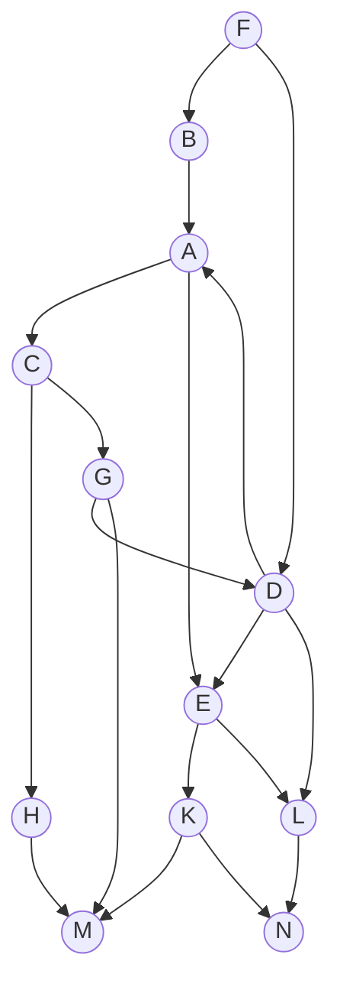

## Задание №7. Оптимальное расписание. Лексикографическая стратегия.

### Вариант 5:
#### Таблица зависимостей:

| Предшествующее задание | F | F | G | B | D | D | D | A | A | C | C | E | E | H | G | K | K | L |
|------------------------|---|---|---|---|---|---|---|---|---|---|---|---|---|---|---|---|---|---|
| Последующее задание    | B | D | D | A | A | E | L | C | E | H | G | K | L | M | M | M | N | N |

### Граф зависимостей

### Алгоритм решения задачи
1) Перед выполнением алгоритма необходимо удалить из графа зависимостей транзитивные ребра.

3) Для построения расписания необходимо назначить приоритет для каждой задачи. В первую очередь приоритеты 1, 2, 3, ... назначаются стокам графа (вершины, из которых нет исходящих ребер). 

4) Для заданий, все прямые потомки которых уже имеют приоритеты, составляется строка из приоритетов прямых потомков, записанных в убывающем порядке. Приоритет (t + 1) назначается заданию, у которого строка из приоритетов является лексикографически наименьшей.

5) После того как приоритеты для всех задач назначены, задачи добавляются в расписание в соответствии с их приоритетом. В каждый момент времени выбираются задачи готовые к выполнению (для которых все предшествующие задачи выполнены к началу момента времени) из них для добавления в расписание выбирается задача с наибольшим приоритетом.
