## Задание №7. Оптимальное расписание. Лексикографическая стратегия. Вариант 5

## Дано:

### Таблица зависимостей:

| Предшествующее задание | F | F | G | B | D | D | A | A | C | C | E | E | H | G | K | K | L |
|------------------------|---|---|---|---|---|---|---|---|---|---|---|---|---|---|---|---|---|
| Последующее задание    | B | D | D | A | E | L | C | E | H | G | K | L | M | M | M | N | N |

### Граф зависимостей:

## 1. Удалим транзитивные рёбра графа:

Транзитивные рёбра: G->M, A->E, F->D, D->L
### Таблица зависимостей после удаления транзитивных рёбер:

| Предшествующее задание | F | G | B | D | A | C | C | E | E | H | K | K | L |
|------------------------|---|---|---|---|---|---|---|---|---|---|---|---|---|
| Последующее задание    | B | D | A | E | C | H | G | K | L | M | M | N | N |

### Граф зависимостей после удаления транзитивных рёбер: 

## 2. Назначаем приоритет стокам графа:

## 3. Назначаем приоритет остальным задачам:

## 4. Составляем расписание

Диаграмма Ганта:

```mermaid
gantt
    title Диаграмма Ганта
    dateFormat HH:mm    
    axisFormat %H:%M
    Начало выполнения работ : milestone, m1, 00:00, 0h
    section Исполнитель 1
    F         :f, 00:00, 1h
    B         :b, after f, 1h    
    A         :a, after b, 1h    
    C         :c, after a, 1h
    G         :g, after c, 1h
    D         :d, after g, 1h
    E         :e, after d, 1h
    K         :k, after e, 1h
    M         :m, after k, 1h
    section Исполнитель 2
    H         :h, 04:00, 1h
    L         :l, 07:00, 1h
    N         :n, after l, 1h
    Окончание выполнения работ : milestone, m2, 09:00, 0h
```

**Примечание: Задачу H с приоритетом 3 можем брать раньше приоритетов 4 и 5 (задачи K и L), т.к. на момент времени 04:00 предшествующая для H задача С уже готова, а у K и L нет.**

## Алгоритм решения задачи
1. Перед выполнением алгоритма необходимо удалить из графа зависимостей транзитивные ребра.
2. Для построения расписания необходимо назначить приоритет для каждой задачи. В первую очередь приоритеты 1, 2, 3, ... назначаются стокам графа (вершины, из которых нет исходящих ребер).
3. Для заданий, все прямые потомки которых уже имеют приоритеты, составляется строка из приоритетов прямых потомков, записанных в убывающем порядке. Приоритет (t + 1) назначается заданию, у которого строка из приоритетов является лексикографически наименьшей.
4. После того как приоритеты для всех задач назначены, задачи добавляются в расписание в соответствии с их приоритетом. В каждый момент времени выбираются задачи готовые к выполнению (для которых все предшествующие задачи выполнены к началу момента времени) из них для добавления в расписание выбирается задача с наибольшим приоритетом.
