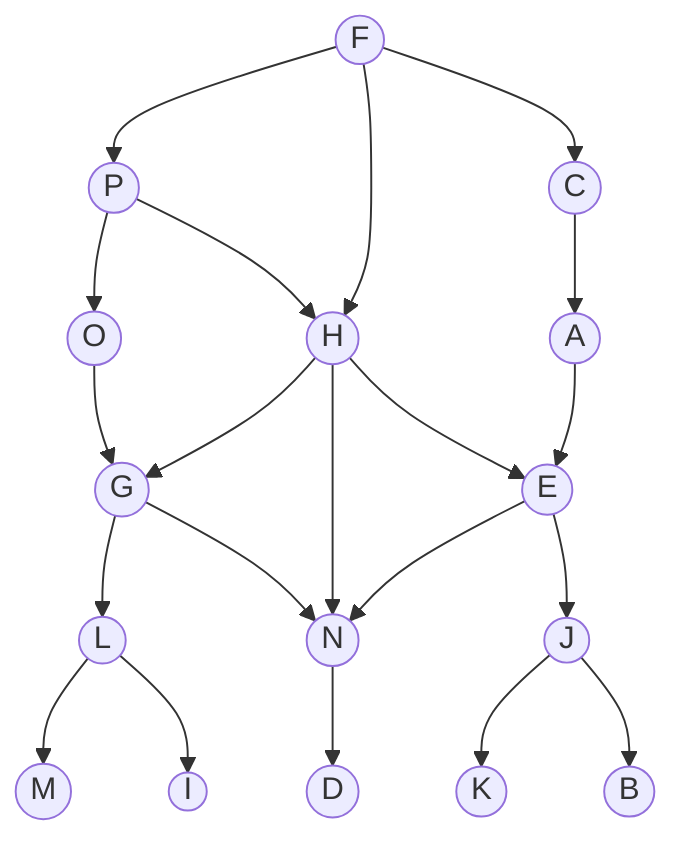
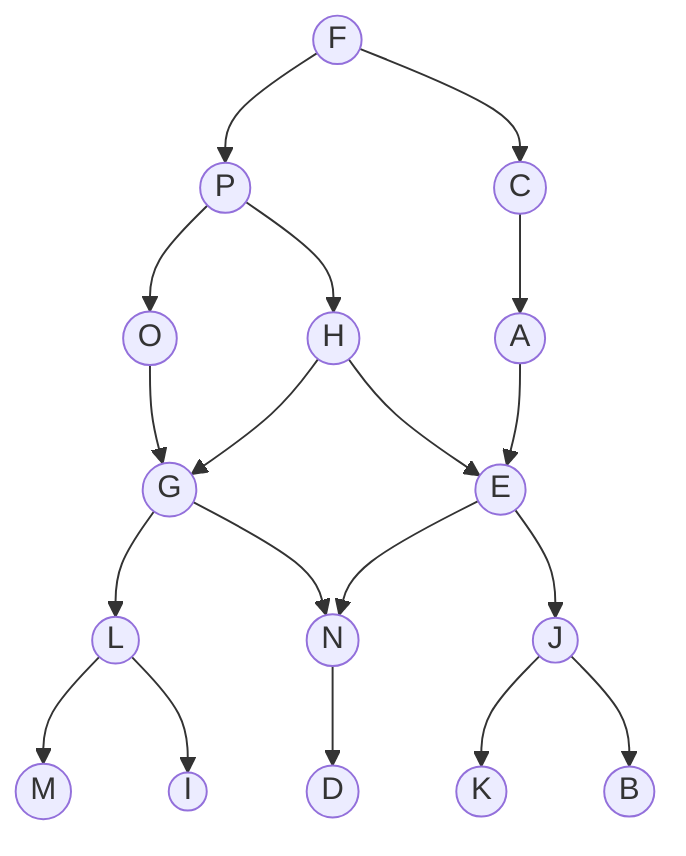
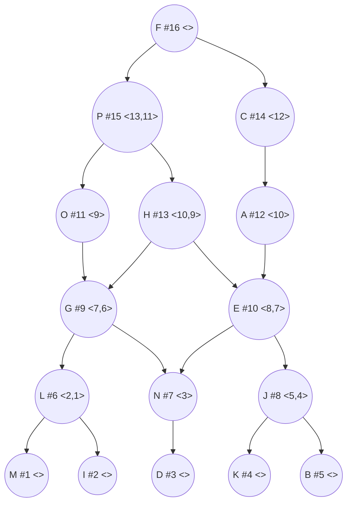

# Задание №7. Построение расписания.
## Оптимальное расписание. Лексикографическая стратегия.

## Постановка задачи:
1. Количество заданий произвольно;`
2. Все задания имеют одинаковую длительность;
3. Задания зависимы, причём **граф зависимостей не должен содержать транзитивных ребер**;
4. Запрещены прерывания при выполнении заданий;
5. Количество **работников строго 2**;
6. Работники универсальны;
7. Производительность работников, размеры оплаты из труда и т.д. не учитываются;

*Требуется построить расписание выполнения всех заданий для заданного количества исполнителей в кратчайшие сроки.*

## Вариант 7 

Придумать условия задачи на использование Лексикографической стратегии и оформить соответствующее решение. Заданий не менее 15, количество транзитивных ребер не менее 2, с простоем одного исполнителя в начале и в конце расписания.

### Таблица зависимостей
| Предшествующее задание | L | L | G | G | J | J | E | E | H | H | H | N | C | F | F | F | P | P | A | O |
|------------------------|---|---|---|---|---|---|---|---|---|---|---|---|---|---|---|---|---|---|---|---|
| Последующее задание    | M | I | L | N | K | B | J | N | N | G | E | D | A | C | P | H | H | O | E | G |

### Исходный граф зависимостей

## Лексикографическая стратегия
Перед выполнением алгоритма необходимо удалить из графа зависимостей транзитивные ребра.

### Граф зависимостей без транзитивных ребер

Для построения расписания необходимо назначить приоритет для каждой задачи. В первую очередь приоритеты 1, 2, 3, 4 назначаются стокам графа (вершины, из которых нет исходящих ребер). 

Для заданий, все прямые потомки которых уже имеют приоритеты, составляется строка из приоритетов прямых потомков, записанных в убывающем порядке. Приоритет (t + 1) назначается заданию, у которого строка из приоритетов является лексикографически наименьшей.

### Граф зависимостей с приоритетами
Приоритет - #

Строка приоритетов прямых потомков - <>

После того как приоритеты для всех задач назначены, задачи добавляются в расписание в соответствии с их приоритетом. В каждый момент времени выбираются задачи готовые к выполнению (для которых все предшествующие задачи выполнены к началу момента времени) из них для добавления в расписание выбирается задача с наибольшим приоритетом.

### Диаграмма Ганта

```mermaid
gantt
    title Диаграмма Ганта
    dateFormat HH:mm    
    axisFormat %H:%M
    Начало выполнения работ : milestone, m1, 00:00, 0h
    section Исполнитель 1
    F         :f, 00:00, 1h
    P         :p, after f, 1h    
    H         :h, after p, 1h    
    O         :o, after h, 1h
    G         :g, after o, 1h
    N         :n, after g, 1h
    B         :b, after n, 1h
    D         :d, after b, 1h
    M         :m, after d, 1h
    section Исполнитель 2
    C         :c, 01:00, 1h
    A         :a, after c, 1h
    E         :e, after a, 1h
    J         :j, after e, 1h
    L         :l, after j, 1h
    K         :k, after l, 1h
    I         :i, after k, 1h
    Окончание выполнения работ : milestone, m2, 09:00, 0h
```

