# Задание №7. Команда Second.
 ### Постановка задачи:
1. количество заданий произвольно;
2. все задания имеют одинаковую длительность;
3. задания зависимы, причём **граф зависимостей не должен содержать транзитивных ребер**;
4. запрещены прерывания при выполнении заданий;
5. количество **работников строго 2**;
6. работники универсальны;
7. производительность работников, размеры оплаты из труда и т.д. не учитываются;

*Требуется построить расписание выполнения всех заданий для заданного 
количества исполнителей в кратчайшие сроки.*

### Вариант 2:
#### Таблица зависимостей:

| Предшествующее задание | A | A | A | B | C | C | C | D | E | E | F | F | G | H | I | J | J | K |
|------------------------|---|---|---|---|---|---|---|---|---|---|---|---|---|---|---|---|---|---|
| Последующее задание    | D | B | C | E | G | K | F | F | H | I | I | J | K | L | L | M | N | N |

*На основе таблицы зависимостей построим Граф зависимостей.*

### Граф зависимостей:

*Теперь удалим все транзитивные рёбра.*

### Граф зависимостей без транзитивных рёбер:

# Создание графа зависимостей с приоритетами
В графе зависимостей приоритет обычно определяется глубиной узла относительно корневого узла (A в нашем случае). Чем глубже узел, тем позже он должен быть выполнен (или тем ниже его приоритет, если мы говорим о порядке выполнения).

Мы можем также учитывать узлы, имеющие несколько входящих связей. Узлы с несколькими входящими связями, как правило, должны выполнятся позже узлов с меньшим количеством входящих связей.

На основе этого, мы можем присвоить примерные приоритеты каждому узлу, учитывая глубину и количество входящих связей

### Граф зависимостей с приоритетами:

# Формирование диаграммы Ганта
Теперь сформируем диаграмму Ганта на основе вышесоставленного графа. Добавим задачи расписание в соответствии с их приоритетом. В каждый момент времени выбираются задачи готовые к выполнению (для которых все предшествующие задачи выполнены к началу момента времени) из них для добавления в расписание выбирается задача с наибольшим приоритетом.

### Диаграмма Ганта:

```mermaid
gantt
    title Диаграмма Ганта
    dateFormat HH:mm    
    axisFormat %H:%M
    Начало выполнения работ : milestone, m1, 00:00, 0h
    section Исполнитель 1
    A         :a, 00:00, 1h
    D         :d, after a, 1h    
    F         :f, after d, 1h    
    E         :e, after f, 1h
    K         :k, after g, 1h
    H         :h, after k, 1h
    M         :m, after h, 1h
    section Исполнитель 2
    C         :c, after a, 1h
    B         :b, after c, 1h
    G         :g, after b, 1h
    J         :j, after e, 1h
    I         :i, after j, 1h
    N         :n, after i, 1h
    L         :l, after n, 1h
    Окончание выполнения работ : milestone, m2, after l, 0h
```

Длительность итогового расписания: 8 часов.