# Задание №7. Оптимальное расписание. Лексикографическая стратегия. Команда Synergy.

## Постановка задачи:
1. Количество заданий произвольно;
2. Все задания имеют одинаковую длительность;
3. Задания зависимы, причём **граф зависимостей не должен содержать транзитивных ребер**;
4. Запрещены прерывания при выполнении заданий;
5. Количество **работников строго 2**;
6. Работники универсальны;
7. Производительность работников, размеры оплаты из труда и т.д. не учитываются.

*Требуется построить расписание выполнения всех заданий для заданного количества исполнителей в кратчайшие сроки.*

## Вариант 4:

### Таблица зависимостей:

| Предшествующее задание | A | J | J | K | L | L | L | M | N | N | O | O | E | E | F | G | G | H | I |
|------------------------|---|---|---|---|---|---|---|---|---|---|---|---|---|---|---|---|---|---|---|
| Последующее задание    | C | C | E | F | E | K | H | H | I | F | H | D | A | C | B | B | D | C | B |

### Граф зависимостей:

*Удаляем все транзитивные рёбра (Ребро u→v в графе называется транзитивным, если существует путь от u до v, который не включает это ребро. Другими словами, если можно добраться от u до v через другие вершины, то ребро u→v является транзитивным и может быть удалено без потери информации о достижимости.)*
### Граф зависимостей без транзитивных рёбер:

# Создание графа зависимостей с приоритетами
В графе зависимостей приоритет задач определяется их уровнем в иерархии относительно корневого узла. Задачи, находящиеся на более низких уровнях, должны выполняться позже 
Также задачи с большим количеством входящих связей обычно должны выполняться позже, чем те, у которых меньше входящих связей.
Исходя из этого, можно назначить приблизительные приоритеты каждому узлу, учитывая как его уровень в иерархии, так и количество входящих связей.

# Формирование диаграммы Ганта
Теперь создадим диаграмму Ганта, основываясь на ранее построенном графе. Распределим задачи в расписании в соответствии с их приоритетами. В каждый момент времени будем выбирать готовые к выполнению задачи (те, для которых все предшествующие задачи уже выполнены к этому моменту) и добавлять в расписание задачу с наивысшим приоритетом.

### Диаграмма Ганта:

```mermaid
gantt
    title Диаграмма Ганта
    dateFormat HH:mm    
    axisFormat %H:%M
    Начало выполнения работ : milestone, m1, 00:00, 0h
    section Исполнитель 1
    L         :l, 00:00, 1h
    N         :n, after l, 1h  
    O         :o, after n, 1h
    E         :e, after o, 1h
    F         :f, after e, 1h
    H         :h, after f, 1h    
    B         :b, after h, 1h
    C         :c, after b, 1h
    section Исполнитель 2
    J         :j, 00:00, 1h
    K         :k, after j, 1h
    M         :m, after k, 1h
    G         :g, after m, 1h
    I         :i, after g, 1h
    A         :a, after i, 1h
    D         :d, after a, 1h
    Окончание выполнения работ : milestone, m2, 08:00, 0h
```

Длительность итогового расписания: 8 часов.