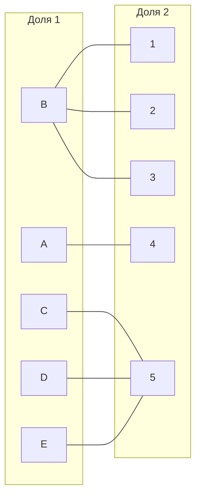
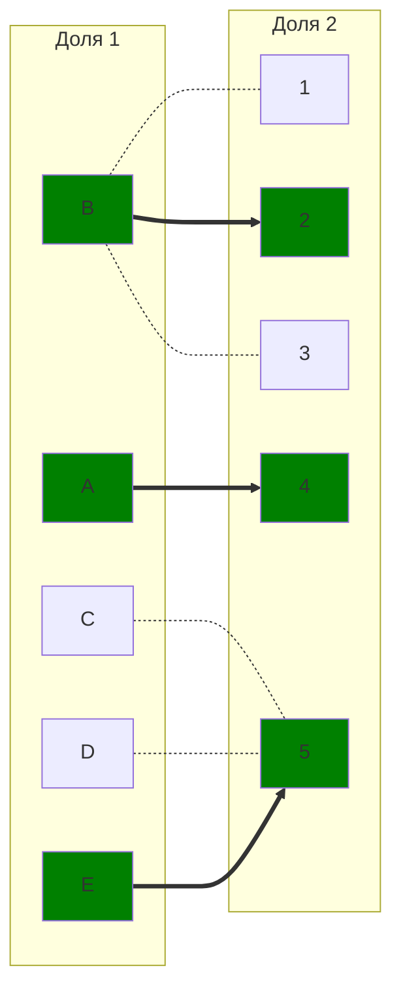
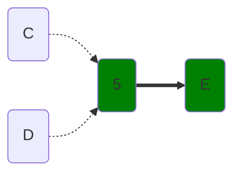
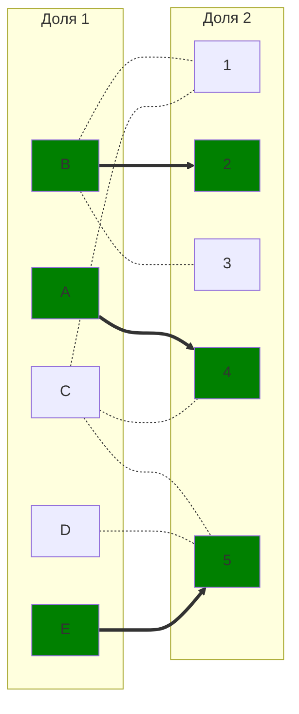
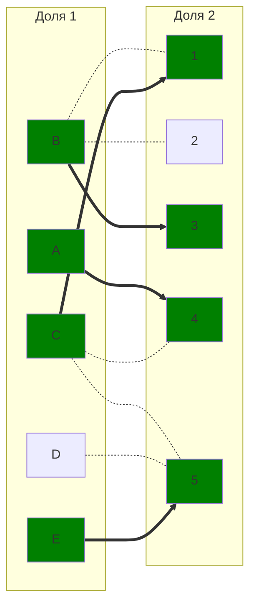
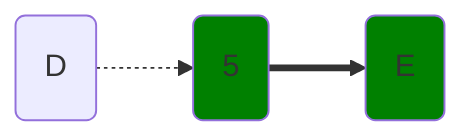
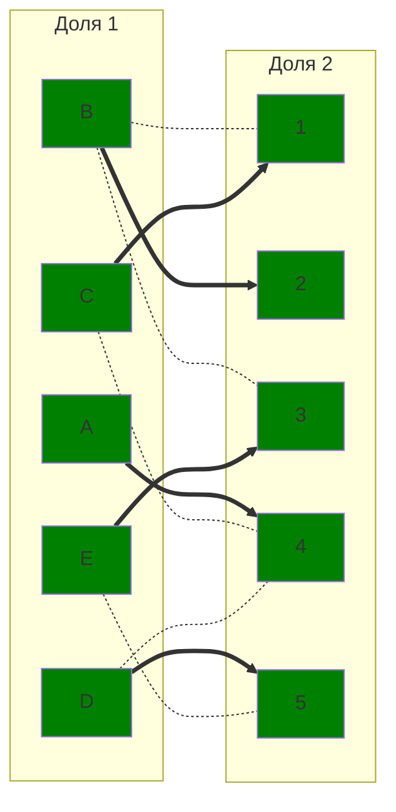

# Задание 8. Задача о назначениях. Венгерский алгоритм - вариант 1
## Исходная матрица затрат
|       | **1** | **2** | **3** | **4** | **5** |
|-------|:-----:|:-----:|:-----:|:-----:|:-----:|
| **A** |   15 |  15  |  11  |   9   |   14 |
| **B** |  8   |  8   |  6   |  11   |   15 |
| **C** |  12  |  15  |  15  |  10   |   9  |
| **D** |   12 |   15 |  10  |  7    |  5   |
| **E** |   11 |  10  |  7   |  15   |   5  |

## Этап I. Выполняем редукцию матрицы затрат по строкам и столбцам.
### Редукция по строкам
В каждой строке выбираем минимальное чило и вычитаем его из всей строки.

|       | **1** | **2** | **3** | **4** | **5** | **Редукция** |
|-------|:-----:|:-----:|:-----:|:-----:|:-----:|:-----:|
| **A** |   15   |  15   |  11   |   9   |   14   |  **-9**   |
| **B** |  8   |  8   |  6   |  11   |   15   |  **-6**   |
| **C** |  12   |  15   |  15   |  10   |   9   |  **-9**   |
| **D** |   12   |   15   |  10   |  7   |  5   |  **-5**   |
| **E** |   11   |  10   |  7   |  15   |   5   |  **-5**   |

Результат
|       | **1** | **2** | **3** | **4** | **5** |
|-------|:-----:|:-----:|:-----:|:-----:|:-----:|
| **A** |   6   |   6   |   2   |   0   |   5   |
| **B** |   2   |   2   |   0   |   5   |   9   |
| **C** |   3   |   6   |   6   |   1   |   0   |
| **D** |   7   |   10  |   5   |   2   |   0   |
| **E** |   6   |   5   |   2   |   10  |   0   |

### Редукция по столбцам
|       | **1** | **2** | **3** | **4** | **5** |
|:-----:|:-----:|:-----:|:-----:|:-----:|:-----:|
| **A** |   6   |   6   |   2   |   0   |   5   |
| **B** |   2   |   2   |   0   |   5   |   9   |
| **C** |   3   |   6   |   6   |   1   |   0   |
| **D** |   7   |   10  |   5   |   2   |   0   |
| **E** |   6   |   5   |   2   |   10  |   0   |
|**Редукция**|**-2**|**-2**|    |       |       |

Результат:
|       | **1** | **2** | **3** | **4** | **5** |
|-------|:-----:|:-----:|:-----:|:-----:|:-----:|
| **A** |   4   |   4   |   2   |   0   |   5   |
| **B** |   0   |   0   |   0   |   5   |   9   |
| **C** |   1   |   4   |   6   |   1   |   0   |
| **D** |   5   |   8   |   5   |   2   |   0   |
| **E** |   4   |   3   |   2   |   10  |   0   |

## Этап II. Строим двудольный граф на основе редуцированной матрицы.

Ребра, обозначенная нулём в матрице будут присутствовать в нашем двудольном графе, все остальные – нет.

## Этап III. В построенном двудольном графе ищем соврешенное парсочетание.
### Выбираем начальное паросочетание
Для начала исполнения алгоритма необходимо выбрать стартовое паросочетание, с которым начнём искать чередующуюся цепь.
Этим паросочетанием будет следующий набор рёбер:

$[A;4], [B; 2], [E; 5]$ 

Отобразим на двудольном графе. Пунктирное ребро – 'светлое' ребро, а толстое ребро – 'тёмное'. Зеленая вершина – 'тёмная', серая вершина – 'светлая'.

### Ищем чередующуюся цепь волновым методом.

Дальнейшее постороение цепи невозможно, необходимо произвести диаганальную редукцию.

$X=\{C;D;E\}$

$Y=\{5\}$

$\neg(Y)=\{1;2;3;4\}$

### Диаганальная редукция.
Вычитаем из строк множества $X$ минимальное значение пересечение моножества $X$ и $\neg(Y)$, а в столбцы $Y$ это значение добавляем.
|       | **1** | **2** | **3** | **4** | **5** |**Редукция** |
|:-----:|:-----:|:-----:|:-----:|:-----:|:-----:|:-----:|
| **A** |   4   |   4   |   2   |   0   |   5   |
| **B** |   0   |   0   |   0   |   5   |   9  |
| **C** |   <ins>1</ins>   |   <ins>4</ins>   |   <ins>6</ins>   |   <ins>1</ins>   |  <ins>0</ins>   |   **-1**  |
| **D** |   <ins>5</ins>   |   <ins>8</ins>   |   <ins>5</ins>   |   <ins>2</ins>   |  <ins>0</ins>   |   **-1**  |
| **E** |   <ins>4</ins>   |   <ins>3</ins>   |   <ins>2</ins>   |   <ins>10</ins>  |   <ins>0</ins>   |  **-1**  |
| **Редукция** |       |     |   |     | **+1** |

Результат:
|       | **1** | **2** | **3** | **4** | **5** |
|-------|:-----:|:-----:|:-----:|:-----:|:-----:|
| **A** |   4   |   4   |   2   |   0   |   6   |
| **B** |   0   |   0   |   0   |   5   |   10  |
| **C** |   0   |   3   |   5   |   0   |   0   |
| **D** |   4   |   7   |   4   |   1   |   0   |
| **E** |   3   |   2   |   1   |   9   |   0   |

Добавляем новые ребра $[C;1], [C; 4]$ в двудольный граф.
 

Изменим стартовый набор паросочетания, так как появились новые ребра и, визуально проанализировав, можно легко добавить одно ребро. Новый набор ребер паросочетания　(вершину E　соединили с четвертой вместо пятой, вершину B подключили к пятой):
$[A;3], [D; 1], [E; 4], [B; 5]$:

### Ищем чередующуюся цепь волновым методом.

Дальнейшее постороение цепи невозможно, необходимо произвести диаганальную редукцию.

$X=\{D;E\}$

$Y=\{5\}$

$\neg(Y)=\{1;2;3;4\}$

### Диаганальная редукция.
Вычитаем из строк множества $X$ минимальное значение пересечение моножества $X$ и $\neg(Y)$, а в столбцы $Y$ это значение добавляем.
|       | **1** | **2** | **3** | **4** | **5** |**Редукция** |
|:-----:|:-----:|:-----:|:-----:|:-----:|:-----:|:-----:|
| **A** |   4   |   4   |   2   |   0   |   6   |
| **B** |   0   |   0   |   0   |   5   |   10  |
| **C** |   0   |   3   |   5   |   0   |   0   |
| **D** |   <ins>4</ins>   |   <ins>7</ins>   |   <ins>4</ins>   |   <ins>1</ins>   |   <ins>0</ins>   | **-1** |
| **E** |   <ins>3</ins>   |   <ins>2</ins>   |   <ins>1</ins>   |   <ins>9</ins>   |   <ins>0</ins>   | **-1** |
| **Редукция** |       |     |   |     | **+1**    |

Результат:
|       | **1** | **2** | **3** | **4** | **5** |
|-------|:-----:|:-----:|:-----:|:-----:|:-----:|
| **A** |   4   |   4   |   2   |   0   |   7   |
| **B** |   0   |   0   |   0   |   5   |   11  |
| **C** |   0   |   3   |   5   |   0   |   1   |
| **D** |   3   |   6   |   3   |   0   |   0   |
| **E** |   2   |   1   |   0   |   8   |   0   |

Добавляем новые ребра $[D; 4], [E; 3]$ в двудольный граф.

# Ответ
Совершенное паросочетание найдено. Это:

$[A;4], [B; 2], [C; 1], [D; 5], [E; 3]$

Минимальная сумма выполнения работ – **41**.
