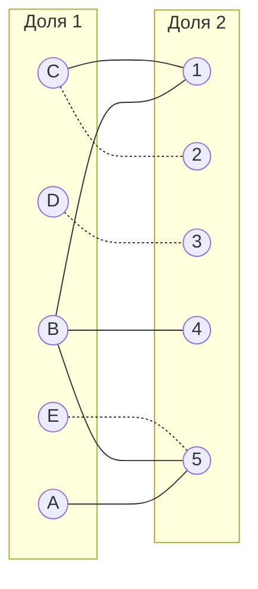
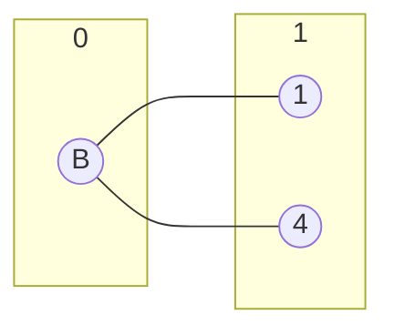
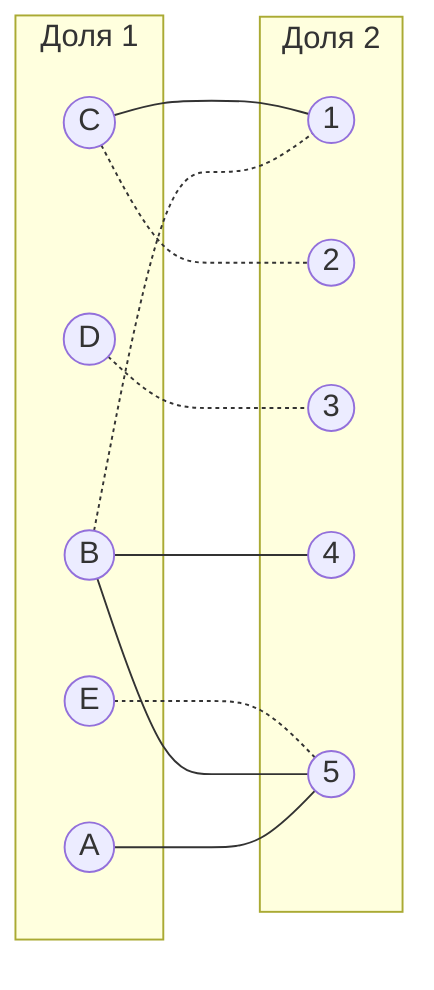
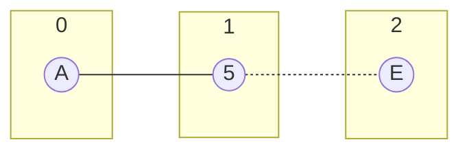
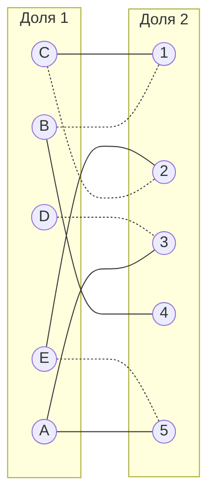
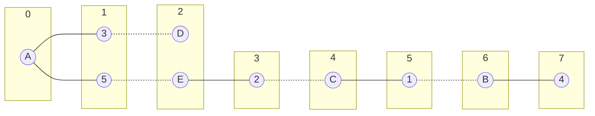
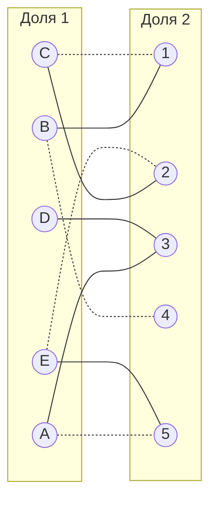
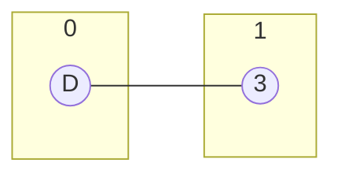
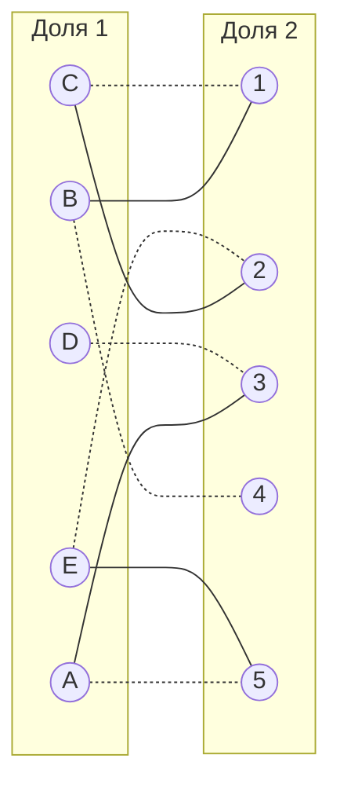

# Задача о назначениях. Венгерский алгоритм.

## Задание
В каждом варианте представлены условия задачи о назначении, в соответствии с которыми необходимо: 
1. Решить задачу с использованием Венгерского алгоритма.
2. Оформить решение задачи по шагам с подробными комментариями, таблицами и диаграммами.
3. В ответе указать минимальную сумму затрат на выполнение всех заданий.
4. В ответе вывести найденные назначения

## Вариант 3
#### Матрица затрат:

|       | **1** | **2** | **3** | **4** | **5** |
|-------|:-----:|:-----:|:-----:|:-----:|:-----:|
| **A** |  12   |  14   |   6   |   8   |   5   |
| **B** |   7   |  10   |  10   |   6   |   6   |
| **C** |   9   |   8   |  13   |  14   |  12   |
| **D** |   7   |   9   |   5   |  10   |  12   |
| **E** |  14   |   6   |  11   |  10   |   5   |

## Решение

|       |        **1**        |        **2**        |        **3**        |        **4**        |        **5**        |
|-------|:-------------------:|:-------------------:|:-------------------:|:-------------------:|:-------------------:|
| **A** |         12          |         14          |          6          |          8          |$$\color{green}{5}$$ |
| **B** |          7          |         10          |         10          |          6          |$$\color{green}{6}$$ |
| **C** |          9          |$$\color{green}{8}$$ |         13          |         14          |         12          |
| **D** |          7          |          9          |$$\color{green}{5}$$ |         10          |         12          |
| **E** |         14          |          6          |         11          |         10          |$$\color{green}{5}$$ |

Редукция по строкам

|       |        **1**        |        **2**        |        **3**        |        **4**        |        **5**        |
|-------|:-------------------:|:-------------------:|:-------------------:|:-------------------:|:-------------------:|
| **A** |          7          |          9          |          1          |          3          |          0          |
| **B** |$$\color{green}{1}$$ |          4          |          4          |$$\color{green}{0}$$ |$$\color{green}{0}$$ |
| **C** |          1          |$$\color{green}{0}$$ |          5          |          6          |          4          |
| **D** |          2          |          4          |$$\color{green}{0}$$ |          5          |          7          |
| **E** |          9          |          1          |          6          |          5          |          0          |

Редукция по столбцам

|       | **1** | **2** | **3** | **4** | **5** |
|-------|:-----:|:-----:|:-----:|:-----:|:-----:|
| **A** |   6   |   9   |   1   |   3   |   0   |
| **B** |   0   |   4   |   4   |   0   |   0   |
| **C** |   0   |   0   |   5   |   6   |   4   |
| **D** |   1   |   4   |   0   |   5   |   7   |
| **E** |   8   |   1   |   6   |   5   |   0   |

### Граф

Начнем с C2, D3, E5

Паросочетание -> перекрашиваем

Больше идти некуда -> диаг. редукция 

### Диаг. редукция (A, E, 5)

|       |        **1**        |        **2**        |        **3**        |        **4**        |        **5**        |
|-------|:-------------------:|:-------------------:|:-------------------:|:-------------------:|:-------------------:|
| **A** |          0          |$$\color{green}{6}$$ |$$\color{green}{9}$$ |$$\color{green}{1}$$ |$$\color{green}{3}$$ |
| **E** |          0          |$$\color{green}{8}$$ |$$\color{green}{1}$$ |$$\color{green}{6}$$ |$$\color{green}{5}$$ |
| **B** |$$\color{red}{0}$$   |          0          |          4          |          4          |          0          |
| **C** |$$\color{red}{4}$$   |          0          |          0          |          5          |          6          |
| **D** |$$\color{red}{7}$$   |          1          |          4          |          0          |          5          |

min 1

|       |  **1**  |  **2**  |  **3**  |  **4**  |  **5**  |
|-------|:-------:|:-------:|:-------:|:-------:|:-------:|
| **A** |    0    |    5    |    8    |    0    |    2    |
| **E** |    0    |    7    |    0    |    5    |    4    |
| **B** |    1    |    0    |    4    |    4    |    0    |
| **C** |    5    |    0    |    0    |    5    |    6    |
| **D** |    8    |    1    |    4    |    0    |    5    |

### Граф

Черед. цепь -> перекрашиваем

Черед. цепь -> перекрашиваем

## Вывод
Min будет A5, B4, C1, D3, E2 \
5 + 6 + 9 + 5 + 6 = 31