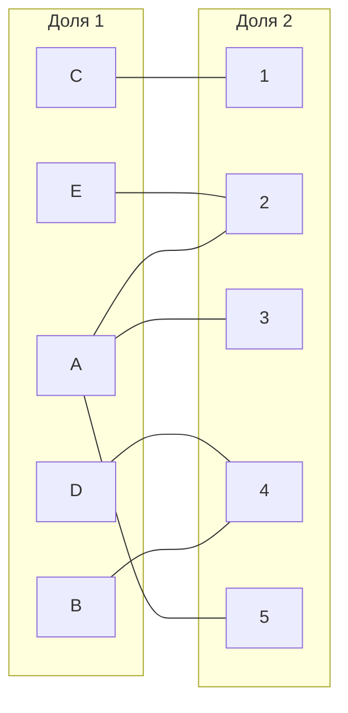
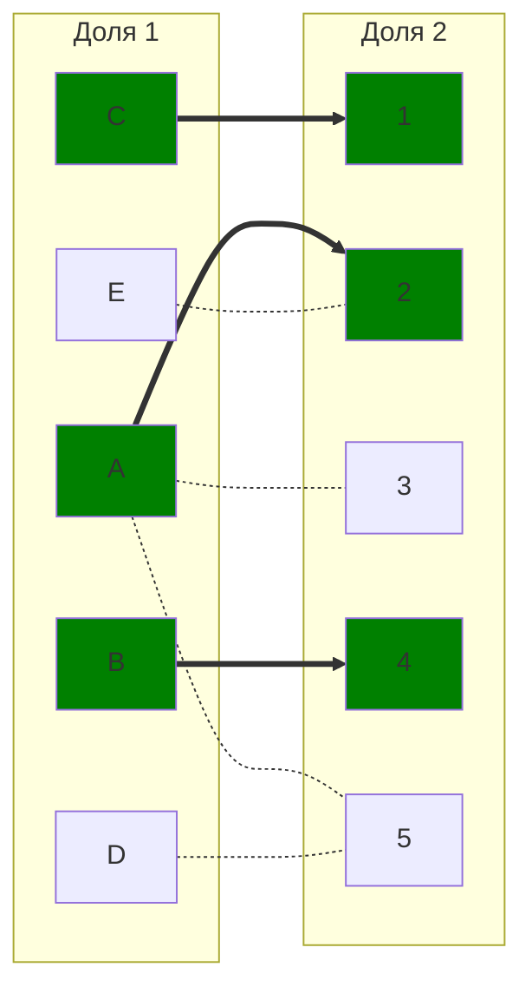
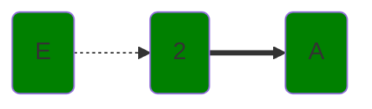
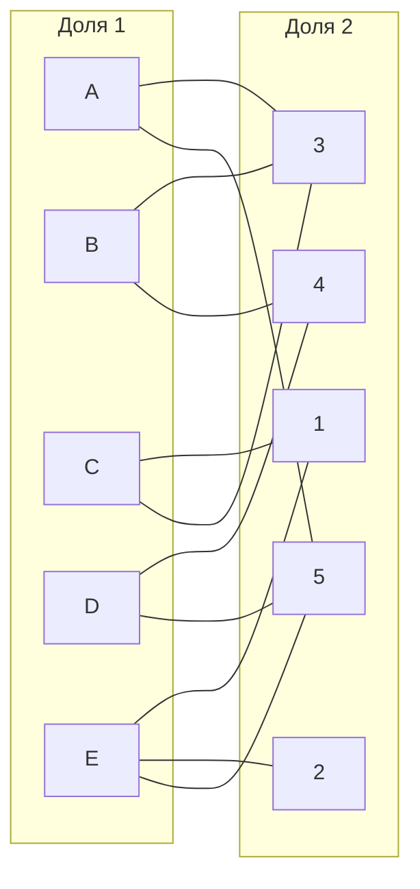
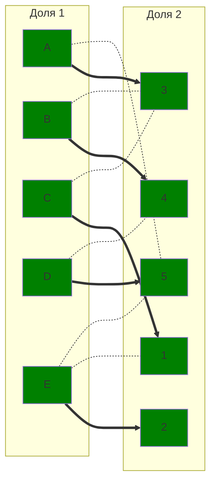

# Задание 8. Задача о назначениях. Венгерский алгоритм — вариант 11

## Исходная матрица затрат:
|       | **1** | **2** | **3** | **4** | **5** |
|-------|:-----:|:-----:|:-----:|:-----:|:-----:|
| **A** |  15   |   9   |  11   |  12   |  11   |
| **B** |  11   |  13   |  11   |   7   |  14   |
| **C** |   5   |  14   |  11   |   6   |  14   |
| **D** |  14   |  13   |  14   |   5   |   9   |
| **E** |   8   |   6   |  15   |  12   |  12   |

---

## Этап I. Выполняем редукцию матрицы затрат по строкам и столбцам.

### Редукция по строкам
В каждой строке выбираем минимальное число и вычитаем его из всей строки.

|       | **1** | **2** | **3** | **4** | **5** | **Редукция** |
|-------|:-----:|:-----:|:-----:|:-----:|:-----:|:-----------:|
| **A** |  15   |   9   |  11   |  12   |  11   |   **-9**    |
| **B** |  11   |  13   |  11   |   7   |  14   |   **-7**    |
| **C** |   5   |  14   |  11   |   6   |  14   |   **-5**    |
| **D** |  14   |  13   |  14   |   5   |   9   |   **-5**    |
| **E** |   8   |   6   |  15   |  12   |  12   |   **-6**    |

Результат после вычитания:
|       | **1** | **2** | **3** | **4** | **5** |
|-------|:-----:|:-----:|:-----:|:-----:|:-----:|
| **A** |   6   |   0   |   2   |   3   |   2   |
| **B** |   4   |   6   |   4   |   0   |   7   |
| **C** |   0   |   9   |   6   |   1   |   9   |
| **D** |   9   |   8   |   9   |   0   |   4   |
| **E** |   2   |   0   |   9   |   6   |   6   |

### Редукция по столбцам

|       | **1** | **2** | **3** | **4** | **5** |
|-------|:-----:|:-----:|:-----:|:-----:|:-----:|
| **A** |   6   |   0   |  2−2=0 |   3   |  2−2=0 |
| **B** |   4   |   6   |  4−2=2 |   0   |  7−2=5 |
| **C** |   0   |   9   |  6−2=4 |   1   |  9−2=7 |
| **D** |   9   |   8   |  9−2=7 |   0   |  4−2=2 |
| **E** |   2   |   0   |  9−2=7 |   6   |  6−2=4 |

Результат:
|       | **1** | **2** | **3** | **4** | **5** |
|-------|:-----:|:-----:|:-----:|:-----:|:-----:|
| **A** |   6   |   0   |   0   |   3   |   0   |
| **B** |   4   |   6   |   2   |   0   |   5   |
| **C** |   0   |   9   |   4   |   1   |   7   |
| **D** |   9   |   8   |   7   |   0   |   2   |
| **E** |   2   |   0   |   7   |   6   |   4   |

---

## Этап II. Строим двудольный граф на основе редуцированной матрицы

Рёбра соответствуют нулям в таблице:

- **A**: 2, 3, 5
- **B**: 4
- **C**: 1
- **D**: 4
- **E**: 2

## Этап III. В построенном двудольном графе ищем совершенное паросочетание.

### Выбираем начальное паросочетание
После редукции матрицы мы получили следующую таблицу нулей. На её основе строим двудольный граф.  

Начальное паросочетание выберем «на глаз»:
\[
[A;2], [B;4], [C;1]
\]

Отобразим текущее состояние (с тройкой рёбер) на двудольном графе. Пунктирные рёбра – это «светлые» рёбра (не в текущем паросочетании), толстые – «тёмные» (в паросочетании). Зелёные вершины – «тёмные», серые – «светлые».

### Ищем чередующуюся цепь волновым методом.

Дальнейшее расширение цепи невозможно без дополнительной диагональной редукции.

$X=\{A;B;\}$

$Y=\{2;4\}$

$\neg(Y)=\{1;3;5\}$

### Диаганальная редукция.
Вычитаем из строк множества $X$ минимальное значение пересечение моножества $X$ и $\neg(Y)$, а в столбцы $Y$ это значение добавляем.

Результат:
|       | **1** | **2** | **3** | **4** | **5** |
|-------|:-----:|:-----:|:-----:|:-----:|:-----:|
| **A** |   6   |   2   |   0   |   5   |   0   |
| **B** |   4   |   8   |   2   |   2   |   5   |
| **C** |   0   |   9   |   2   |   1   |   5   |
| **D** |   7   |   8   |   5   |   0   |   0   |
| **E** |   0   |   0   |   5   |   6   |   2   |

Добавляем новые ребра в двудольный граф
Рёбра соответствуют нулям в обновленной матрице:
**A**: 3, 5
**B**: 3, 4
**C**: 1, 3
**D**: 4, 5
**E**: 1, 2, 5

Выбираем новое начальное паросочетание с учетом новых нулей
**D** может быть соединена с **4** или **5**. **E** может быть соединена с **1**,**2**,**5**.
Переназначаем **А** с **2** на **3**. Тогда новое парасочетание: 

\[
[A;3], [B;4], [C;1], [D;5], [E;2]
\]

Отобразим новое состояние паросочетания на двудольном графе.

Теперь все строки и столбцы заняты в паросочетании. Таким образом, совершенное паросочетание найдено.

## Ответ

Совершенное парасочетание:

\[
[A;3], [B;4], [C;1], [D;5], [E;2]
\]

Минимальная сумма выполнения работ рассчитывается по исходной матрице затрат:
**А**: 11
**B**: 7
**C**: 5
**D**: 9
**E**: 6

Тогда минимальная сумма выполнения работ - **38**
