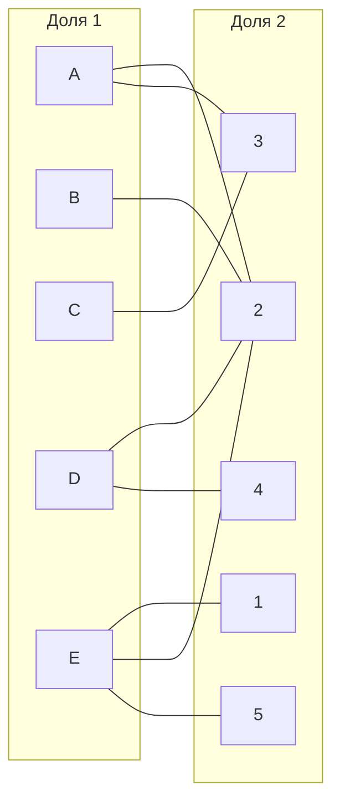
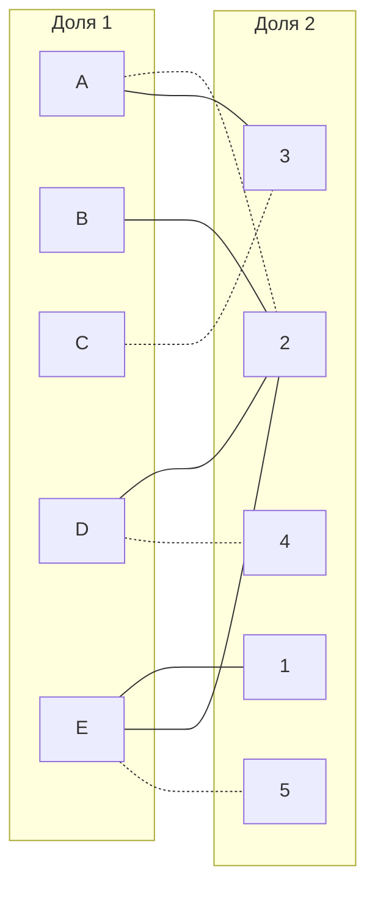
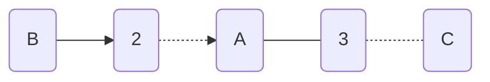
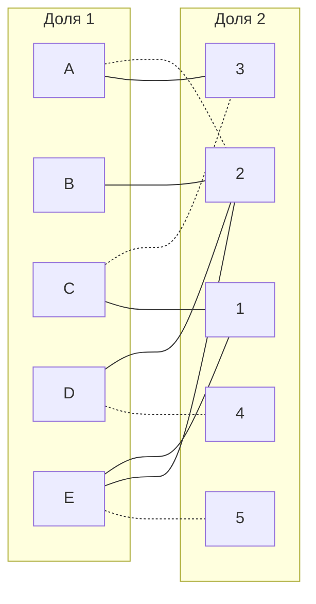
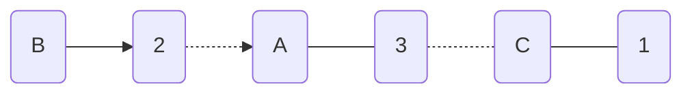
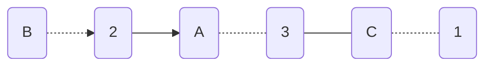
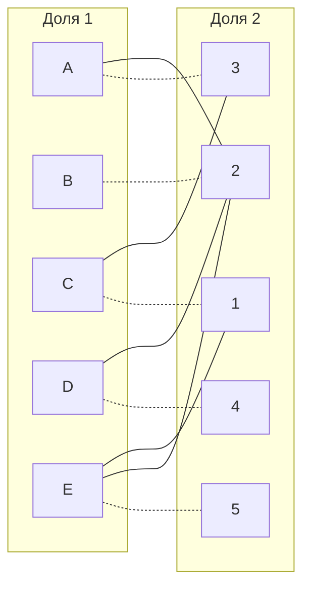
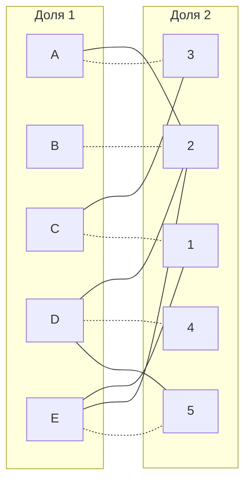

# Задание 8. Вариант 5
## Постановка задачи
1. Дан полный двудольный граф, в котором каждое ребро имеет определенную стоимость. Вершины первой доли представляют задачи, вершины второй доли исполнителей. Стоимость ребра определяет затраты при выполнении соответствующей задачи соответствующим исполнителем. 
2. Затраты неотрицательны и представлены в виде матрицы затрат, в которой на пересечении i-й строки и j-го столбца указаны затраты j-го исполнителя на выполнение i-го задания.
3. Необходимо назначить исполнителей на задачи таким образом, чтобы общая стоимость затрат была минимальной.
4. Задача сводится к нахождению совершенного паросочетания с минимальной суммарной стоимостью в двудольном графе.

#### Матрица затрат:

|       | **1** | **2** | **3** | **4** | **5** |
|-------|:-----:|:-----:|:-----:|:-----:|:-----:|
| **A** |  15   |   7   |   7   |  12   |  12   |
| **B** |  15   |   5   |  14   |  14   |  11   |
| **C** |  11   |  12   |   5   |  11   |   7   |
| **D** |  14   |   5   |  12   |   6   |   6   |
| **E** |  13   |   8   |  13   |  15   |   8   |

#### Шаг 1. 
Проведем редукцию матрицы затрат. Вычтем из каждой строки минимальное значение, представленное в этой строке.

|       | **1** | **2** | **3** | **4** | **5** | **Min** |
|-------|:-----:|:-----:|:-----:|:-----:|:-----:|:-----:|
| **A** |   8   |  0   |  0   |   5   |   5   |  **-7**   |
| **B** |  10   |  0   |  9   |  9   |   6   |  **-5**   |
| **C** |  6   |  7   |  0   |  6   |   2   |  **-5**   |
| **D** |   9   |   0   |  7   |  1   |  1   |  **-5**   |
| **E** |   5   |  0  |  5   |  7   |   0  |  **-8**   |

После чего вычтем из каждого столбца минимальное значение, представленное в этом столбце.

|       | **1** | **2** | **3** | **4** | **5** |
|:-----:|:-----:|:-----:|:-----:|:-----:|:-----:|
| **A** |   3   |   0   |   0   |   4   |   5   |
| **B** |   5   |   0   |   9   |   8   |   6   |
| **C** |   1   |   7   |   0   |   5   |   2   |
| **D** |   4   |   0   |   7   |   0   |   1   |
| **E** |   0   |   0   |   5   |   6   |   0   |
| **Min** |  **-5**  |    |    |   **-1**   |       |

Получим редуцированную матрицу, где нули обозначают наименее затратные варианты назначений.

|       | **1** | **2** | **3** | **4** | **5** |
|-------|:-----:|:-----:|:-----:|:-----:|:-----:|
| **A** |  3   |   0   |   0   |  4   |  5   |
| **B** |  5   |   0   |  9   |  8   |  6   |
| **C** |  1   |  7   |   0   | 5   |   2   |
| **D** |  4   |  0   |  7   |   0   |  1   |
| **E** |  0   |   0   |  5   |  6   |   0   |

#### Шаг 2. 
На основе полученной матрицы строим двудольный граф, куда вынесем только те ребра, которые обозначены в графе нулями.

#### Шаг 3. 
Начинаем поиск совершенного паросочетания.
Для начал выберем произвольное паросочетание, в котором начнем искать чередующуюся цепь. Возьмем цепь A --- 2, C --- 3, D --- 4, E --- 5 и пытаемся построить совершенное паросочетание с помощью чередующихся деревьев. 

Построим чередующуюся цепь волновым методом: 

В построенном дереве нет цепей, чередующееся относительно текущего паросочетания, то есть в указанном графе нет совершенного паросочетания.

#### Шаг 4. Проведем диагональную редукцию матрицы
$X = \{B, A, C\}$

$Y = \{ 2,3 \}$

Необходимо найти минимальный элемент из строк, включенных во множество X и столбцов, не включенных во множество Y. В нашем случае это будут строки B, A, C и столбцы 1,4,5. Минимальный элемент 1, расположен в строке C и столбце 1.

Вычтем найденное значение из строк множества X и прибавим к столбцам множества Y: 
|       | **1** | **2** | **3** | **4** | **5** | **Min** |
|-------|:-----:|:-----:|:-----:|:-----:|:-----:|:-----:|
| **A** |    2  |   0  |  0   |   3  |  4   |  **-1**   |
| **B** |  4  |  0  |  9   |  7  |   5  |  **-1**   |
| **C** |  0   |  7   |  0   |  4   |  1    | **-1**   |
| **D** |   4   |  0    |   8  |  0   |  1     |    |
| **E** |   0  |  0  | 6   |  6   |  0  |   |
| **Min** |  |  **+1**  |  **+1**   |   |       |

В ячейке C1 появилось новое нулевое значение, добавим соответствующее ребро в двудольный граф.

#### Шаг 5. Снова пытаемся построить совершенное паросочетание

Построим чередующуюся цепь волновым методом: 

Чередующаяся цепь найдена.
Перекрашиваем её.

Осталась неиспользованной вершина D, которую мы брали в исходной цепи с соединением 4. Также, если на данном этапе повторно выполнить диагональную редукцию и взять цепь B-.- 2 --- D -.- 4, то ячейка D5 превратится в 0, тем самым мы получим еще одно ребро и полное соединение всех долей 1 и 2. 

Полученное ниже расписание является совершенным. 

$[A;3], [B; 2], [C; 1], [D; 4], [E; 5]$

Выпишем полученные назначения и их стоимости из исходной матрицы:
- A3 - 7
- B2 - 5
- C1 - 11
- D4 - 6
- E5 - 8

Общая стоимость затрат = 7 + 5 + 11 + 6 + 8 = 37.

# Ответ
Совершенное паросочетание:

$[A;3], [B; 2], [C; 1], [D; 4], [E; 5]$

Общая стоимость затрат = **37**.