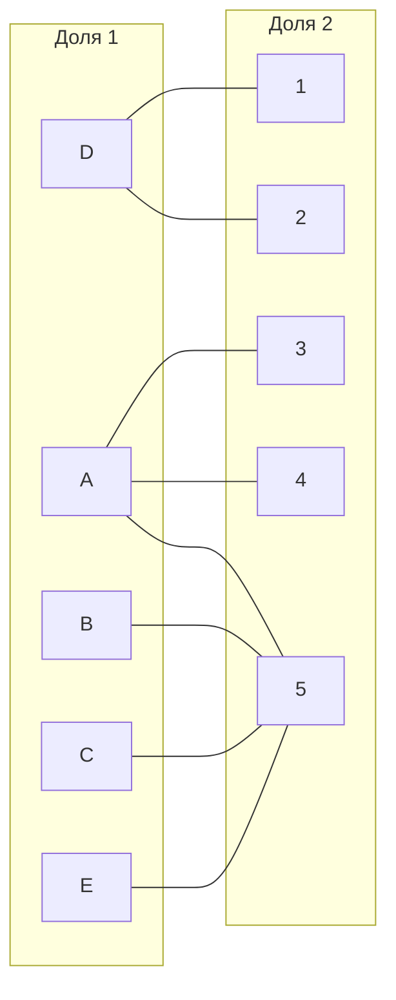
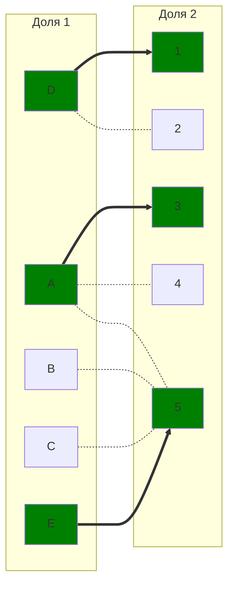
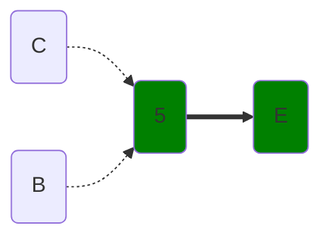
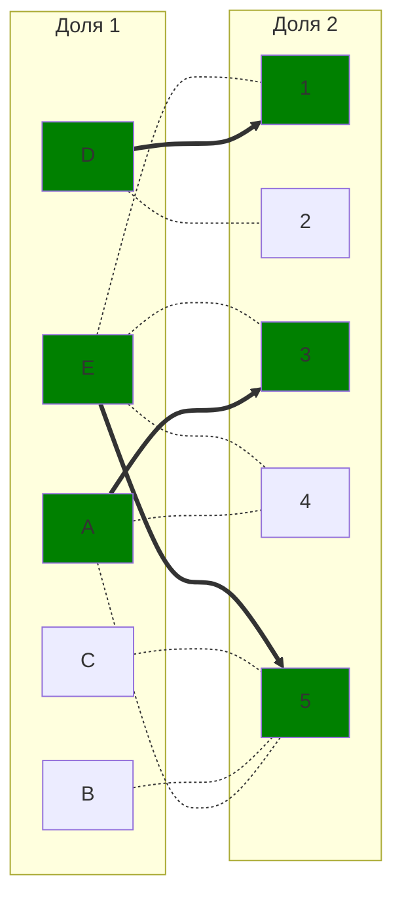
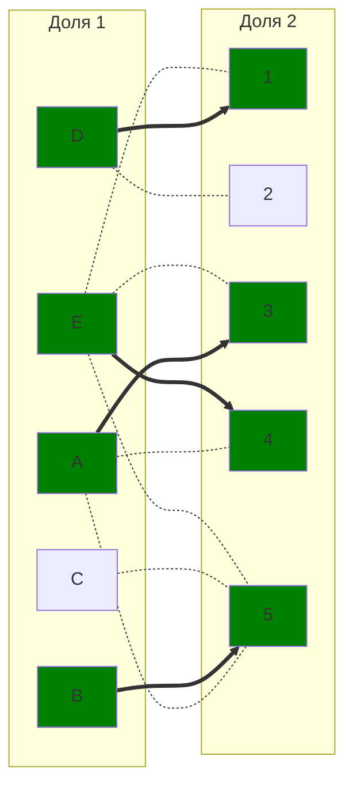
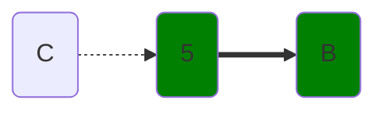
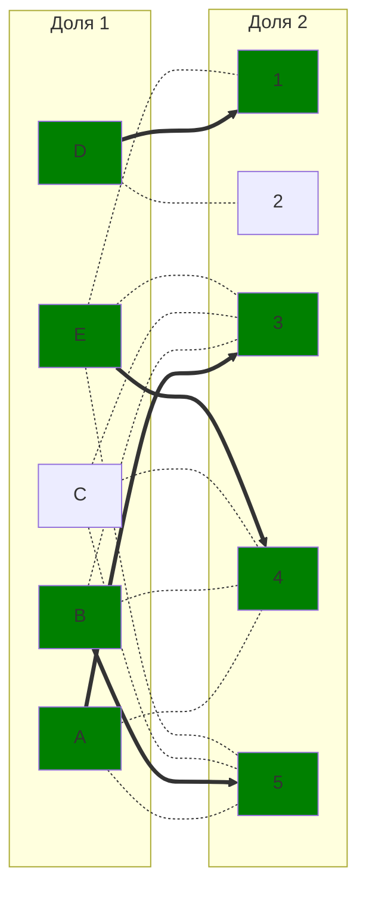
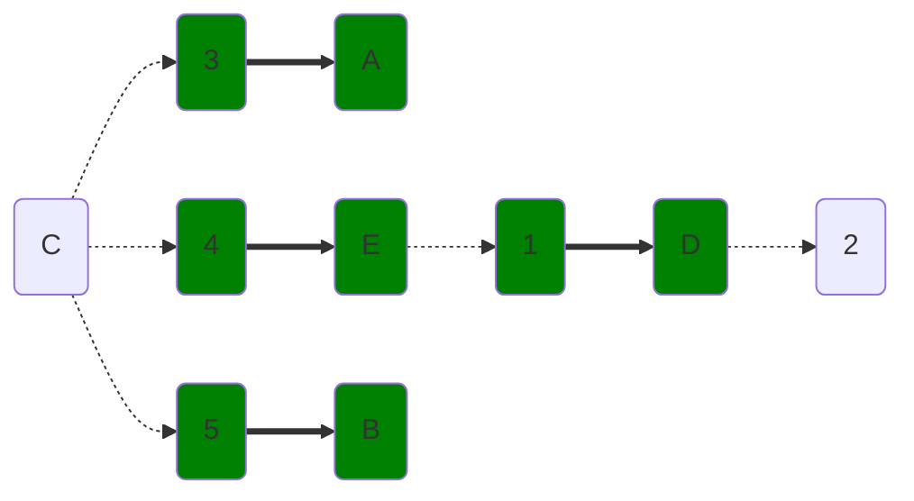
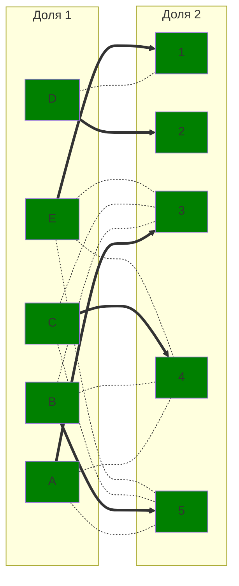

# Задание 8. Задача о назначениях. Венгерский алгоритм - вариант 7
## Исходная матрица затрат:
|       | **1** | **2** | **3** | **4** | **5** |
|-------|:-----:|:-----:|:-----:|:-----:|:-----:|
| **A** |   9   |  10   |  11   |   9   |   7   |
| **B** |  10   |  11   |  12   |  10   |   5   |
| **C** |  10   |  14   |  12   |  10   |   5   |
| **D** |   6   |   7   |  14   |  12   |  14   |
| **E** |   8   |  10   |  12   |  10   |   6   |

## Этап I. Выполняем редукцию матрицы затрат по строкам и столбцам.
### Редукция по строкам
В каждой строке выбираем минимальное чило и вычитаем его из всей строки.

|       | **1** | **2** | **3** | **4** | **5** | **Редукция** |
|-------|:-----:|:-----:|:-----:|:-----:|:-----:|:-----:|
| **A** |   9   |  10   |  11   |   9   |   7   |  **-7**   |
| **B** |  10   |  11   |  12   |  10   |   5   |  **-5**   |
| **C** |  10   |  14   |  12   |  10   |   5   |  **-5**   |
| **D** |   6   |   7   |  14   |  12   |  14   |  **-6**   |
| **E** |   8   |  10   |  12   |  10   |   6   |  **-6**   |

Результат:
|       | **1** | **2** | **3** | **4** | **5** |
|-------|:-----:|:-----:|:-----:|:-----:|:-----:|
| **A** |   2   |   3   |   4   |   2   |   0   |
| **B** |   5   |   6   |   7   |   5   |   0   |
| **C** |   5   |   9   |   7   |   5   |   0   |
| **D** |   0   |   1   |   8   |   6   |   8   |
| **E** |   2   |   4   |   6   |   4   |   0   |

### Редукция по столбцам
|       | **1** | **2** | **3** | **4** | **5** |
|:-----:|:-----:|:-----:|:-----:|:-----:|:-----:|
| **A** |   2   |   3   |   4   |   2   |   0   |
| **B** |   5   |   6   |   7   |   5   |   0   |
| **C** |   5   |   9   |   7   |   5   |   0   |
| **D** |   0   |   1   |   8   |   6   |   8   |
| **E** |   2   |   4   |   6   |   4   |   0   |
| **Редукция** |       |   **-1**  |  **-4**  |   **-2**   |       |

Результат:
|       | **1** | **2** | **3** | **4** | **5** |
|-------|:-----:|:-----:|:-----:|:-----:|:-----:|
| **A** |   2   |   2   |   0   |   0   |   0   |
| **B** |   5   |   5   |   3   |   3   |   0   |
| **C** |   5   |   8   |   3   |   3   |   0   |
| **D** |   0   |   0   |   4   |   4   |   8   |
| **E** |   2   |   3   |   2   |   2   |   0   |

## Этап II. Строим двудольный граф на основе редуцированной матрицы.

Ребра, обозначенная нулём в матрице будут присутствовать в нащшем двудольном графе, все остальные – нет.

## Этап III. В построенном двудольном графе ищем соврешенное парсочетание.
### Выбираем начальное паросочетание
Для начала исполнения алгоритма необходимо выбрать стартовое паросочетание, с которым начнём искать чередующуюся цепь.
Этим паросочетанием будет следующий набор рёбер:

$[A;3], [D; 1], [E; 5]$ 

Отобразим на двудольном графе. Пунктирное ребро – 'светлое' ребро, а толстое ребро – 'тёмное'. Зеленая вершина – 'тёмная', серая вершина – 'светлая'.

### Ищем чередующуюся цепь волновым методом.

Дальнейшее постороение цепи невозможно, необходимо произвести диаганальную редукцию.

$X=\{B;C;E\}$

$Y=\{5\}$

$\neg(Y)=\{1;2;3;4\}$

### Диаганальная редукция.
Вычитаем из строк множества $X$ минимальное значение пересечение моножества $X$ и $\neg(Y)$, а в столбцы $Y$ это значение добавляем.
|       | **1** | **2** | **3** | **4** | **5** |**Редукция** |
|:-----:|:-----:|:-----:|:-----:|:-----:|:-----:|:-----:|
| **A** |   2   |   2   |   0   |   0   |   0   |
| **B** |   <ins>5</ins>   |   <ins>5</ins>    |   <ins> 3</ins>    |   <ins>3</ins>    |   0   |  **-2**   |
| **C** |   <ins> 5</ins>   |   <ins> 8</ins>    |   <ins> 3</ins>    |   <ins> 3</ins>    |   0   |  **-2**   |
| **D** |   0   |   0   |   4   |   4   |   8   |
| **E** |   <ins> 2</ins>    |   <ins> 3</ins>    |   <ins> 2 </ins>   |   <ins> 2</ins>    |   0   |  **-2**   |
| **Редукция** |       |     |   |     | **+2**    |

Результат:
|       | **1** | **2** | **3** | **4** | **5** |
|-------|:-----:|:-----:|:-----:|:-----:|:-----:|
| **A** |   2   |   2   |   0   |   0   |   2   |
| **B** |   3   |   3   |   1   |   1   |   0   |
| **C** |   3   |   6   |   1   |   1   |   0   |
| **D** |   0   |   0   |   4   |   4   |   10   |
| **E** |   0   |   1   |   0   |   0   |   0   |

Добавляем новые ребра $[E;1], [E; 3], [E; 4]$ в двудольный граф.
 

Изменим статртовый набор паросочетания, так как появились новые ребра и, визуально проанализировав, можно легко добавить одно ребро. Новый набор ребер паросочетания　(вершину E　соединили с четвертой вместо пятой, вершину B подклчили к пятой):
$[A;3], [D; 1], [E; 4], [B; 5]$:

### Ищем чередующуюся цепь волновым методом.

Дальнейшее постороение цепи невозможно, необходимо произвести диаганальную редукцию.

$X=\{B;C\}$

$Y=\{5\}$

$\neg(Y)=\{1;2;3;4\}$

### Диаганальная редукция.
Вычитаем из строк множества $X$ минимальное значение пересечение моножества $X$ и $\neg(Y)$, а в столбцы $Y$ это значение добавляем.
|       | **1** | **2** | **3** | **4** | **5** |**Редукция** |
|:-----:|:-----:|:-----:|:-----:|:-----:|:-----:|:-----:|
| **A** |   2   |   2   |   0   |   0   |   2   |
| **B** |   <ins>3</ins>   |   <ins>3</ins>   |   <ins>1</ins>   |   <ins>1</ins>   |   0   |**-1**    |
| **C** |   <ins>3</ins>   |   <ins>6</ins>   |   <ins>1</ins>   |   <ins>1</ins>   |   0   |**-1**    |
| **D** |   0   |   0   |   4   |   4   |   10   |
| **E** |   0   |   1   |   0   |   0   |   0   |
| **Редукция** |       |     |   |     | **+1**    |

Результат:
|       | **1** | **2** | **3** | **4** | **5** |
|-------|:-----:|:-----:|:-----:|:-----:|:-----:|
| **A** |   2   |   2   |   0   |   0   |   3   |
| **B** |   2   |   2   |   0   |   0   |   0   |
| **C** |   2   |   5   |   0   |   0   |   0   |
| **D** |   0   |   0   |   4   |   4   |   11   |
| **E** |   0   |   1   |   0   |   0   |   1  |

Добавляем новые ребра $[B;3], [B; 4], [C; 3], [C; 4]$ в двудольный граф.

### Ищем чередующуюся цепь волновым методом.

Чередующаяся цепь найдена. Это: $C-4-E-1-D-2$.
Перекравшиваем ребра этой цепи в двудольном графе.

# Ответ
Совершенное паросочетание найдено. Это:

$[A;3], [B; 5], [C; 4], [D; 2], [E; 1]$

Минимальная сумма выполнения работ – **41**.