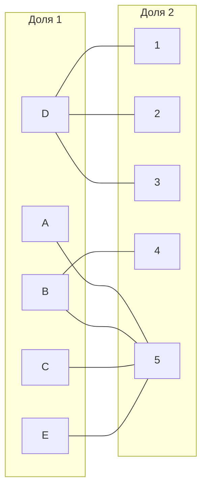
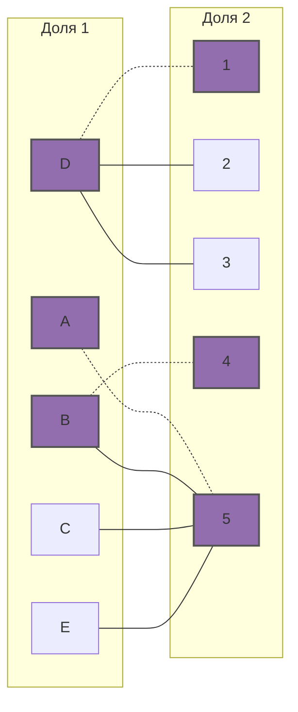
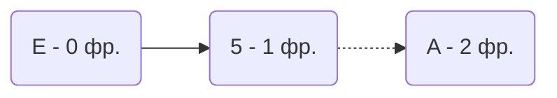
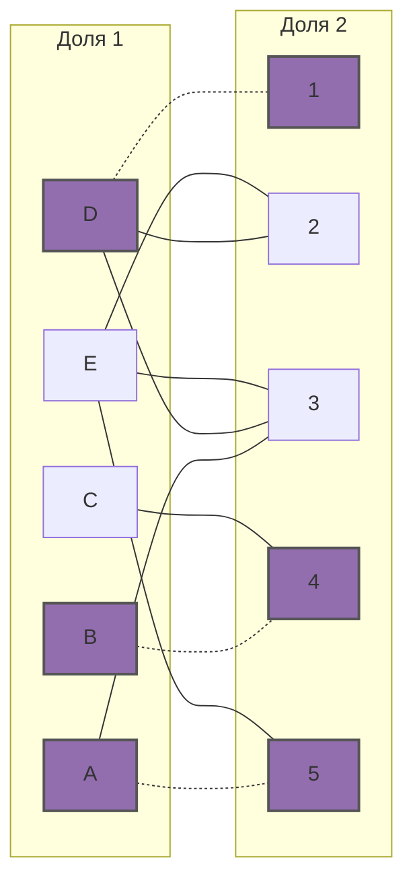
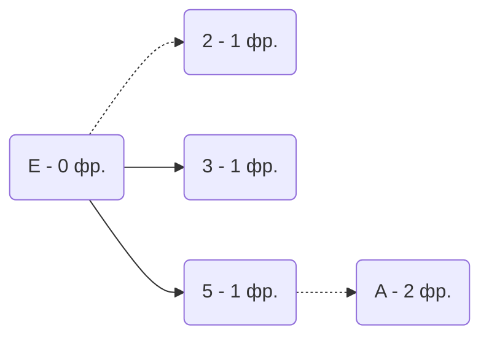
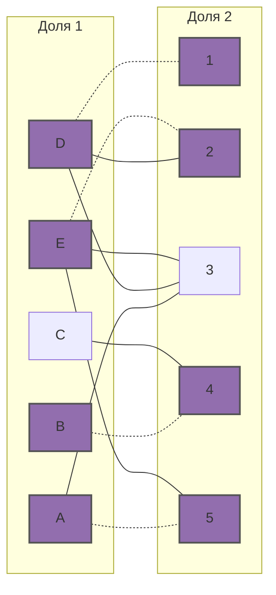
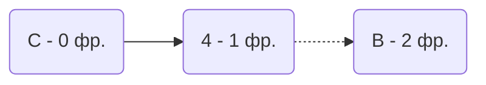
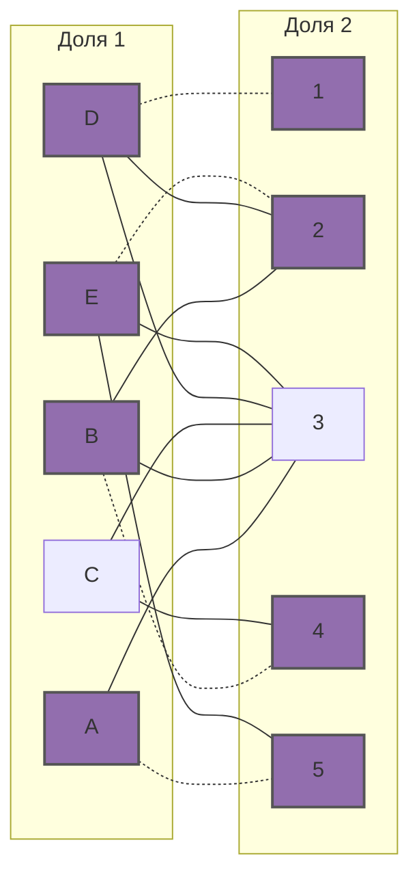
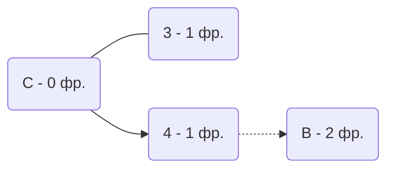
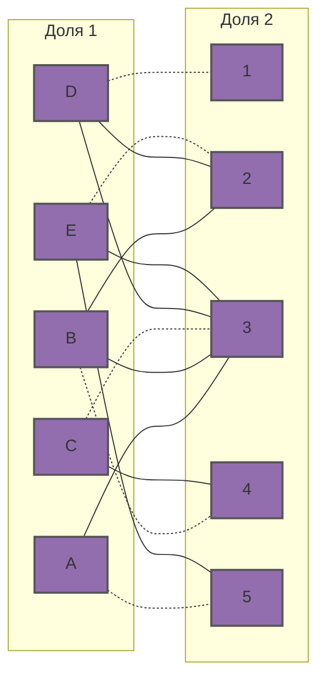

# Задание №8
## Вариант 10. Задача о назначениях. Венгерский алгоритм.

Дана матрица затрат для задач A, B, C, D, E и исполнителей 1, 2, 3, 4, 5:

|       | **1** | **2** | **3** | **4** | **5** |
|-------|:-----:|:-----:|:-----:|:-----:|:-----:|
| **A** |   14   |   11   |   8   |   14   |   **5**   |
| **B** |   12   |   8   |   6   |   8   |   **5**   |
| **C** |   15   |   12   |   9   |   11   |   **7**   |
| **D** |   11   |   12   |   **10**   |   15   |   15   |
| **E** |   13   |   10   |   8   |   14   |   **5**   |

**1.** Проведем редукцию матрицы затрат. Вычтем из каждой строки минимальное значение, представленное в этой строке.

|       | **1** | **2** | **3** | **4** | **5** | **Min** |
|-------|:-----:|:-----:|:-----:|:-----:|:-----:|:-----:|
| **A** |   9   |   6   |   3   |   9   |   0   |   **-5**   |
| **B** |   7   |   3   |   1   |   **3**   |   0   |   **-5**   |
| **C** |   8   |   5   |   2   |   4   |   0   |   **-7**   |
| **D** |   **1**   |   **2**   |   0   |   5   |   5   |   **-10**   |
| **E** |   8   |   5   |   3   |   9   |   0   |   **-5**   |

После чего вычтем из каждого столбца минимальное значение, представленное в этом столбце.

|       | **1** | **2** | **3** | **4** | **5** |
|-------|:-----:|:-----:|:-----:|:-----:|:-----:|
| **A** |   8   |   4   |   3   |   6   |   0   |
| **B** |   6   |   1   |   1   |   0   |   0   |
| **C** |   7   |   3   |   2   |   1   |   0   |
| **D** |   0   |   0   |   0   |   2   |   5   |  
| **E** |   7   |   3   |   3   |   6   |   0   | 
| **Min** | **-1** | **-2** | **-** | **3** | **-** |

Получим редуцированную матрицу, где нули обозначают наименее затратные варианты назначений.

|       | **1** | **2** | **3** | **4** | **5** |
|-------|:-----:|:-----:|:-----:|:-----:|:-----:|
| **A** |   8   |   4   |   3   |   6   |   0   |
| **B** |   6   |   1   |   1   |   0   |   0   |
| **C** |   7   |   3   |   2   |   1   |   0   |
| **D** |   0   |   0   |   0   |   2   |   5   |  
| **E** |   7   |   3   |   3   |   6   |   0   | 

**2.** Построим двудольный граф, вынесем на него те ребра, для которых в редуцированной матрице указаны нули.

Выберем произвольное паросочетание A --- 5, B --- 4 и D --- 1 и попытаемся построить совершенное паросочетание с помощью чередующихся деревьев.

Попытаемся построить дерево из оставшейся непокрытой вершины E.

В построенном дереве нет цепей, чередующееся относительно текущего паросочетания, ветка закончились в покрытой вершине **А**, то есть в указанном графе нет совершенного паросочетания.

**3.** Поскольку чередующейся цепи нет, то необходимо применить диагональную редукцию.

Во множество X выпишем все **покрытые построенным деревом** вершины первой доли графа, во множество Y все **покрытые построенным деревом** вершины из второй доли графа.

X = \{A, E\}

Y = \{5 \}

Необходимо найти минимальный элемент из строк, включенных во множество X и столбцов, не включенных во множество Y. В нашем случае это будут строки A, E и столбцы 1, 2, 3, 4.
Минимальный элемент 3, вычтем найденное значение из строк множества X и прибавим к столбцам множества Y:

|       | **1** | **2** | **3** | **4** | **5** |
|-------|:-----:|:-----:|:-----:|:-----:|:-----:|
| **A** |   5   |   1   |   **0**   |   3   |   0   |
| **B** |   6   |   1   |   1   |   0   |   **3**   |
| **C** |   7   |   3   |   2   |   1   |   **3**   |
| **D** |   0   |   0   |   0   |   2   |   8  |  
| **E** |   4   |   **0**   |   **0**   |   3   |   0   | 

В ячейках А3, E2 и E3 появились новые нулевые значения, добавим соответствующие ребра в двудольный граф. При этом ребра B5 и C5 удаляются, т.к. после редуцирования значения соответствующих ячеек перестали быть равны 0.

Заметим, что в строке С пропал единственный 0, поэтому проведём редуцирование по этой строке:

|       | **1** | **2** | **3** | **4** | **5** | **Min**
|-------|:-----:|:-----:|:-----:|:-----:|:-----:|:-----:
| **A** |   5   |   1   |   0   |   3   |   0   |  0  
| **B** |   6   |   1   |   1   |   0   |   3   |  0  
| **C** |   5   |   2   |   1   |   0   |   2   |  **-1**  
| **D** |   0   |   0   |   0   |   2   |   8   |  0    
| **E** |   4   |   0   |   0   |   3   |   0   |  0   

Строим новый граф:

**4**. Пытаемся добавить новые непокрытые вершины в дерево:

Добавляем цепь E2 в паросочетание:

Заметим, что вершина C остаётся непокрытой. Построим новое дерево с вершиной C:

В построенном дереве нет цепей, чередующееся относительно текущего паросочетания, ветка закончились в покрытой вершине **B**, то есть в указанном графе нет совершенного паросочетания. 

**5**. Т.к. чередующейся цепи нет, применяем диагональную редукцию

X = \{B, C\}

Y = \{4 \}

Необходимо найти минимальный элемент из строк, включенных во множество X и столбцов, не включенных во множество Y. В нашем случае это будут строки B, C и столбцы 1, 2, 3, 5.
Минимальный элемент 1, вычтем найденное значение из строк множества X и прибавим к столбцам множества Y:

|       | **1** | **2** | **3** | **4** | **5** |
|-------|:-----:|:-----:|:-----:|:-----:|:-----:|
| **A** |   5   |   1   |   0   |   4   |   0   |
| **B** |   5   |   **0**   |   **0**   |   0   |   2   |
| **C** |   5   |   1   |   **0**   |   0   |   3   |
| **D** |   0   |   0   |   0   |   3   |   8   |
| **E** |   4   |   0   |   0   |   4   |   0   |

После редуцирования значения ячеек B2, B3, C3 стали равны 0. Добавляем соответствующие рёбра в граф:

Добавляем в дерево новое ребро:

Добавляем вершину C3 в паросочетание:

В полученном графе все вершины покрыты, значит полученное расписание является совершенным. Выпишем полученные назначения и их стоимости из исходной матрицы:

|       | **1** | **2** | **3** | **4** | **5** |
|-------|:-----:|:-----:|:-----:|:-----:|:-----:|
| **A** |   14   |   11   |   8  |   14   |   **5**   |
| **B** |   12   |   8   |   6   |   **8**   |   5   |
| **C** |   15   |   12   |   **9**   |   11   |   7   |
| **D** |   **11**   |   12   |   10   |   15   |   15   |
| **E** |   13   |   **10**   |   8   |   14   |   5   |
- A5 - 5
- B4 - 8
- C3 - 9
- D1 - 11
- E2 - 10

Общая стоимость затрат = 5 + 8 + 9 + 11 + 10 = 43.

## Ответ
Минимальная стоимость затрат 43, при следующих назначениях:
- задача D, исполнитель 1,
- задача E, исполнитель 2,
- задача C, исполнитель 3,
- задача B, исполнитель 4.
- задача 5, исполнитель 5.
