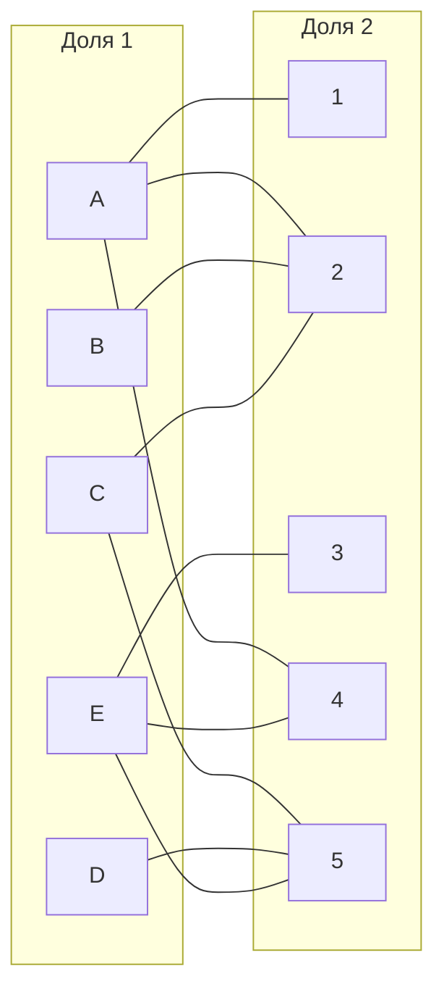
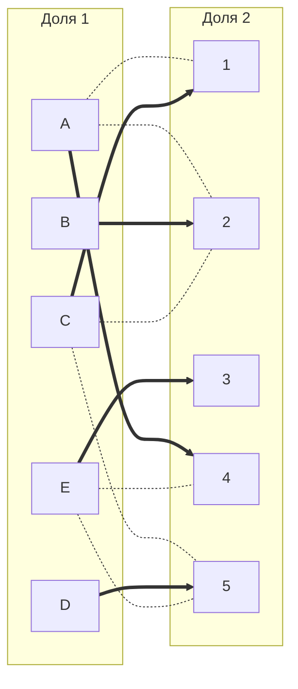

# Задание 8. Задача о назначениях. Венгерский алгоритм - вариант 6
## Исходная матрица затрат:
|       | **1** | **2** | **3** | **4** | **5** |
|-------|:-----:|:-----:|:-----:|:-----:|:-----:|
| **A** |   9    |  7   |  12   |  7    |   8   |
| **B** |   12   |  7   |  12   |  12   |   12  |
| **C** |   8    |  5   |  10   |  8    |   5   |
| **D** |   11   |  10  |  14   |  11   |   6   |
| **E** |   12   |  15  |  10   |  14   |   8   |

## Шаг 1
Выполняем редукцию по строкам:
|       | **1** | **2** | **3** | **4** | **5** |    |
|-------|:-----:|:-----:|:-----:|:-----:|:-----:|:--:|
| **A** |   2    |  0   |  5    |  0    |   1   | -7 |
| **B** |   5    |  0   |  5    |  5    |   5   | -7 |
| **C** |   3    |  0   |  5    |  3    |   0   | -5 |
| **D** |   5    |  4   |  8    |  5    |   0   | -6 |
| **E** |   4    |  7   |  2    |  6    |   0   | -8 |

Выполняем редукцию по столбцам:
|       | **1** | **2** | **3** | **4** | **5** |
|-------|:-----:|:-----:|:-----:|:-----:|:-----:|
| **A** |   0    |  0   |  3    |  0    |   1   |
| **B** |   3    |  0   |  3    |  5    |   5   |
| **C** |   1    |  0   |  3    |  3    |   0   |
| **D** |   3    |  4   |  6    |  5    |   0   |
| **E** |   2    |  7   |  0    |  6    |   0   |
|       |   -2   |  0   |  2    |  0    |   0   |

## Шаг 2
Строим двудольный граф на основе редуцированной матрицы. В графе будут присутствовать только те ребра, которые равны 0 в нашей редуцированной матрице:

## Шаг 3.
В полученном графе ищем совершенное паросочетание
### Шаг 3.1
Выбираем любое начальное паросочетание: [A; 1], [B; 2] [C; 5] [E; 3]

Отобразим это на графе:

```mermaid
graph LR
    subgraph "Доля 1"
        A[A]
        B[B]
        C[C]
        D[D]
        E[E]
    end
    subgraph "Доля 2"
        1[1]
        2[2]
        3[3]
        4[4]
        5[5]
    end
    A ==> 1
    A -.- 2
    A -.- 4
    B ==> 2
    C -.- 2
    C ==> 5
    D -.- 5
    E ==> 3
    E -.- 4
    E -.- 5

    style A fill:#4f4f4f
    style B fill:#4f4f4f
    style C fill:#4f4f4f
    style E fill:#4f4f4f
    style 1 fill:#4f4f4f
    style 2 fill:#4f4f4f
    style 5 fill:#4f4f4f
    style 3 fill:#4f4f4f
```

### Шаг 3.2
Волновым методом пытаемся расширить наше паросочетание:

```mermaid
graph LR
    D(D) -.- 5(5) ==> C(C) -.- 2(2) ==> B(B)
    style 5 fill:#4f4f4f
    style C fill:#4f4f4f
    style B fill:#4f4f4f
    style 2 fill:#4f4f4f
```

### Шаг 3.3
Поскольку мы не смогли найти совершенное паросочетание в нашем графе, то проводим диагональную редукцию:
|       | **2** | **5** | **1** | **3** | **4** |   |
|-------|:-----:|:-----:|:-----:|:-----:|:-----:|:-:|
| **B** | **0**  |**5** |  2    |  2    |   4   |-1 |
| **C** | **0**  |**0** |  0    |  2    |   2   |-1 |
| **D** | **4**  |**0** |  2    |  5    |   4   |-1 |
| **A** |   1    |  2   |**0**  |**3**  | **0** |   |
| **E** |   8    |  1   |**2**  |**0**  | **6** |   |
|       |  +1    | +1   |       |       |       |   |

Возвращаемся к шагу 2.
Строим новый граф

```mermaid
graph LR
    subgraph "Доля 1"
        A[A]
        B[B]
        C[C]
        D[D]
        E[E]
    end
    subgraph "Доля 2"
        1[1]
        2[2]
        3[3]
        4[4]
        5[5]
    end
    A ==> 1
    A -.- 4
    B ==> 2
    C -.- 2
    C ==> 5
    C -.- 1
    D -.- 5
    E ==> 3
    E -.- 4
    

    style A fill:#4f4f4f
    style B fill:#4f4f4f
    style C fill:#4f4f4f
    style E fill:#4f4f4f
    style 1 fill:#4f4f4f
    style 2 fill:#4f4f4f
    style 5 fill:#4f4f4f
    style 3 fill:#4f4f4f
```

Пытаемся увеличить паросочетание волновым методом:

```mermaid
graph LR
    D(D) -.- 5(5) ==> C(C) -.- 1(1) ==> A(A) -.- 4(4)
    C(C) -.- 2(2) ==> B(B)
    style 5 fill:#4f4f4f
    style C fill:#4f4f4f
    style 1 fill:#4f4f4f
    style A fill:#4f4f4f
    style 2 fill:#4f4f4f
    style B fill:#4f4f4f
```

Мы нашли чередующуюся цепь. Перекрашиваем ее и отражаем это на графе:

Получили совершенное паросочетание: [A; 4] [B; 2] [C; 1] [D; 5] [E; 3]
Это паросочетание соответствует нашей начальной матрице затрат. Минимальные затраты = 7+7+8+6+10 = 38 
