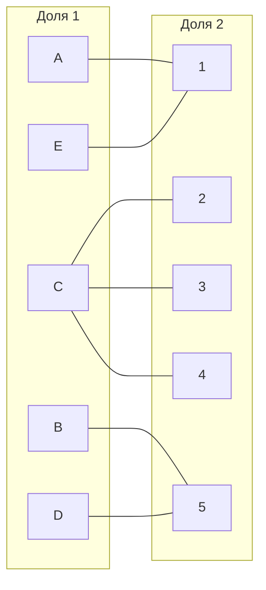
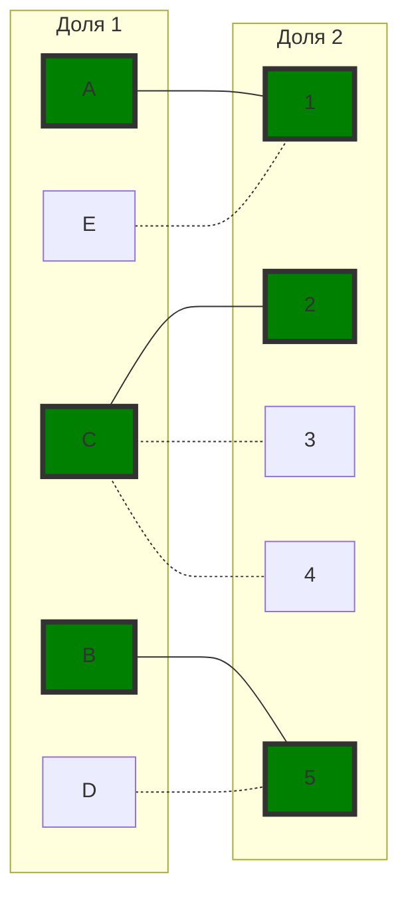
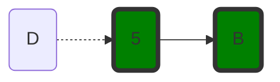
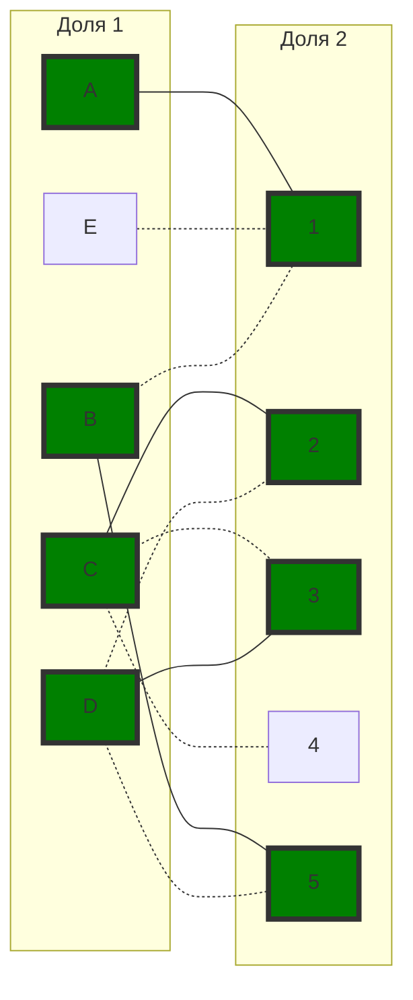
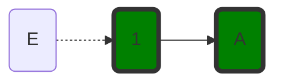
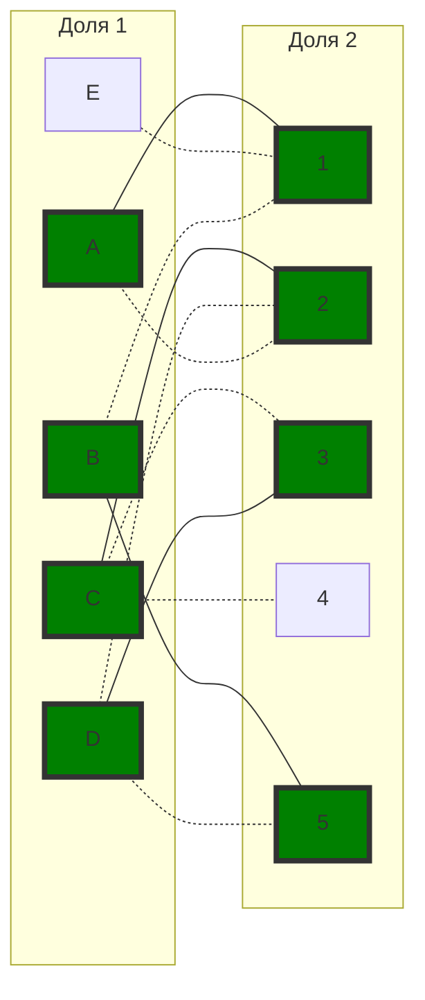
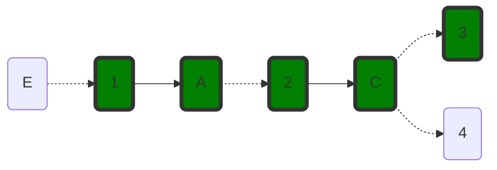
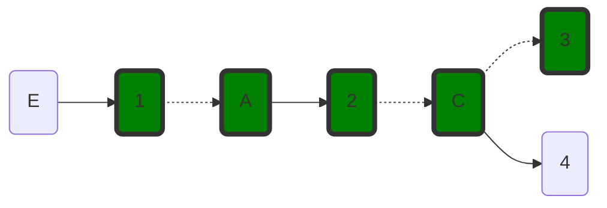
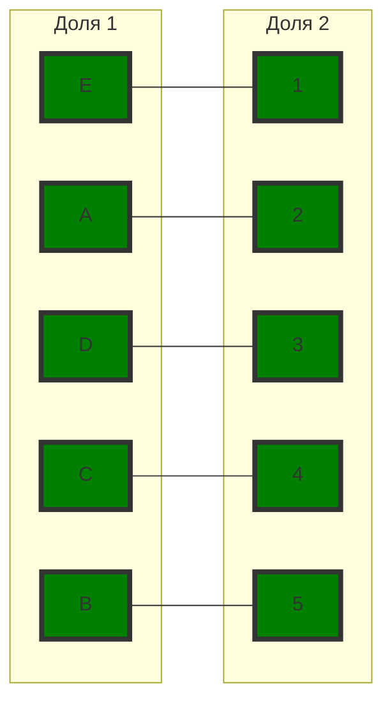

Задание №8. Вариант 4
Команда no-name:
Долгих Юлия
Осока Варвара
Шперкин Савва

#### Матрица затрат:

|       | **1** | **2** | **3** | **4** | **5** |
|-------|:-----:|:-----:|:-----:|:-----:|:-----:|
| **A** |   5   |   6   |  13   |   9   |   6   |
| **B** |   6   |   9   |  15   |  14   |   5   |
| **C** |  13   |   7   |   9   |   8   |  10   |
| **D** |  12   |   6   |   8   |  13   |   5   |
| **E** |   7   |   9   |  14   |  15   |   8   |

### Венгерский алгоритм
#### Шаг 1
Необходимо выполнить редукцию матрицы по строкам и столбцам.
По строкам

|       | **1** | **2** | **3** | **4** | **5** |**Вычитаем** |
|-------|:-----:|:-----:|:-----:|:-----:|:-----:|:-----:|
| **A** |   0   |   1   |   8   |   4   |   1   |-5|
| **B** |   1   |   4   |  10   |   9   |   0   |-5|
| **C** |   6   |   0   |   2   |   1   |   3   |-7|
| **D** |   7   |   1   |   3   |   8   |   0   |-5|
| **E** |   0   |   2   |   7   |   8   |   1   |-7|

По столбцам

|       | **1** | **2** | **3** | **4** | **5** |
|-------|:-----:|:-----:|:-----:|:-----:|:-----:|
| **A** |   0   |   1   |   6   |   3   |   1   |
| **B** |   1   |   4   |   8   |   8   |   0   |
| **C** |   6   |   0   |   0   |   0   |   3   |
| **D** |   7   |   1   |   1   |   7   |   0   |
| **E** |   0   |   2   |   5   |   7   |   1   |
|**Вычитаем**|-|-|-2|-1|-|

#### 2 Шаг
Построить двудольный граф редуцированной матрицы

Паросочетание:
$A-->1$
$C-->2$
$B-->5$

#### 3 Шаг
Строим чередующееся дерево волновым методом

Чередующаяся цепь не найдена.
#### 4 Шаг
Так как чередующаяся цепь не найдена, необходимо применить диагональную редукцию по D, B, 5.

|       | **1** | **2** | **3** | **4** | **5** |
|-------|:-----:|:-----:|:-----:|:-----:|:-----:|
| **A** |   0   |   1   |   6   |   3   |   2   |
| **B** |   0   |   3   |   7   |   7   |   0   |
| **C** |   6   |   0   |   0   |   0   |   4   |
| **D** |   6   |   0   |   0   |   6   |   0   |
| **E** |   0   |   2   |   5   |   7   |   2   |

Паросочетание:
$A-->1$
$C-->2$
$B-->5$
$D-->3$
#### 5 Шаг
Строим чередующееся дерево волновым методом

Чередующееся дерево не получилось.
#### 6 Шаг
Необходимо выполнить диагональную редукцию матрицы по A, E, 1.

|       | **1** | **2** | **3** | **4** | **5** |
|-------|:-----:|:-----:|:-----:|:-----:|:-----:|
| **B** |   1   |   3   |   7   |   7   |   0   |
| **C** |   7   |   0   |   0   |   0   |   4   |
| **D** |   7   |   0   |   0   |   6   |   0   |
| **A** |   0   |   0   |   5   |   2   |   1   |
| **E** |   0   |   1   |   4   |   6   |   1   |

#### 7 Шаг
Строим чередующееся дерево волновым методом.

Чередующаяся цепь найдена.
Перекрашиваем её.

Совершенное паросочетание найдено.
$A-->2$
$B-->5$
$C-->4$
$D-->3$
$E-->1$

Ответ:
$A-->2(6)$
$B-->5(5)$
$C-->4(8)$
$D-->3(8)$
$E-->1(7)$