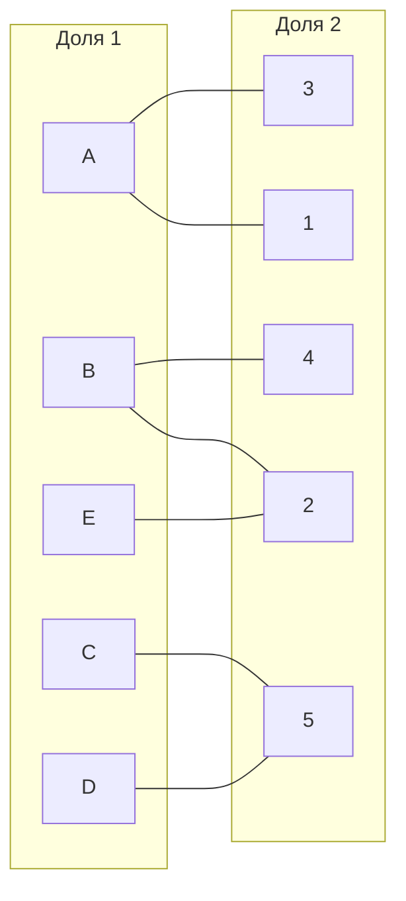
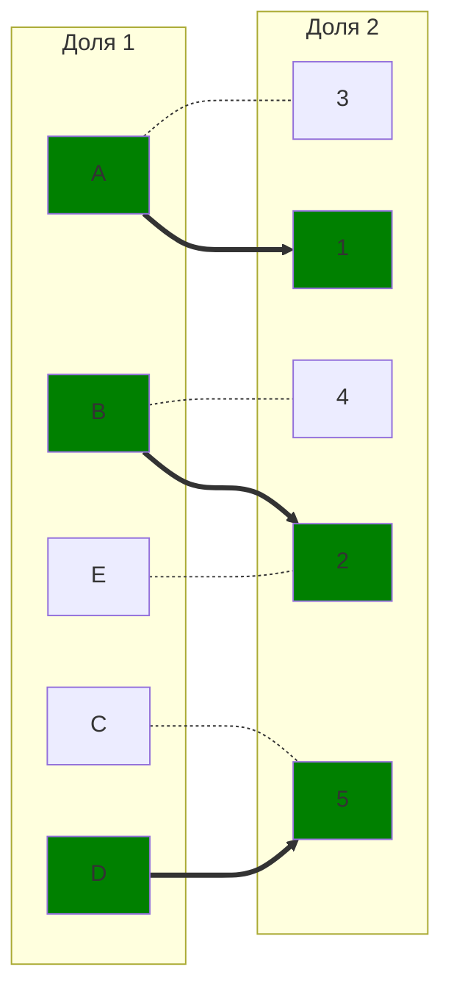
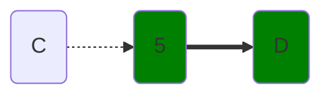
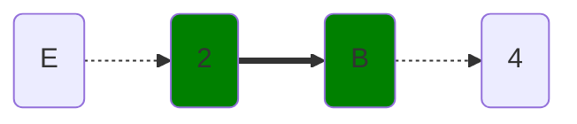
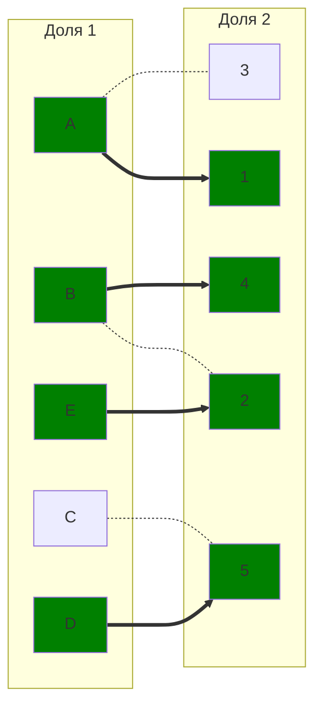
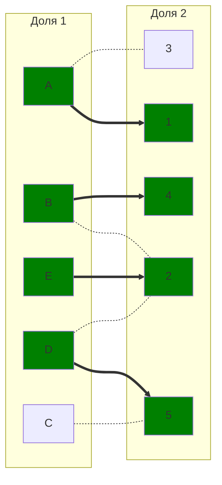
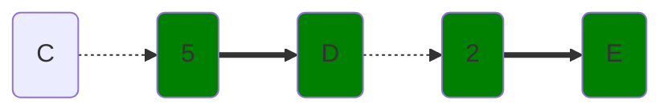
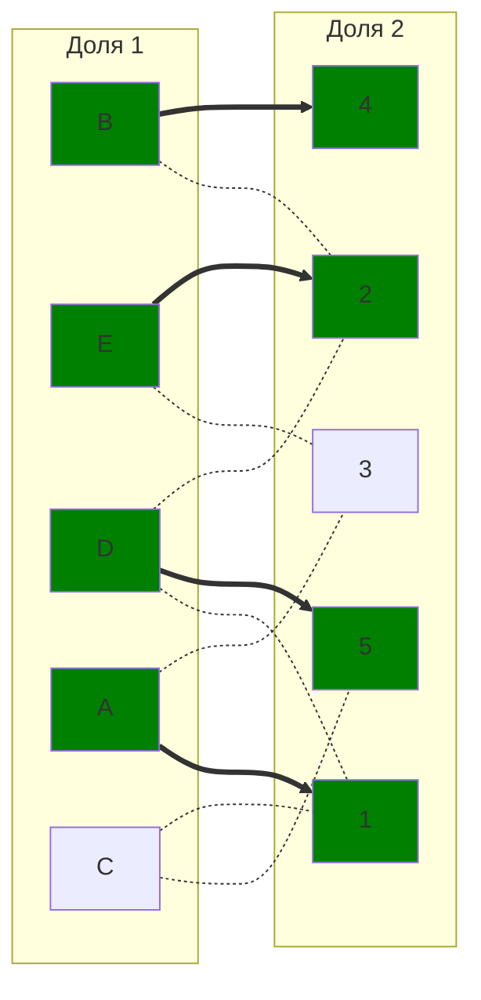
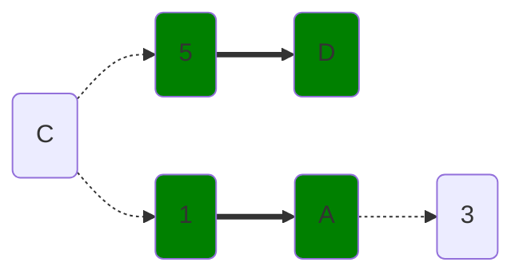
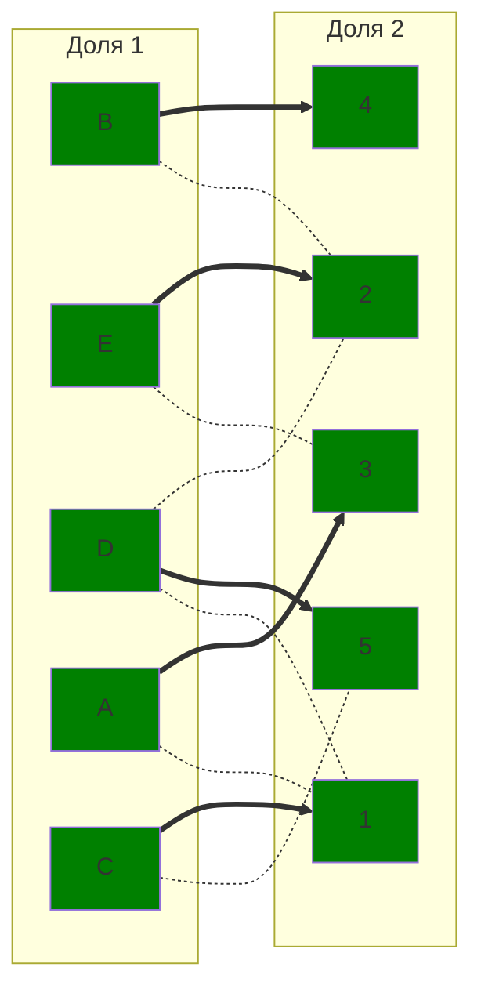

# Задание 8. Задача о назначениях. Венгерский алгоритм
### Вариант 8:
#### Матрица затрат:

|       | **1** | **2** | **3** | **4** | **5** |
|-------|:-----:|:-----:|:-----:|:-----:|:-----:|
| **A** |  12   |  11   |  10   |  13   |  14   |
| **B** |  10   |   6   |  12   |   7   |  15   |
| **C** |   9   |   7   |  15   |  14   |   5   |
| **D** |  11   |   8   |  11   |  14   |   7   |
| **E** |  13   |   5   |   6   |   9   |  10   |

## Этап I. Выполняем редукцию матрицы затрат по строкам и столбцам.
### Редукция по строкам
В каждой строке выбираем минимальное чило и вычитаем его из всей строки.

|       | **1** | **2** | **3** | **4** | **5** | **Редукция** |
|-------|:-----:|:-----:|:-----:|:-----:|:-----:|:-----:|
| **A** |   12   |  11   |  10  |   13  |   14   |  **-10**   |
| **B** |  10   |  6   |  12   |  7   |   15   |  **-6**   |
| **C** |  9   | 7   |  15   |  14   |   5   |  **-5**   |
| **D** |  11   |   8   |  11   |  14   |  7   |  **-7**   |
| **E** |   13  |  5   |  6   |  9   |   10   |  **-5**   |

Результат:

|       | **1** | **2** | **3** | **4** | **5** |
|-------|:-----:|:-----:|:-----:|:-----:|:-----:|
| **A** |   2   |   1   |   0   |   3   |   4   |
| **B** |   4   |   0   |   6   |   1   |   9   |
| **C** |   4   |   2   |   10  |   9   |   0   |
| **D** |   4   |   1   |   4   |   7   |   0   |
| **E** |   8   |   0   |   1   |   4   |   5   |

### Редукция по столбцам
|       | **1** | **2** | **3** | **4** | **5** |
|:-----:|:-----:|:-----:|:-----:|:-----:|:-----:|
| **A** |   2   |   1   |   0   |   3   |   4   |
| **B** |   4   |   0   |   6   |   1   |   9   |
| **C** |   4   |   2   |   10  |   9   |   0   |
| **D** |   4   |   1   |   4   |   7   |   0   |
| **E** |   8   |   0   |   1   |   4   |   5   |
| **Редукция** |**-2**|     |   |   **-1**   |       |

Результат:
|       | **1** | **2** | **3** | **4** | **5** |
|-------|:-----:|:-----:|:-----:|:-----:|:-----:|
| **A** |   0   |   1   |   0   |   2   |   4   |
| **B** |   2   |   0   |   6   |   0   |   9   |
| **C** |   2   |   2   |   10  |   8   |   0   |
| **D** |   2   |   1   |   4   |   6   |   0   |
| **E** |   6   |   0   |   1   |   3   |   5   |

## Этап II. Строим двудольный граф на основе редуцированной матрицы.

Ребра, обозначенная нулём в матрице будут присутствовать в нащшем двудольном графе, все остальные – нет.

## Этап III. В построенном двудольном графе ищем соврешенное парсочетание.
### Выбираем начальное паросочетание
Для начала исполнения алгоритма необходимо выбрать стартовое паросочетание, с которым начнём искать чередующуюся цепь.
Этим паросочетанием будет следующий набор рёбер:

$[A;1], [B; 2], [D; 5]$ 

Отобразим на двудольном графе. Пунктирное ребро – 'светлое' ребро, а толстое ребро – 'тёмное'. Зеленая вершина – 'тёмная', серая вершина – 'светлая'.

### Ищем чередующуюся цепь волновым методом.

Чередующаяся цепь найдена. Это: $E-2-B-4$.
Перекравшиваем ребра этой цепи в двудольном графе.

### Ищем чередующуюся цепь волновым методом.

Дальнейшее постороение цепи невозможно, необходимо произвести диаганальную редукцию.

$X=\{D;C\}$

$Y=\{5\}$

$\neg(Y)=\{1;2;3;4\}$

### Диаганальная редукция.
Вычитаем из строк множества $X$ минимальное значение пересечение моножества $X$ и $\neg(Y)$, а в столбцы $Y$ это значение добавляем.
|       | **1** | **2** | **3** | **4** | **5** |**Редукция** |
|:-----:|:-----:|:-----:|:-----:|:-----:|:-----:|:-----:|
| **A** |   0   |   1   |   0   |   2   |   4   |
| **B** |   2   |   0   |   6   |   0   |   9   |   |
| **C** |   <ins>2</ins>    |   <ins>2</ins>    |  <ins>10</ins>    |   <ins>8</ins>    |   0   |  **-1**   |
| **D** |   <ins>2</ins>    |   <ins>1</ins>    |   <ins>4</ins>    |   <ins>6</ins>    |   0   | **-1** |
| **E** |   6   |  0    |   1   |  3    |   5   |     |
| **Редукция** |       |     |   |     | **+1**    |

Результат:
|       | **1** | **2** | **3** | **4** | **5** |
|-------|:-----:|:-----:|:-----:|:-----:|:-----:|
| **A** |   0   |   1   |   0   |   2   |   5   |
| **B** |   2   |   0   |   6   |   0   |   10  |
| **C** |   1   |   1   |   9   |   7   |   0   |
| **D** |   1   |   0   |   3   |   5   |   0   |
| **E** |   6   |   0   |   1   |   3   |   6   |

Добавляем новые ребра $[D;2]$ в двудольный граф.
 

### Ищем чередующуюся цепь волновым методом.

Дальнейшее постороение цепи невозможно, необходимо произвести диаганальную редукцию.

$X=\{C;D;E\}$

$Y=\{5;2\}$

$\neg(Y)=\{1;3;4\}$

### Диаганальная редукция.
Вычитаем из строк множества $X$ минимальное значение пересечение моножества $X$ и $\neg(Y)$, а в столбцы $Y$ это значение добавляем.
|       | **1** | **2** | **3** | **4** | **5** |**Редукция** |
|:-----:|:-----:|:-----:|:-----:|:-----:|:-----:|:-----:|
| **A** |   0   |   1   |   0   |   2   |   5   |
| **B** |   2   |   0   |   6   |   0   |  10   |   |
| **C** |   <ins>1</ins>    |   1    |  <ins>9</ins>    |   <ins>7</ins>    |   0   |  **-1**   |
| **D** |   <ins>1</ins>    |   0   |   <ins>3</ins>    |   <ins>5</ins>    |   0   | **-1** |
| **E** |   <ins>6</ins>   |  0    |   <ins>1</ins>   |  <ins>3</ins>    |   6   | **-1** |
| **Редукция** |       |**+1** |   |     | **+1**    |

Результат:
|       | **1** | **2** | **3** | **4** | **5** |
|-------|:-----:|:-----:|:-----:|:-----:|:-----:|
| **A** |   0   |   2   |   0   |   2   |   6   |
| **B** |   2   |   1   |   6   |   0   |   11  |
| **C** |   0   |   1   |   8   |   6   |   0   |
| **D** |   0   |   0   |   2   |   4   |   0   |
| **E** |   5   |   0   |   0   |   2   |   6   |

Добавляем новые ребра $[C;1], [D; 1], [E; 3]$ в двудольный граф.

### Ищем чередующуюся цепь волновым методом.

Чередующаяся цепь найдена. Это: $C-1-A-3$.
Перекравшиваем ребра этой цепи в двудольном графе.

# Ответ
Совершенное паросочетание найдено. Это:

$[A;3], [B; 4], [C; 1], [D; 5], [E; 2]$

Минимальная сумма выполнения работ – **38**.
