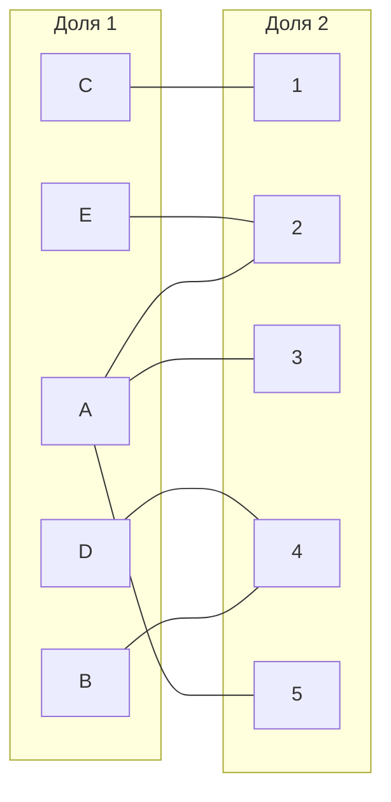
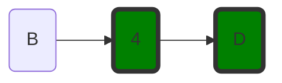
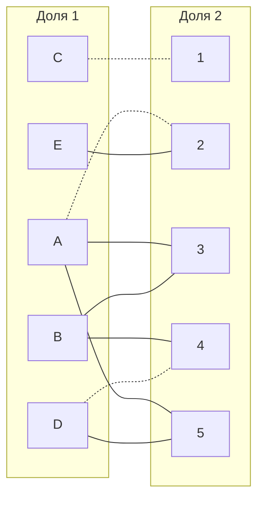
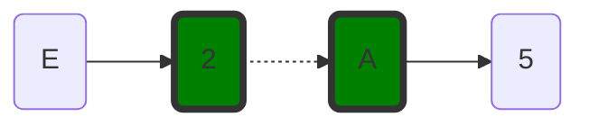
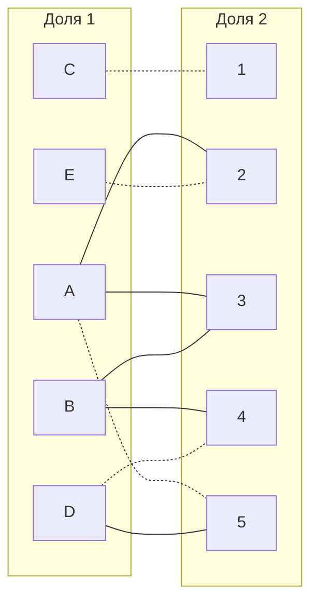
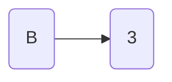
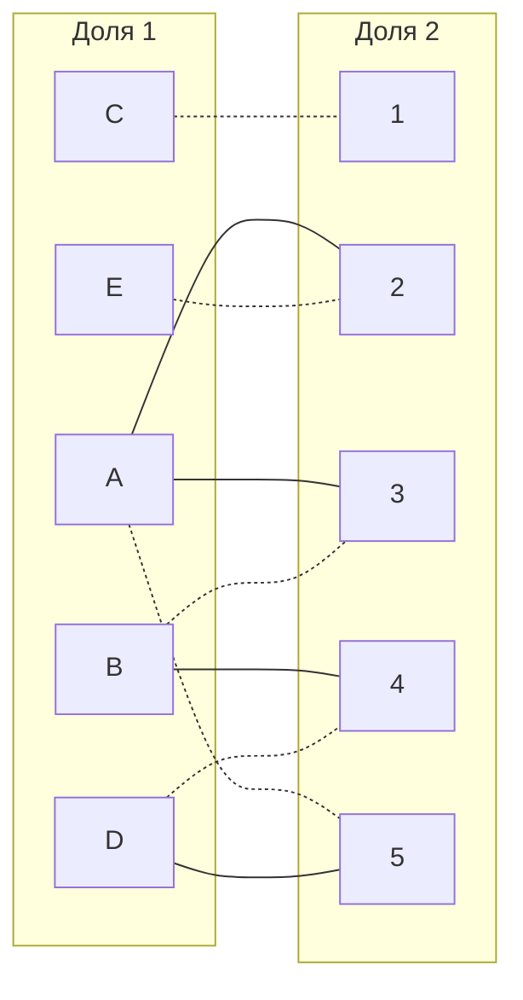

## Задание 8. ootd вариант 11

Дана матрица затрат для задач A, B, C, D, E и исполнителей 1, 2, 3, 4, 5:

|       | **1**  | **2** | **3** | **4** | **5** |
|-------|:-----: |:-----:|:-----:|:-----:|:-----:|
| **A** |   15   |   9   |   11  |   12  |   11  |
| **B** |   11   |   13  |   11  |   7   |   14  |
| **C** |   5    |   14  |   11  |   6   |   14  |
| **D** |   14   |   13  |   14  |   5   |   9   |
| **E** |   8    |   6   |   15  |   12  |   12  |

1. Выполним редукцию матрицы затрат по строкам и по столбцам.

|       | **1**  | **2** | **3** | **4** | **5** | **Min** |
|-------|:-----: |:-----:|:-----:|:-----:|:-----:|:-------:|
| **A** |   6    |   0   |   2   |   3   |   2   |   -9    |
| **B** |   4    |   6   |   4   |   0   |   7   |   -7    |
| **C** |   0    |   9   |   6   |   1   |   9   |   -5    |
| **D** |   9    |   8   |   9   |   0   |   4   |   -5    |
| **E** |   2    |   0   |   9   |   6   |   6   |   -6    |

|       | **1**  | **2** | **3** | **4** | **5** | **Min** |
|-------|:-----: |:-----:|:-----:|:-----:|:-----:|:-------:|
| **A** |   6    |   0   |   0   |   3   |   0   |   -0    |
| **B** |   4    |   6   |   2   |   0   |   5   |   -0    |
| **C** |   0    |   9   |   4   |   1   |   7   |   -2    |
| **D** |   9    |   8   |   7   |   0   |   2   |   -0    |
| **E** |   2    |   0   |   7   |   6   |   4   |   -2    |

Получим редуцированную матрицу, где нули обозначают наименее затратные варианты назначений.

|       | **1**  | **2** | **3** | **4** | **5** | 
|-------|:-----: |:-----:|:-----:|:-----:|:-----:|
| **A** |   6    |   0   |   0   |   3   |   0   |  
| **B** |   4    |   6   |   2   |   0   |   5   |   
| **C** |   0    |   9   |   4   |   1   |   7   |   
| **D** |   9    |   8   |   7   |   0   |   2   |   
| **E** |   2    |   0   |   7   |   6   |   4   |   

###2. Строим двудольный граф и ищем в нем паросочетание

###Пусть начальное паросочетание C --- 1, A --- 2, D --- 4 

###Запускаем волновой метод, непокрытая вершина B

Чередующая цепь не найдена. Применяем диагональную редукцию к матрице

|       | 1  | 2 | 3 | 4 | 5 | 
|-------|:-----: |:-----:|:-----:|:-----:|:-----:|
| A |   6    |   0   |   0   |   3   |   0   |  
| B |   4    |   6   |   2   |   0   |   5   |   
| C |   0    |   9   |   4   |   1   |   7   |   
| D |   9    |   8   |   7   |   0   |   2   |   
| E |   2    |   0   |   7   |   6   |   4   | 

|       | 4  | 1 | 2 | 3 | 5 | 
|-------|:-----: |:-----:|:-----:|:-----:|:-----:|
| B |   0    |  "4"  |  "6"  |  "2"  |  "5"  | 
| D |   0    |  "9"  |  "8"  |  "7"  |  "2"  |           
| A |  "3"   |   6   |   0   |   0   |   0   |   
| C |  "1"   |   0   |   9   |   4   |   7   |   
| E |  "6"   |   2   |   0   |   7   |   4   | 

К числам 3 1 6 добавляем 2.  Из чисел 4 6 2 5 9 8 7 2 вычитаем 2

|       | 4  | 1 | 2 | 3 | 5 | 
|-------|:-----: |:-----:|:-----:|:-----:|:-----:|
| B |   0    |   2   |   4   |   0   |   3   |   
| D |   0    |   7   |   6   |   5   |   0   |           
| A |  "5"   |   6   |   0   |   0   |   0   |   
| C |  "3"   |   0   |   9   |   4   |   7   |   
| E |  "8"   |   2   |   0   |   7   |   4   |

Добавились ребра B3 и D5.
Непокрытая вершина E. Запускаем волновой метод

Нашли чередующуюся цепь.
"Перекрасим" найденную цепь, темными стали ребра E2, A5.

Запускаем волновой метод для B:

черед цепь найдена."Перекрасим" B3

Полученное расписание является совершенным. Выпишем полученные назначения и их стоимости из исходной матрицы:
- C1 - 5
- A5 - 11
- B3 - 11
- D4 - 5
- E2 - 6

Общая стоимость затрат = 5 + 11 + 11 + 5 + 6 = 38.

## Ответ
Минимальная стоимость затрат 38, при следующих назначениях:
- задача B, исполнитель 3,
- задача A, исполнитель 5,
- задача C, исполнитель 1,
- задача E, исполнитель 2,
- задача D, исполнитель 4.