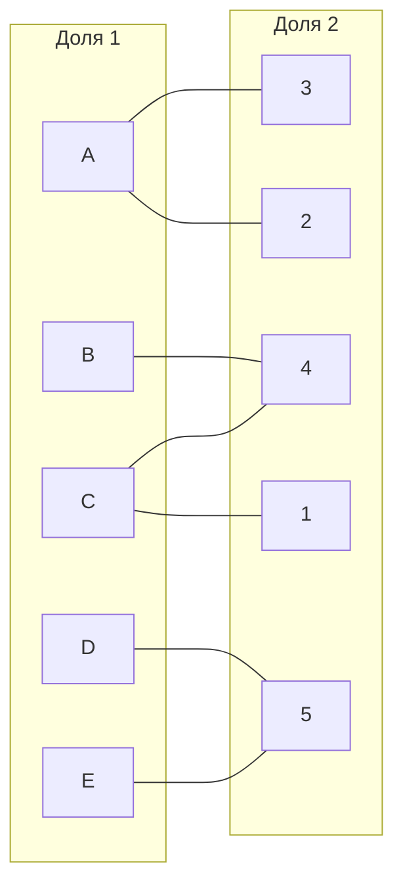
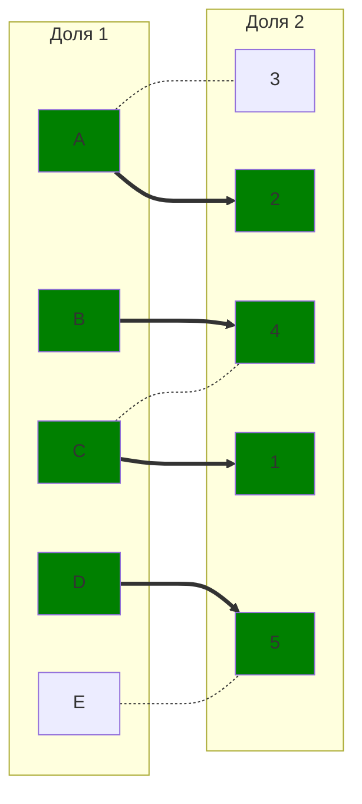
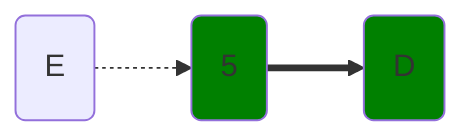
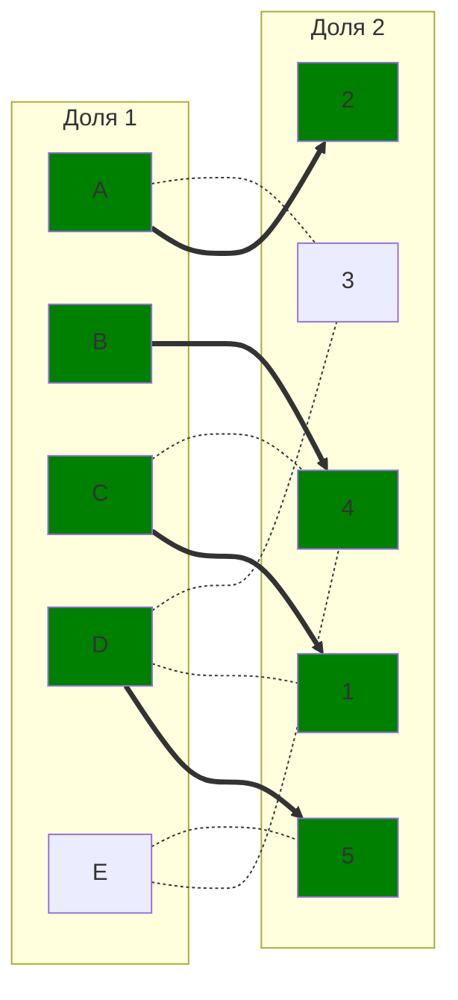
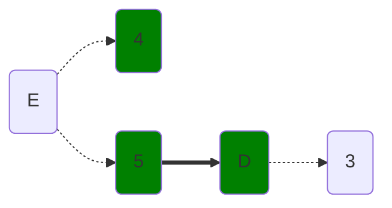
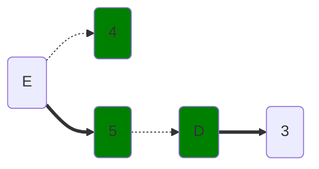
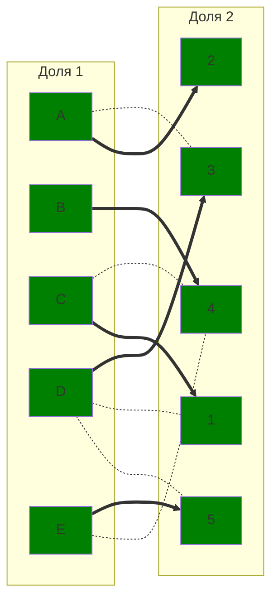
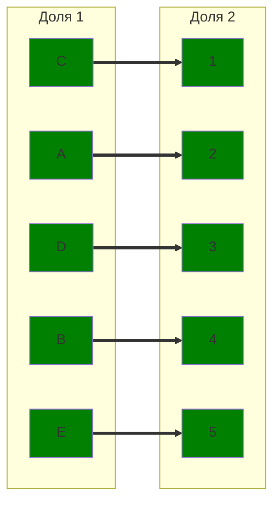

# Задание №8. Команда Second.
### Постановка задачи:
1. Дан полный двудольный граф, в котором каждое ребро имеет определенную стоимость. Вершины первой доли представляют задачи, вершины второй доли исполнителей. Стоимость ребра определяет затраты при выполнении соответствующей задачи соответствующим исполнителем. 
2. Затраты неотрицательны и представлены в виде матрицы затрат, в которой на пересечении i-й строки и j-го столбца указаны затраты j-го исполнителя на выполнение i-го задания.
3. Необходимо назначить исполнителей на задачи таким образом, чтобы общая стоимость затрат была минимальной.
4. Задача сводится к нахождению совершенного паросочетания с минимальной суммарной стоимостью в двудольном графе.

### Вариант 2:
#### Матрица затрат:

|       | **1** | **2** | **3** | **4** | **5** |
|-------|:-----:|:-----:|:-----:|:-----:|:-----:|
| **A** |   9   |   8   |   7   |  14   |  14   |
| **B** |  13   |  13   |  14   |   6   |  12   |
| **C** |   7   |   8   |   9   |   6   |   7   |
| **D** |   8   |   9   |   7   |   9   |   5   |
| **E** |   9   |   9   |  14   |   7   |   5   |

#### Этап 1: Редукция матрицы по строкам и столбцам.

|       | **1** | **2** | **3** | **4** | **5** |**Вычитаем** |
|-------|:-----:|:-----:|:-----:|:-----:|:-----:|:-----:|
| **A** |   2   |   1   |   0   |   7   |   7   |-7|
| **B** |   7   |   7   |   8   |   0   |   6   |-6|
| **C** |   1   |   2   |   3   |   0   |   1   |-6|
| **D** |   3   |   4   |   2   |   4   |   0   |-5|
| **E** |   4   |   4   |   9   |   2   |   0   |-5|

|       | **1** | **2** | **3** | **4** | **5** |
|-------|:-----:|:-----:|:-----:|:-----:|:-----:|
| **A** |   1   |   0   |   0   |   7   |   7   |
| **B** |   6   |   6   |   8   |   0   |   6   |
| **C** |   0   |   1   |   3   |   0   |   1   |
| **D** |   2   |   3   |   2   |   4   |   0   |
| **E** |   3   |   3   |   9   |   2   |   0   |
|**Вычитаем**|-1|-1||||

#### Этап 2: Построение двудольного графа редуцированной матрицы

#### Этап 3: Начальное паросочетаний 

$[A;2], [B; 4], [C; 1], [D; 5]$ 

### Чередующаяся цепь волновым методом.

### Диагональная редукция.

|       | **1** | **2** | **3** | **4** | **5** |**Редукция** |
|:-----:|:-----:|:-----:|:-----:|:-----:|:-----:|:-----:|
| **A** |   1   |   0   |   0   |   7   |   7   |
| **B** |   6   |   6   |   8   |   0   |   6   |  
| **C** |   0   |   1   |   3   |   0   |   1   |  
| **D** |   <ins>2</ins>   |   <ins>3</ins>   |   <ins>2</ins>   |   <ins>4</ins>   |   0   |  **-2**   |
| **E** |   <ins>3</ins>   |   <ins>3</ins>   |   <ins>9</ins>   |   <ins>2</ins>   |   0   |  **-2**   |
| **Редукция** |       |     |   |     | **+2**    |

|       | **1** | **2** | **3** | **4** | **5** |
|-------|:-----:|:-----:|:-----:|:-----:|:-----:|
| **A** |   1   |   0   |   0   |   7   |   9   |
| **B** |   6   |   6   |   8   |   0   |   8   |
| **C** |   0   |   1   |   3   |   0   |   3   |
| **D** |   0   |   1   |   0   |   2   |   0   |
| **E** |   1   |   1   |   7   |   0   |   0   |

#### Этап 4: Добавление новых ребер в граф

$[D;1], [D; 3], [E; 4]$

### Чередующаяся цепь волновым методом.

#### Этап 5: Чередующаяся цепь - $E-5-D-3$.

# Ответ
Совершенное паросочетание - $[A;2], [B; 4], [C; 1], [D; 3], [E; 5].$

Ответ:
$A=2(8);$
$B=4(6);$
$C=1(7);$
$D=3(7);$
$E=5(5).$

Минимальная сумма – 7+6+7+5+9=**33**.