# Задание 8. Задача о назначениях. Венгерский алгоритм - вариант 9. Команда Synergy
## Исходная матрица затрат:
|       | **1** | **2** | **3** | **4** | **5** |
|-------|:-----:|:-----:|:-----:|:-----:|:-----:|
| **A** | 14 | 12 | 9 | 14 | 5 |
| **B** | 15 | 8 | 7 | 5 | 9 |
| **C** | 7 | 14 | 14 | 15 | 11 |
| **D** | 5 | 10 | 12 | 7 | 6 |
| **E** | 15 | 6 | 10 | 12 | 9 |

## Этап I. Выполняем редукцию матрицы затрат по строкам и столбцам.
### Редукция по строкам
В каждой строке мы должны выбрать минимальное число и вычесть его из всей строки 
В первой строке наименьшее число равно 5, во второй - 5, в третьей - 7, в четвёртой - 5, в пятой - 6

Результат редукции по строкам:
|       | **1** | **2** | **3** | **4** | **5** |
|-------|:-----:|:-----:|:-----:|:-----:|:-----:|
| **A** | 9 | 7 | 4 | 9 | 0 |
| **B** | 10 | 3 | 2 | 0 | 4 |
| **C** | 0 | 7 | 7 | 8 | 4 |
| **D** | 0 | 5 | 7 | 2 | 1 |
| **E** | 9 | 0 | 4 | 6 | 3 |

### Редукция по столбцам
В первом, втором, четвёртом и пятом столбце уже есть 0, поэтому вычитаем только из 3 столбца
Наименьшее число в 3 столбце равно 2.

Результат редукции по столбцам:
|       | **1** | **2** | **3** | **4** | **5** |
|-------|:-----:|:-----:|:-----:|:-----:|:-----:|
| **A** | 9 | 7 | 2 | 9 | 0 |
| **B** | 10 | 3 | 0 | 0 | 4 |
| **C** | 0 | 7 | 5 | 8 | 4 |
| **D** | 0 | 5 | 5 | 2 | 1 |
| **E** | 9 | 0 | 2 | 6 | 3 |

## Этап II. Строим двудольный граф на основе редуцированной матрицы.
Ребра, обозначенная нулём в матрице будут присутствовать в нащшем двудольном графе, все остальные – нет.

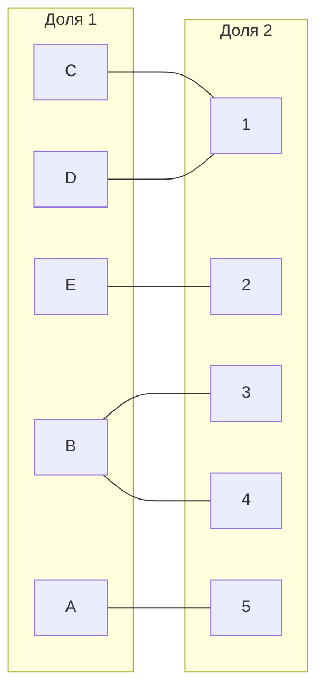

В построенном двудольном графе ищем соврешенное парсочетание.
Пусть это будет: $A-->5$
$E-->2$

Отобразим это на графе.
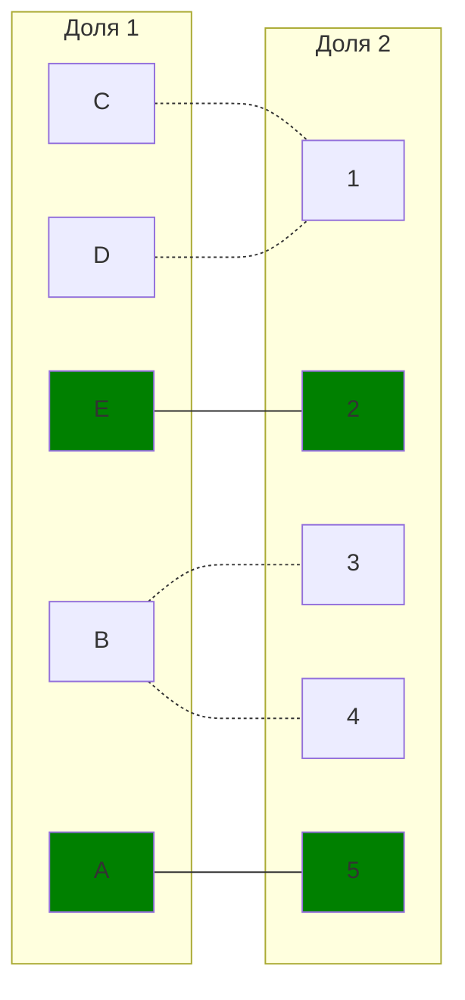

## Этап III. Строим чередующееся дерево волновым методом
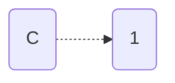
Чередующаяся цепь $C-->1$
Перекрасим $C-->1$

### Граф после первого волнового запуска
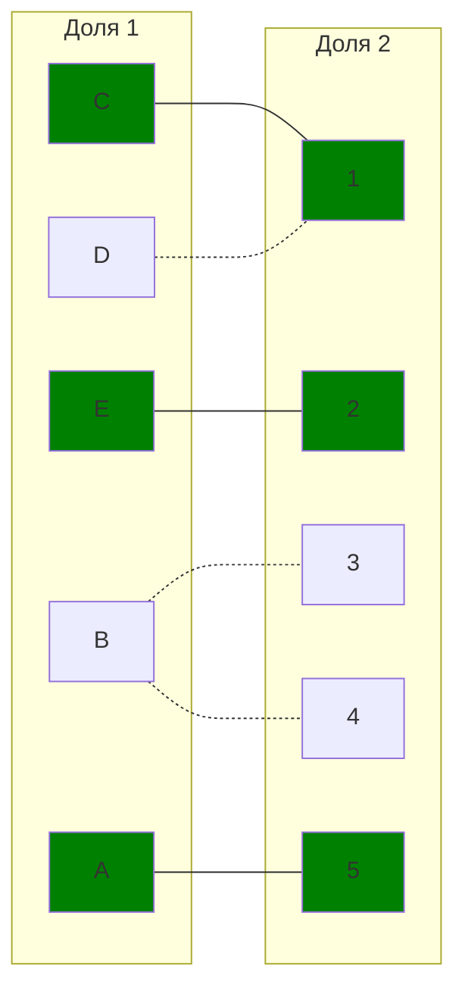

### Второй волновой запуск
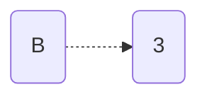
Чередующаяся цепь $B-->3$
Перекрасим $B-->3$

### Граф после второго волнового запуска
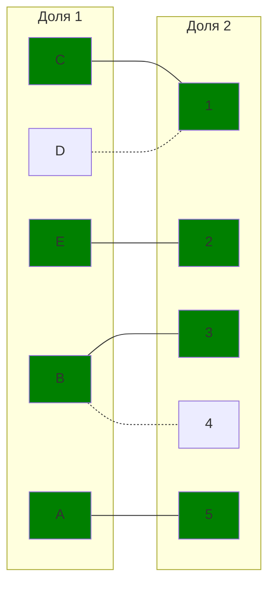

### Третий волновой запуск
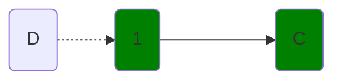
Построение завершено, так как нет 3 фронта

## Этап IV. Диагональная редукция
### Матрица до диагональной редукции 
|       | **1** | **2** | **3** | **4** | **5** |
|-------|:-----:|:-----:|:-----:|:-----:|:-----:|
| **A** | 9 | 7 | 2 | 9 | 0 |
| **B** | 10 | 3 | 0 | 0 | 4 |
| **C** | 0 | 7 | 5 | 8 | 4 |
| **D** | 0 | 5 | 5 | 2 | 1 |
| **E** | 9 | 0 | 2 | 6 | 3 |

|       | **1** | **2** | **3** | **4** | **5** |
|-------|:-----:|:-----:|:-----:|:-----:|:-----:|
| **A** | 9 | 7 | 2 | 9 | 0 |
| **B** | 10 | 3 | 0 | 0 | 4 |
| **E** | 9 | 0 | 2 | 6 | 3 |
| **C** | 0 | 7 | 5 | 8 | 4 |
| **D** | 0 | 5 | 5 | 2 | 1 |

### Матрица после диагональной редукции 
|       | **1** | **2** | **3** | **4** | **5** |
|-------|:-----:|:-----:|:-----:|:-----:|:-----:|
| **A** | 10 | 7 | 2 | 9 | 0 |
| **B** | 11 | 3 | 0 | 0 | 4 |
| **E** | 10 | 0 | 2 | 6 | 3 |
| **C** | 0 | 6 | 4 | 7 | 3 |
| **D** | 0 | 4 | 4 | 1 | 0 |

### Граф после диагональной редукции
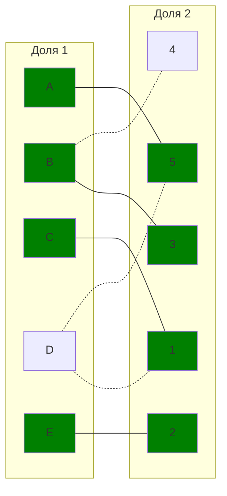
### Строим чередующееся дерево волновым методом.
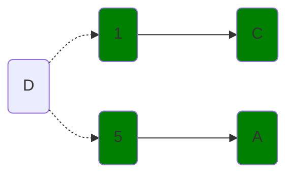

### Вторая диагональная редукция
|       | **1** | **2** | **3** | **4** | **5** |
|-------|:-----:|:-----:|:-----:|:-----:|:-----:|
| **A** | 10 | 7 | 2 | 9 | 0 |
| **B** | 11 | 3 | 0 | 0 | 4 |
| **E** | 10 | 0 | 2 | 6 | 3 |
| **C** | 0 | 6 | 4 | 7 | 3 |
| **D** | 0 | 4 | 4 | 1 | 0 |

|       | **1** | **2** | **3** | **4** | **5** |
|-------|:-----:|:-----:|:-----:|:-----:|:-----:|
| **A** | 10 | 7 | 2 | 9 | 0 |
| **C** | 0 | 6 | 4 | 7 | 3 |
| **D** | 0 | 4 | 4 | 1 | 0 |
| **B** | 11 | 3 | 0 | 0 | 4 |
| **E** | 10 | 0 | 2 | 6 | 3 |

|       | **1** | **5** | **2** | **3** | **4** |
|-------|:-----:|:-----:|:-----:|:-----:|:-----:|
| **A** | 10 | 0 | 7 | 2 | 9 |
| **C** | 0 | 3 | 6 | 4 | 7 |
| **D** | 0 | 0 | 4 | 4 | 1 |
| **B** | 11 | 4 | 3 | 0 | 0 |
| **E** | 10 | 3 | 0 | 2 | 6 |

|       | **1** | **5** | **2** | **3** | **4** |
|-------|:-----:|:-----:|:-----:|:-----:|:-----:|
| **A** | 10 | 0 | 6 | 1 | 8 |
| **C** | 0 | 3 | 5 | 3 | 6 |
| **D** | 0 | 0 | 3 | 3 | 0 |
| **B** | 12 | 5 | 3 | 0 | 0 |
| **E** | 11 | 4 | 0 | 2 | 6 |

### Граф после диагональной редукции
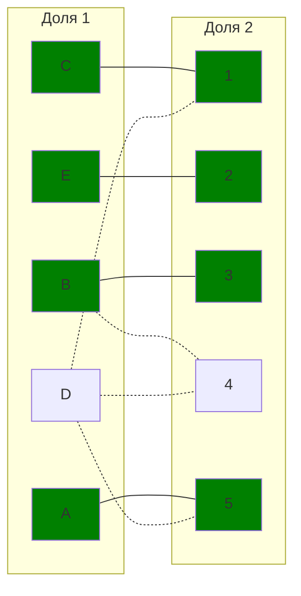

### Строим чередующееся дерево волновым методом.
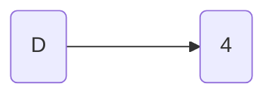
Чередующаяся цепь $D-->4$
Перекрасим $D-->4$

### Граф после волнового запуска
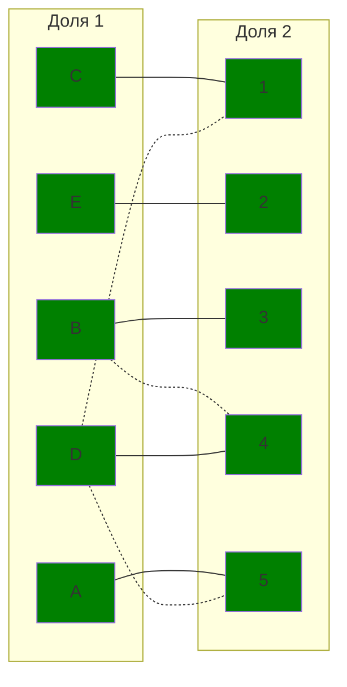

Совершенное паросочетание  $A-->5$, $B-->3$, $C-->1$, $D-->4$, $E-->2$. Это оптимальные назначения
$A-->5$

Ответ: $A-->5(5)$
$B-->3(7)$
$C-->1(7)$
$D-->4(7)$
$E-->2(6)$
Минимальная сумма выполнения работ – **32**.