# Задание №9
# Пропускная способность дуг сети: вариант 6
#### Пропускная способность дуг сети:

|          Дуги          | sa | sb | sc | ba | bc | cd | dt | ac | at |
|:----------------------:|:--:|:--:|:--:|:--:|:--:|:--:|:--:|:--:|:--:|
| Пропускная способность | 6  | 4  | 6  | 5  | 5  | 10 | 8  | 5  | 8  |

### 1. Построим сеть с источником **s**, стоком **t** и указанными пропускными способностями дуг.

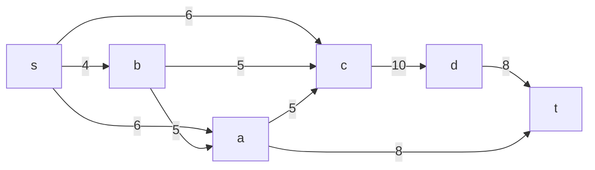

Построим остаточную сеть. Так как изначально поток в сети не задан, все дуги сети являются пустыми (локальный поток равен нулю), соответственно в остаточную сеть необходимо вынести обратную дугу с весом равным пропускной способности. 

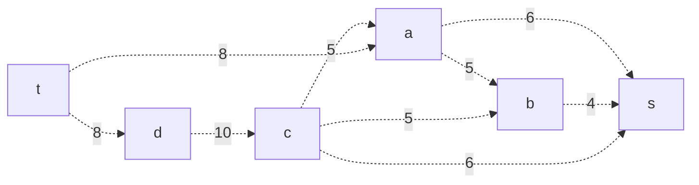

### 2. Проведем поиск увеличивающего пути в остаточной сети
В остаточной сети найден увеличивающий путь t -> a -> s. Минимальный вес дуг на этом пути равен 6.
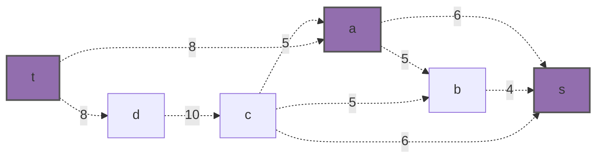

Обновляем остаточную сеть:
a -> s : 0
t -> a : 2

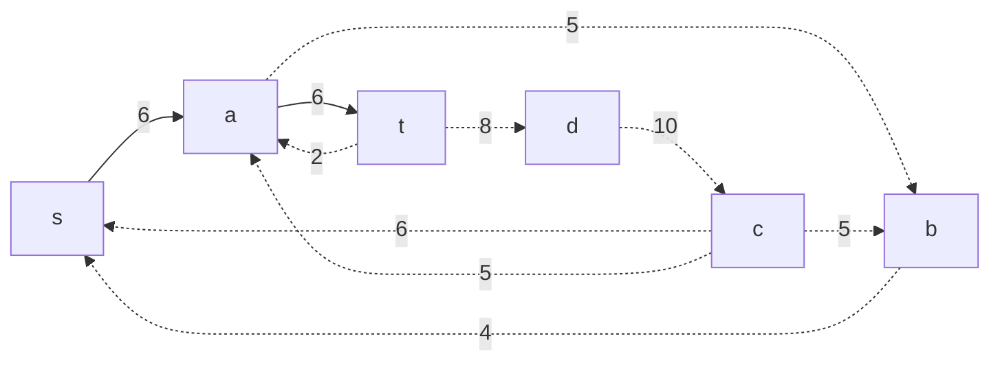

### 3. Продолжим поиск увеличивающего пути в остаточной сети

В остаточной сети найден увеличивающий путь t -> d -> c -> b -> s. Минимальный вес дуг на этом пути равен 4.
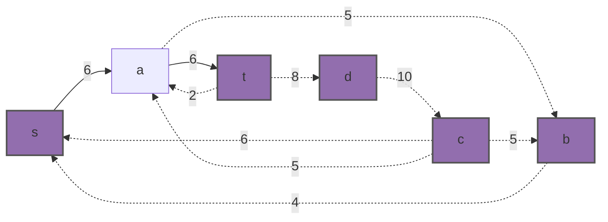

Обновляем поток s -> b: 0 , b ->c: 1, c->d: 6, d->t: 4

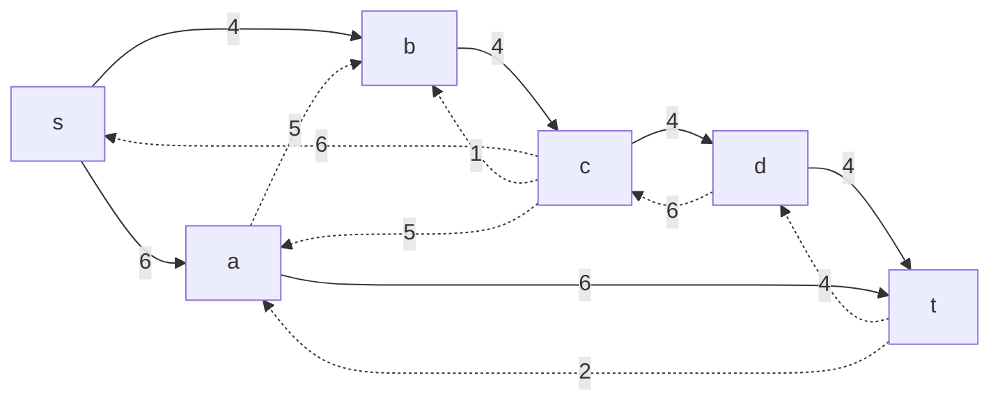

Скорректируем соответствующим образом локальные потоки в исходной сети.

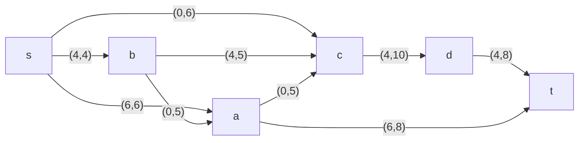

### 4. Продолжим поиск увеличивающего пути в остаточной сети

В остаточной сети найден увеличивающий путь t -> d -> c -> s. Минимальный вес дуг на этом пути равен 4.
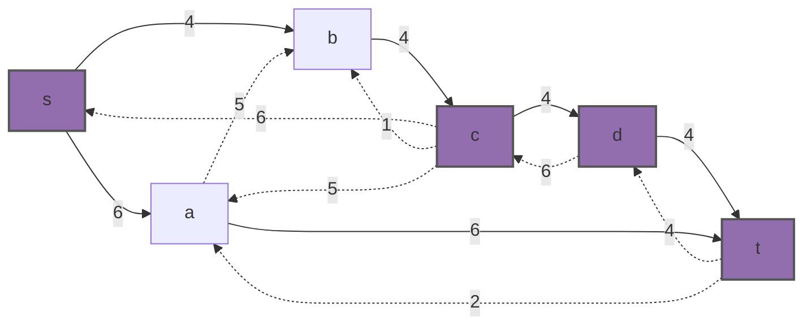
Уменьшим вес дуг на найденном пути, дуги для которых вес стал нулевым удалим из остаточной сети.

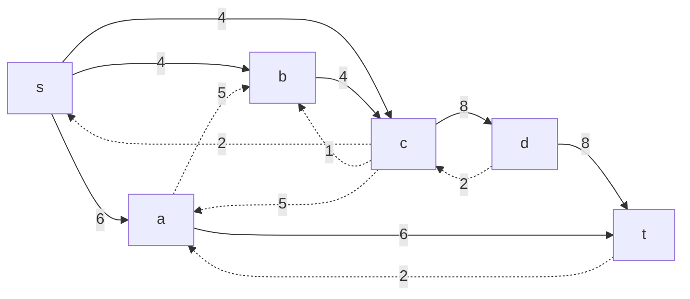

Скорректируем соответствующим образом локальные потоки в исходной сети.

### 5. Продолжим поиск увеличивающего пути в остаточной сети

В остаточной сети найден увеличивающий путь t -> a -> b -> c -> s. Минимальный вес дуг на этом пути равен 2.
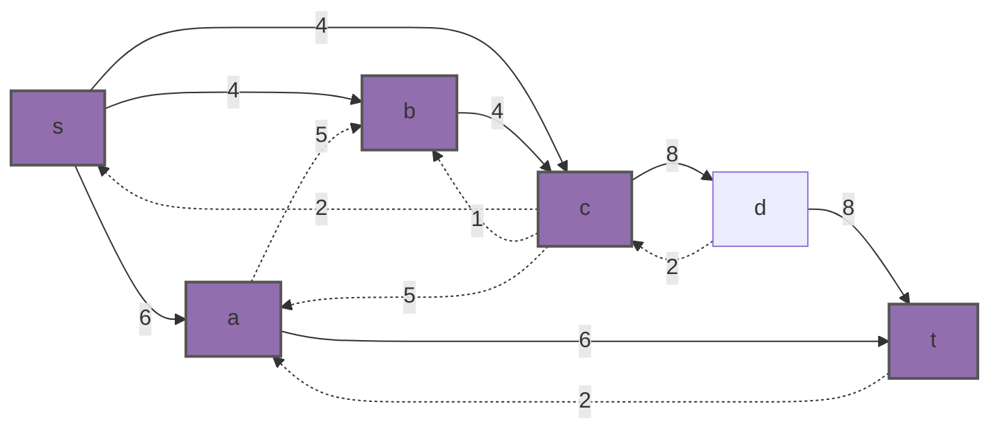
Уменьшим вес дуг на найденном пути, дуги для которых вес стал нулевым удалим из остаточной сети.

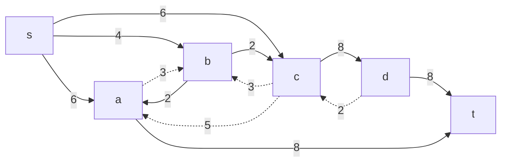

Скорректируем соответствующим образом локальные потоки в исходной сети.

### 6. Продолжим поиск увеличивающего пути в остаточной сети
 
В остаточной сети не найдено увеличивающих путей, следовательно, алгоритм завершил работу и найденный поток величиной **16** является максимальным для данной сети.

### 7. Проверим значение максимального потока перебором всех разрезов сети.
Разрез сети - разбиение множества вершин на два подмножества V1 и V2, где во множество V1 входит источник, а в V2 входит сток.

Пропускная способность разреза - сумма пропускной способности дуг, начинающихся в вершинах из множества V1 и оканчивающихся в вершинах из V2.

Для сети из _n_ вершин существует 2n - 2 различных разрезов, так как две вершины из множества (источник и сток) "зафиксированы" в V1 и V2, остальные вершины можно различными способами распределять между множествами V1 и V2.

Для сети из 6 вершин нужно найти 26 - 2 = 24 = 16 разрезов. 

| № | V1                   | V2 | Пропускная способность разреза |
|---|:--------------------------------|:--------------|:------------------------------:|
| 1 | s                               | a, b, c, d, t |   6+4+6 = 16             |
|   | **s + одна вершина из a, b, c,d** |               |                                |
| 2 | s, a                            | b, c,d, t       |   4+6+5+8=23                |
| 3 | s, b                            | a, c, d,t       |   6+6+5+5=22             |
| 4 | s, c                            | a, b, d,t       |     6+4+10=20      |
| 5 | s, d                              | a, b, c, t       |   4+6+6+8=24          |
|   | **s + пара вершин из a, b, c,d**  |               |                                |
| 6 | s, a, b                         | c,d, t          |   6+5+8+5=24                 |
| 7 | s, a, c                         | b,d, t          |     4+8+10=22            |
| 8 | s, b, c                         | a, d,t          |    6+5+10=21          |
| 9 | s, a, d                      | b,c, t          |         4+6+5+8=23           |
| 10 | s, b, d                         | a,c, t          |  6+6+5+5+8=30               |
| 11| s, c, d                         | a, b,t          |    6+4+8=18          |
|   | **s + три вершины из a, b, c,d**  |               |                                |
| 12 | s, a, b, c                      | d,t             |    8+10=18                |
| 13 | s, a, b, d                      | c,t             |     6+5+8+5+8=32               |
| 14 | s, a, d, c                      | b,t             |     4+8+8=20               |
| 15 | s, d, b, c                      | a,t             |      6+8+5=19              |
|   | **s + четыре вершины из a, b, c,d**  |               |                                |
| 16 | s, a,b,c,d                     | t             |      8+8=16              |
Минимальная пропускная способность разреза равна **16** ( {s} / { a, b, c, t} ), что совпадает с найденной величиной максимального потока в сети.

### Ответ:
Максимальный поток в сети равен **16**, он реализуется следующим локальными потоками:

