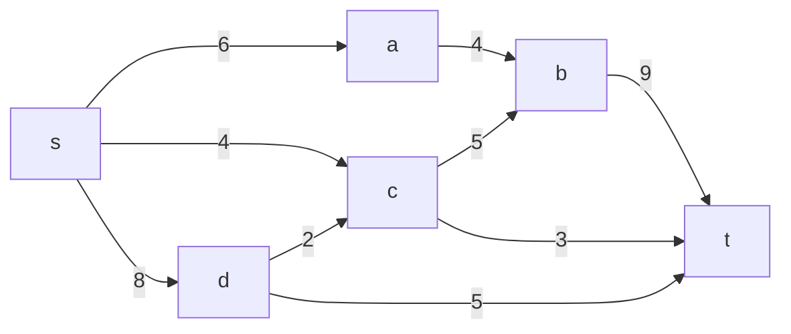
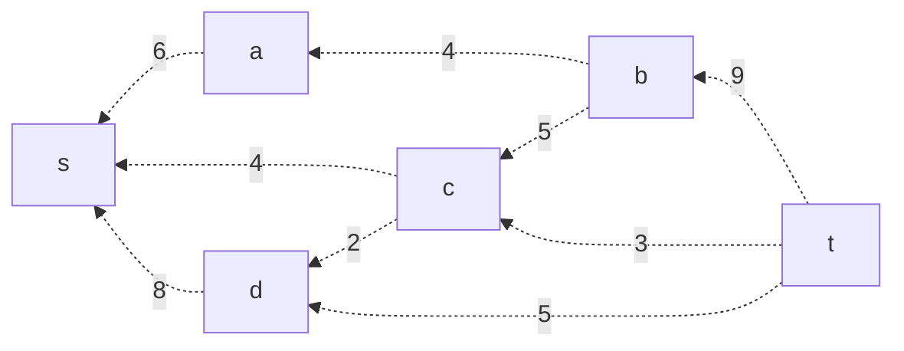
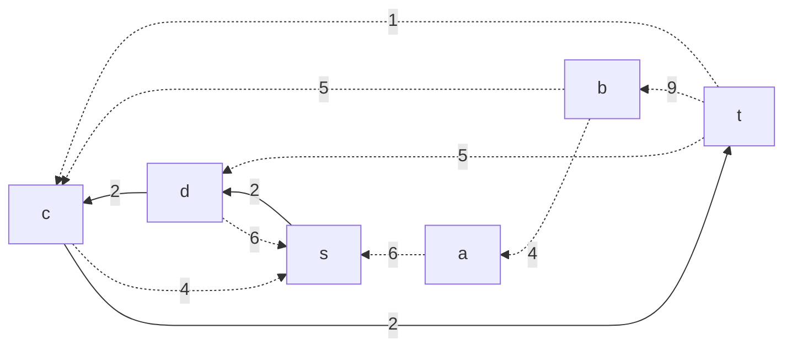
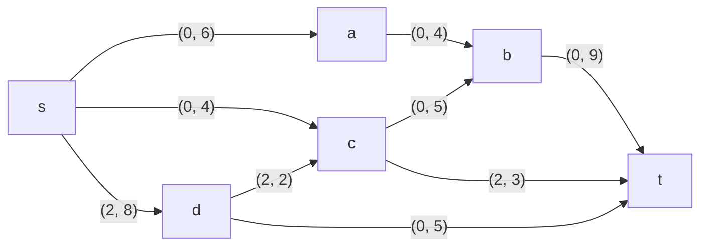
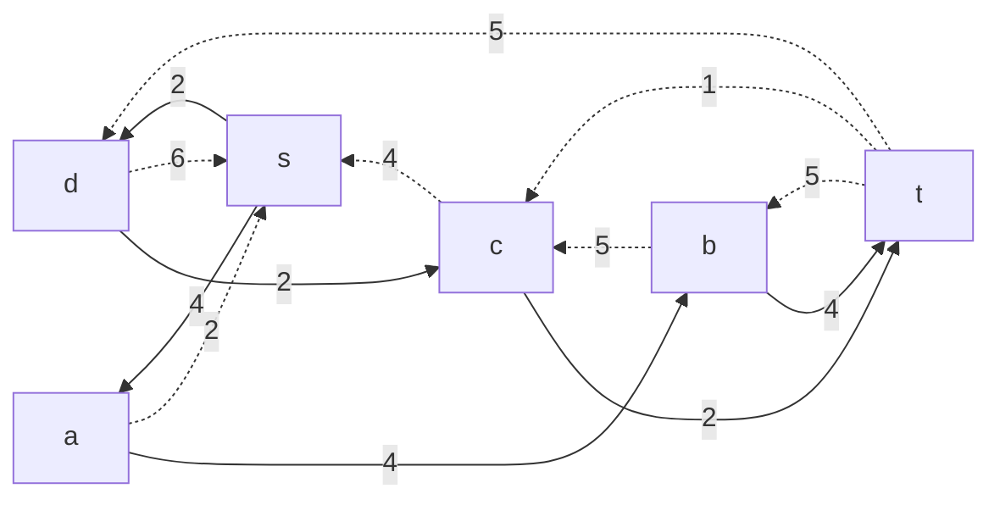
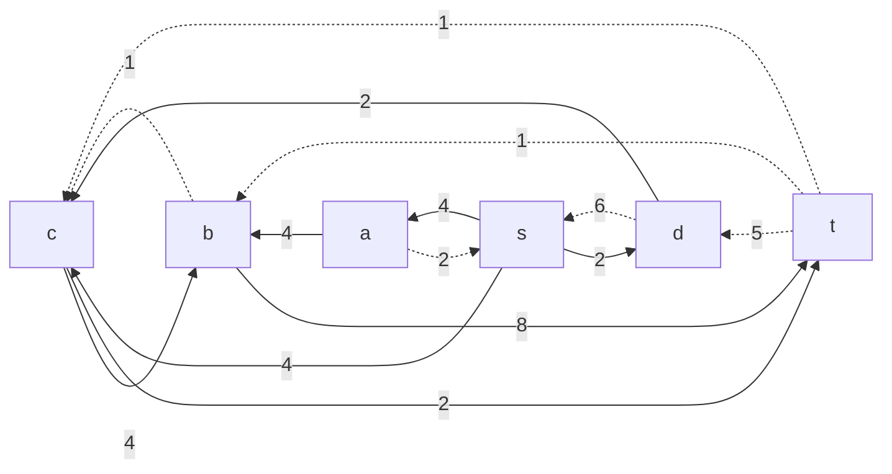
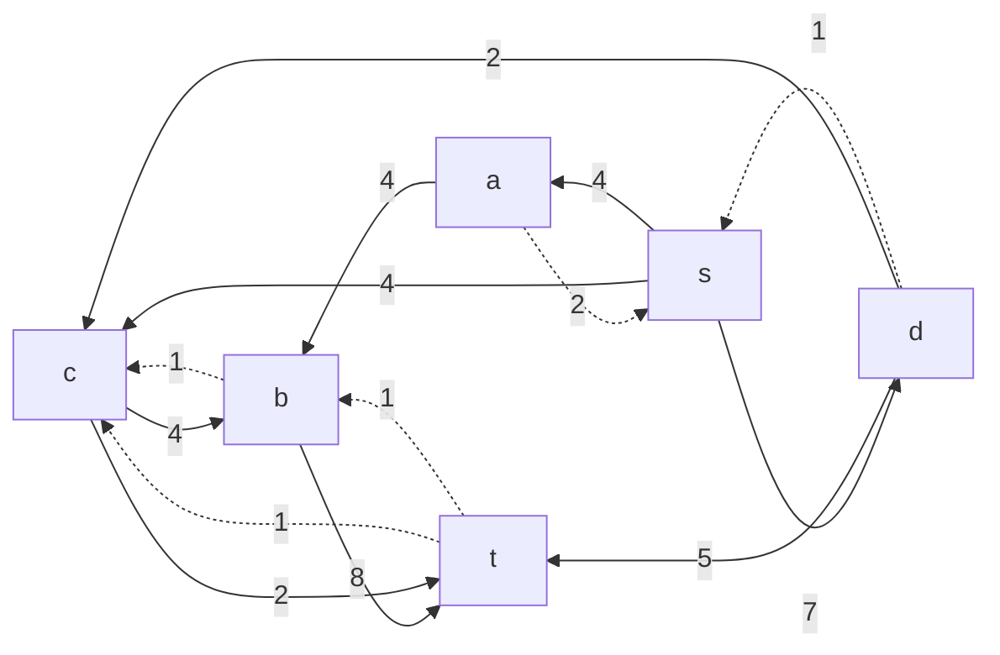

## Вариант 2:
### Пропускная способность дуг сети:

|          Дуги          | sa | sc | sd | ab | cb | dc | bt | ct | dt |
|:----------------------:|:--:|:--:|:--:|:--:|:--:|:--:|:--:|:--:|:--:|
| Пропускная способность | 6  | 4  | 8  | 4  | 5  | 2  | 9  | 3  | 5  |

## Решение
### 1. Построим сеть с источником **s**, стоком **t** и указанными пропускными способностями дуг.

### Остаточная сеть. Локальный поток равен нулю => необходимо вынести обратную дугу с весом равным пропускной способности. 

## Анализ разрезов
Найдем Минимальную пропускную способность сети, используя 16 разных разрезов сети.
|    V1   |    V2   |         Max         |
|:-------:|:-------:|:-------------------:|
|    S    |  ABCDT  |         18          |
|   SA    |  BCDT   |         16          |
|   SB    |  ACDT   |         27          |
|   SC    |  ABDT   |         22          |
|   SD    |  ABCT   |         17          |
|   SAB   |   CDT   |         21          |
|   SAC   |   BDT   |         20          |
|   SAD   |   CBT   |$$\color{green}{15}$$|
|   SBC   |   ADT   |         26          |
|   SBD   |   ACT   |         26          |
|   SCD   |   ABT   |         19          |
|  SABC   |   DT    |         20          |
|  SABD   |   CT    |         20          |
|  SBCD   |   AT    |         23          |
|  SACD   |   BT    |         17          |
|  SACBD  |    T    |         17          |

### Результаты анализа:
Минимальная пропускная способность сети - 15. Пока запомним это число.

### 2. В остаточной сети найден увеличивающий путь t->c->d->s, минимальная пропускная способность на дугах пути - 2.

Уменьшим вес дуг на этом пути на минимальную пропускную способность на пути. Дуги с нулевым весом удалим из осчтаточной сети.

Отразим изменения и на исходной сети.

### 3. В остаточной сети найден ещё один увеличивающий путь t->b->a->s , минимальная пропускная способность на дугах пути - 4.

Уменьшим вес дуг на этом пути на минимальную пропускную способность на пути. Дуги с нулевым весом удалим из осчтаточной сети.

Отразим изменения и на исходной сети.

### 4. В остаточной сети найден увеличивающий путь t->b->c->s , минимальная пропускная способность на дугах пути - 4.

Уменьшим вес дуг на этом пути на минимальную пропускную способность на пути. Дуги с нулевым весом удалим из осчтаточной сети.

Отразим изменения и на исходной сети.

### 5. В остаточной сети найден увеличивающий путь t->d->s , минимальная пропускная способность на дугах пути - 5.

Уменьшим вес дуг на этом пути на минимальную пропускную способность на пути. Дуги с нулевым весом удалим из осчтаточной сети.

Отразим изменения и на исходной сети.

### 6. Продолжим поиск увеличивающего пути в остаточной сети
В остаточной сети больше нет увеличивающих путей, найденный поток величиной 15 (2 + 4 + 4 + 5 = 15) является максимальным в данной сети. Он совпадает с найденной ранее Минимальной пропускной способностью сети.

## Результат
Максимальный поток равен 15, он реализуется этими локальными потоками:
