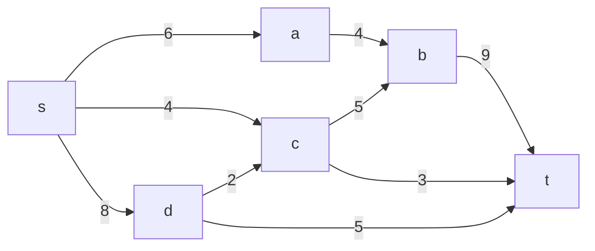
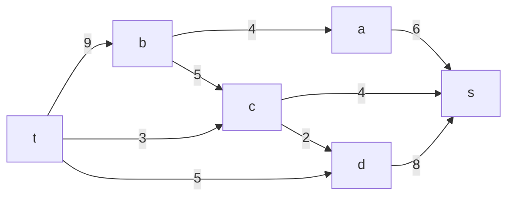
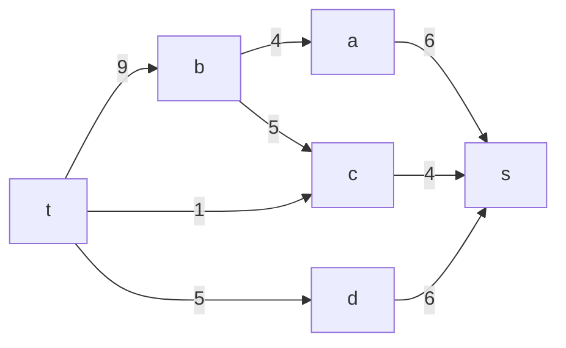
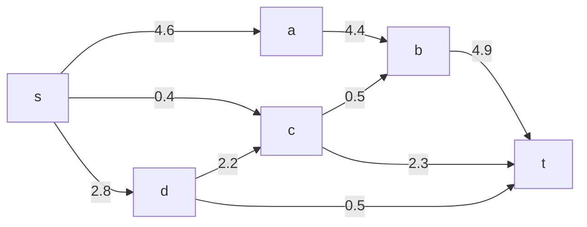
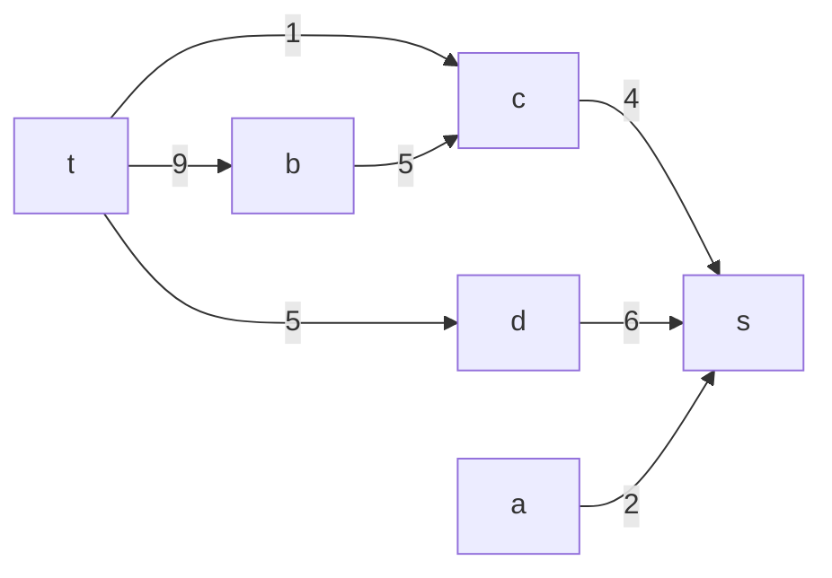
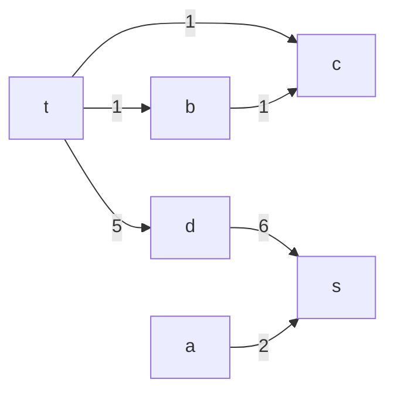
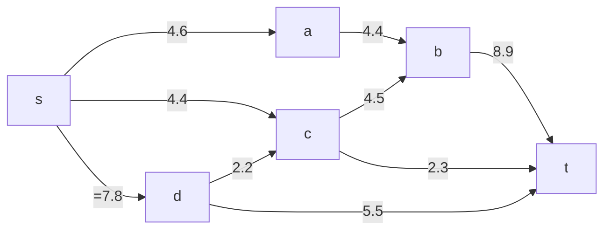

## Вариант 2:
### Пропускная способность дуг сети:

|          Дуги          | sa | sc | sd | ab | cb | dc | bt | ct | dt |
|:----------------------:|:--:|:--:|:--:|:--:|:--:|:--:|:--:|:--:|:--:|
| Пропускная способность | 6  | 4  | 8  | 4  | 5  | 2  | 9  | 3  | 5  |

## Решение

### Анализ разрезов

|   V1    |  V2     |         Max         |
|:-------:|:-------:|:-------------------:|
|    S    |  ABCDT  |         18          |
|   SA    |  BCDT   |         16          |
|   SB    |  ACDT   |         27          |
|   SC    |  ABDT   |         20          |
|   SD    |  ABCT   |         17          |
|   SAB   |   CDT   |         21          |
|   SAC   |   BDT   |         12          |
|   SAD   |   CBT   |$$\color{green}{15}$$|
|   SBC   |   ADT   |         29          |
|   SBD   |   ACT   |         36          |
|   SCD   |   ABT   |         19          |
|  SABC   |   DT    |         18          |
|  SABD   |   CT    |         20          |
|  SBCD   |   AT    |         26          |
|  SACD   |   BT    |$$\color{green}{15}$$|
|  SACBD  |    T    |         17          |

### Остаточная сеть

### берём tcds min 2

### tbas min 4

### tbs min 4

### tds min 5

## Результат
4 + 4 + 7 = 15