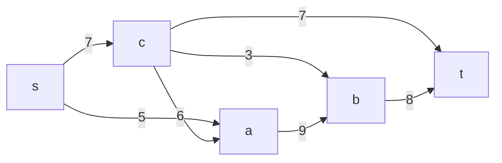
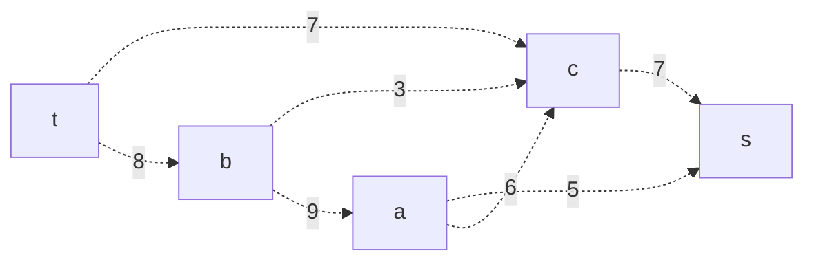
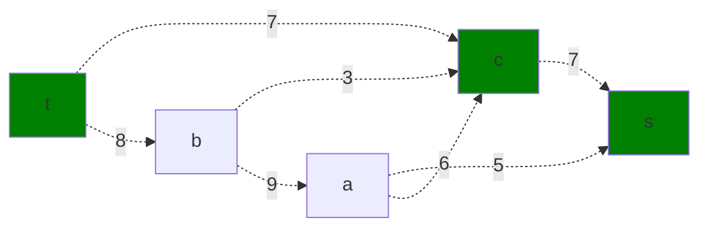
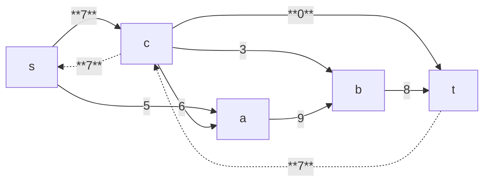
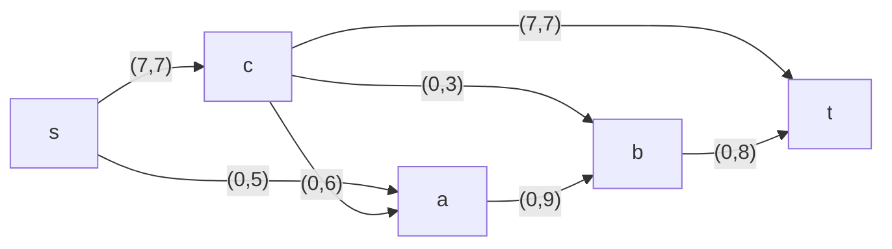
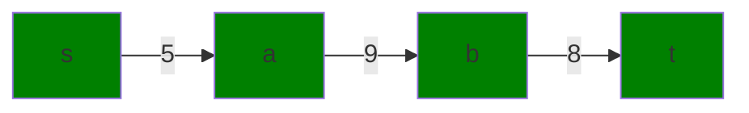
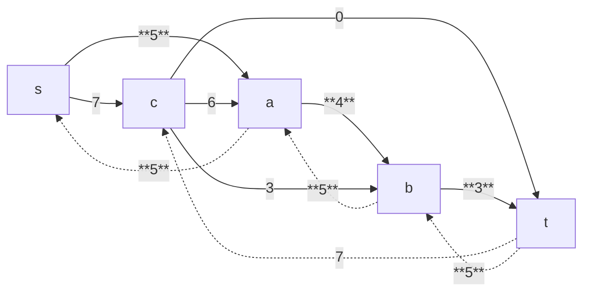

# Задание №9. Команда ewup
### Постановка задачи:
1. Дана сеть (взвешенный ориентированный граф) с источником s и стоком t.
2. Для каждой дуги определена ее пропускная способность.
3. Необходимо найти максимальный поток для указанной сети. 

### Вариант 10:
#### Пропускная способность дуг сети:

|          Дуги          | sc | sa | сa | cb | ab | ct | bt |
|:----------------------:|:--:|:--:|:--:|:--:|:--:|:--:|:--:|
| Пропускная способность | 7  | 5  | 6  | 3  | 9  | 7  | 8  |

## Этап 1: Построение сети по таблице (источник s, сток t)

### Построение остаточной сети
Изначально локальные потоки отсутствуют, поэтому каждая дуга представлена с её полной пропускной способностью, а также добавлены обратные дуги с такой же величиной.

## Этап 2: Поиск увеличивающего пути

Выберем путь s → c → t. Минимальный вес дуг на этом пути равен 7.

Уменьшаем вес дуг.

Корректируем локальные потоки в исходной сети. Сначала локальный поток, потом пропускная способность:

## Этап 3. Поиск следующего увеличивающего пути

Пропускные способности дуг: s→a = 5, a→b = 9, b→t = 8.
Минимальное значение равно 5.

Уменьшаем пропускные способности дуг на величину 5 и добавляем обратные дуги:

Корректируем локальные потоки в исходной сети:

Общий поток = 7 + 5 = 12.

##  Этап 4.  Проверка остаточной сети

В остаточной сети после двух итераций:
s → c: первоначально 7, теперь 7–7 = 0
s → a: первоначально 5, теперь 5–5 = 0

Таким образом, из s отсутствуют исходящие дуги с положительной остаточной пропускной способностью, что означает, что увеличивающих путей больше не существует.

## Этап 5. Проверка максимального потока перебором разрезов

Рассмотрим разрез {s} / {a, c, b, t}.
Пропускная способность разреза равна сумме дуг, исходящих из s:
s → c (7) + s → a (5) = 12.
Это совпадает с найденным значением общего потока.

## Ответ:
Максимальный поток в сети равен **12**, он реализуется следующими локальными потоками:

