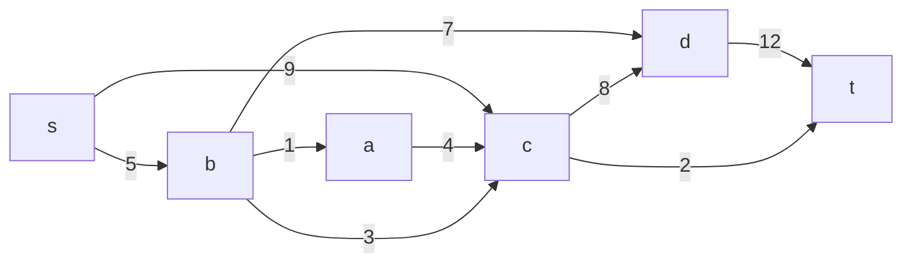
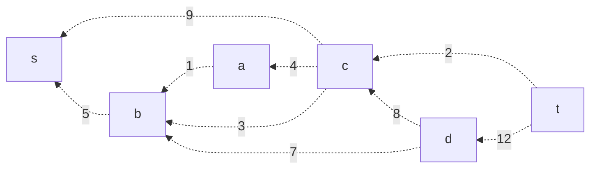
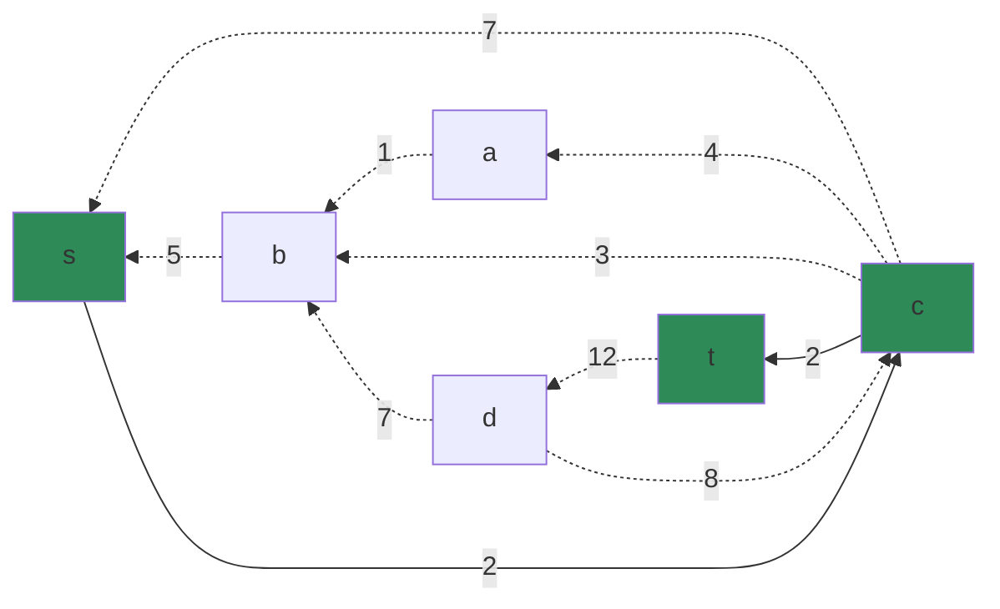
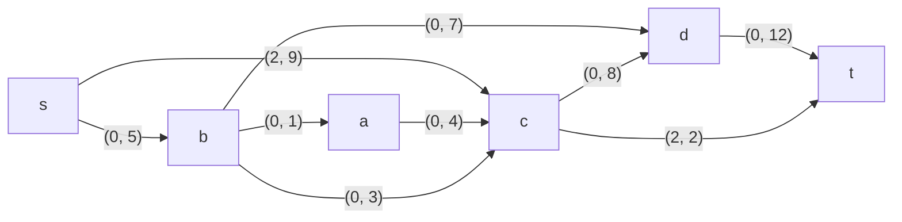
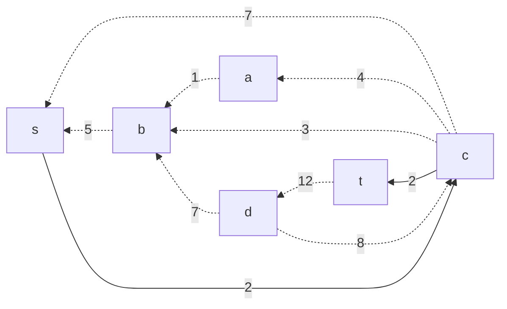
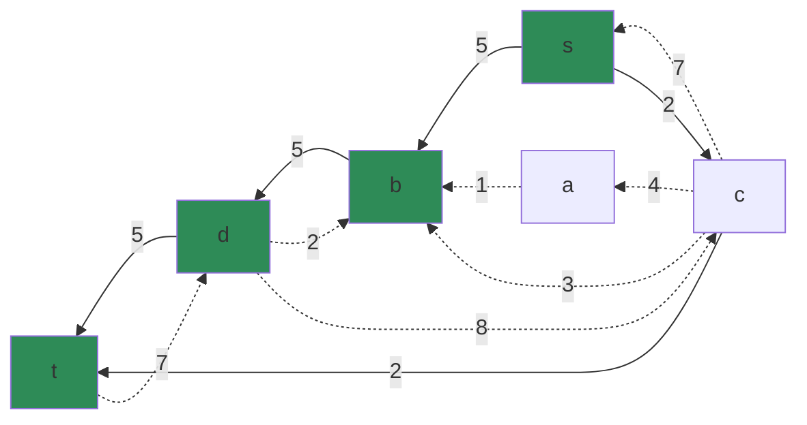
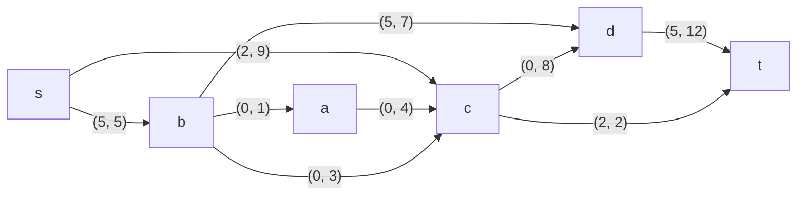
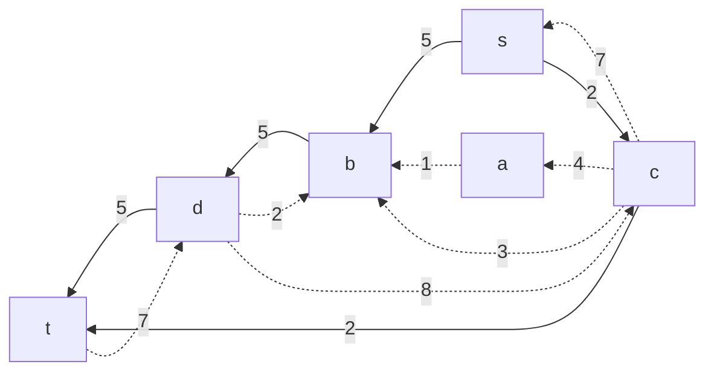
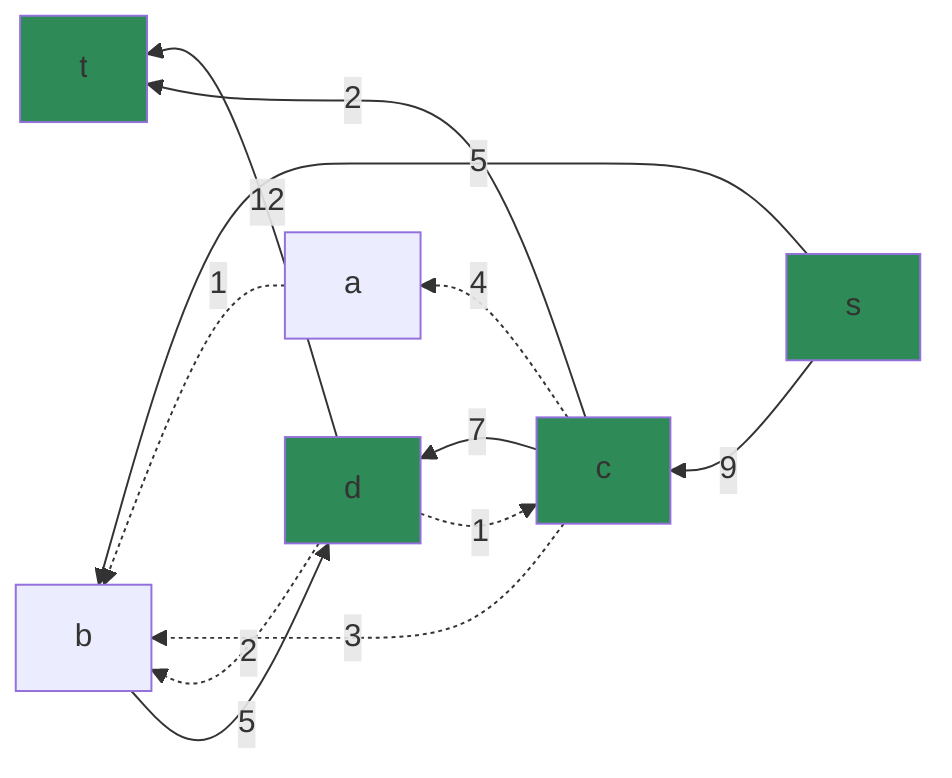
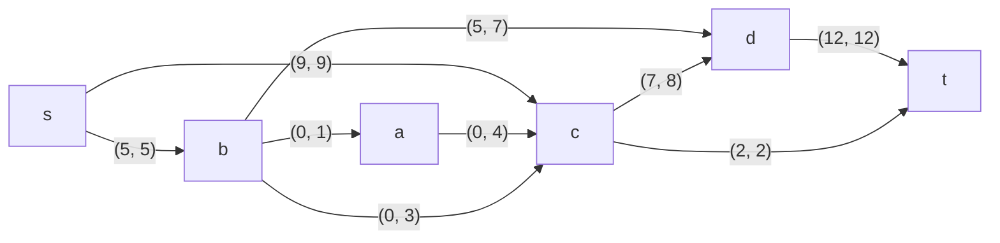

# Задание №9. Вариант 8
Пропускная способность дуг сети указана в таблице.

|          Дуги          | sc | sb | ac | ba | bc | bd | cd | dt | ct |
|:----------------------:|:--:|:--:|:--:|:--:|:--:|:--:|:--:|:--:|:--:|
| Пропускная способность | 9  | 5  | 4  | 1  | 3  | 7  | 8  | 12 |  2 |

### 1. Построим сеть с источником **s**, стоком **t** и указанными пропускными способностями дуг.

Построим остаточную сеть. Так как изначально поток в сети не задан, все дуги сети являются пустыми (локальный поток равен нулю), соответственно в остаточную сеть необходимо вынести обратную дугу с весом равным пропускной способности. 

### 2. Проведем поиск увеличивающего пути в остаточной сети
В остаточной сети найден увеличивающий путь t -> c -> s. Минимальный вес дуг на этом пути равен 2.

Уменьшим вес дуг на найденном пути, дуги для которых вес стал нулевым удалим из остаточной сети.

Скорректируем соответствующим образом локальные потоки в исходной сети. Первым числом будем указывать локальный поток, вторым пропускную способность дуги. 

    

### 3. Продолжим поиск увеличивающего пути в остаточной сети

В остаточной сети найден увеличивающий путь t -> d -> b -> s. Минимальный вес дуг на этом пути равен 5.

Уменьшим вес дуг на найденном пути, дуги для которых вес стал нулевым удалим из остаточной сети.

Скорректируем соответствующим образом локальные потоки в исходной сети.

### 4. Продолжим поиск увеличивающего пути в остаточной сети

В остаточной сети найден увеличивающий путь t -> d -> c -> s. Минимальный вес дуг на этом пути равен 7.

Уменьшим вес дуг на найденном пути, дуги для которых вес стал нулевым удалим из остаточной сети.

Скорректируем соответствующим образом локальные потоки в исходной сети.

### 5. Продолжим поиск увеличивающего пути в остаточной сети
В остаточной сети не найдено увеличивающих путей, следовательно, алгоритм завершил работу и найденный поток величиной **14** является максимальным для данной сети.

### 6. Проверим значение максимального потока перебором всех разрезов сети.
Разрез сети - разбиение множества вершин на два подмножества V1 и V2, где во множество V1 входит источник, а в V2 входит сток.

Пропускная способность разреза - сумма пропускной способности дуг, начинающихся в вершинах из множества V1 и оканчивающихся в вершинах из V2.

Для сети из _n_ вершин существует 2n - 2 различных разрезов, так как две вершины из множества (источник и сток) "зафиксированы" в V1 и V2, остальные вершины можно различными способами распределять между множествами V1 и V2.

Для сети из 6 вершин нужно найти 26 - 2 = 24 = 16 разрезов. 

| № | V1                   | V2 | Пропускная способность разреза |
|---|:--------------------------------|:--------------|:------------------------------:|
| 1 | s                               | a, b, c, d, t    |          **9 + 5 = 14**           |
|   | **s + одна вершина из a, b, c, d** |               |                                |
| 2 | s, a                            | b, c, d, t       |         9 + 5 + 4 = 18        |
| 3 | s, b                            | a, c, d, t       |         9 + 7 + 3 + 1 = 20        |
| 4 | s, c                            | a, b, d, t       |         5 + 8 + 2 = 15         |
| 5 | s, d                            | a, b, с, t       |        9 + 5 + 12 = 26        |
|   | **s + две вершины из a, b, c, d**  |               |                                |
| 6 | s, a, b                         | c, d, t          |         9 + 7 + 3 + 4 = 23         |
| 7 | s, a, c                         | b, d, t          |    5 + 8 + 2 = 15              |
| 8 | s, b, c                         | a, d, t          |  7 + 1 + 8 + 2 = 18             |
| 9 | s, a, d                        | b, c, t          |       9 + 5 + 4 + 12 = 30      |
| 10 | s, b, d                        | a, c, t          |   9 + 1 + 3 + 12 = 25        
| 11 | s, c, d                        | a, b, t          |   5 + 2 + 12 = 19     
|   | **s + три вершины из a, b, c, d**  |               |                                |
| 12 | s, a, b, c                      | d, t             |  7 + 8 + 2 = 17                    |
| 13 | s, d, b, c                      | a, t             |  1 + 2 + 12  = 15                    |
| 14 | s, a, d, c                      | b, t             |  5 + 2 + 12 = 19                    |
| 15 | s, a, b, d                      | c, t             |   9 + 3 + 12 = 24                  |
|   | **s + четыре вершины из a, b, c, d**  |               |                                |
| 16 | s, a, b, c, d                      |t             | **2 + 12 = 14**

Минимальная пропускная способность разреза равна 14 ( {s} / {a, b, c, d, t } ) или ( {s, a, b, c, d} / { t } ), что совпадает с найденной величиной максимального потока в сети.

### Ответ:
Максимальный поток в сети равен 14, он реализуется следующим локальными потоками:

