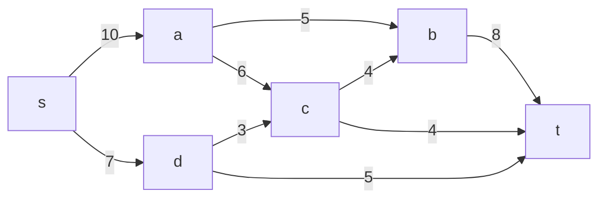
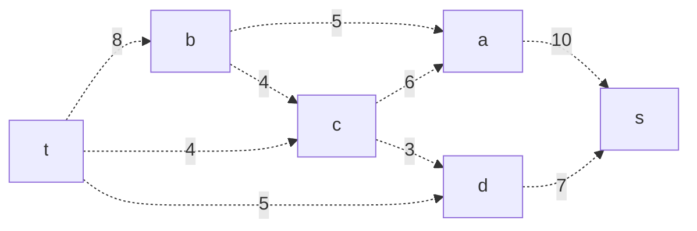
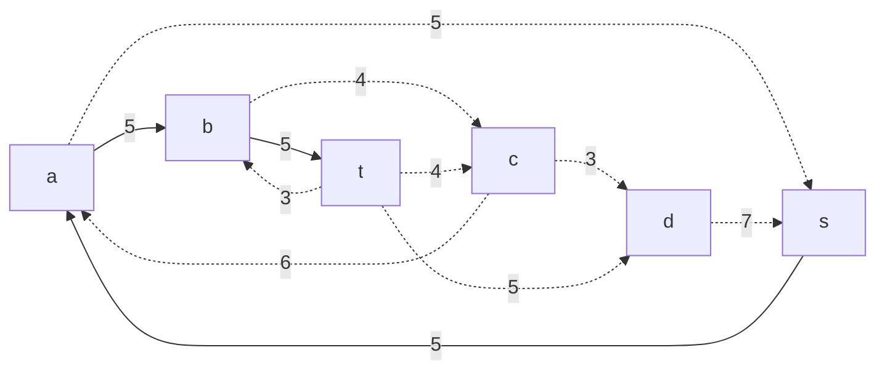
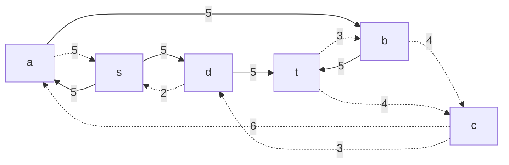
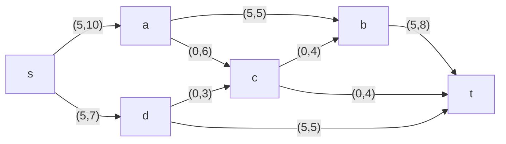
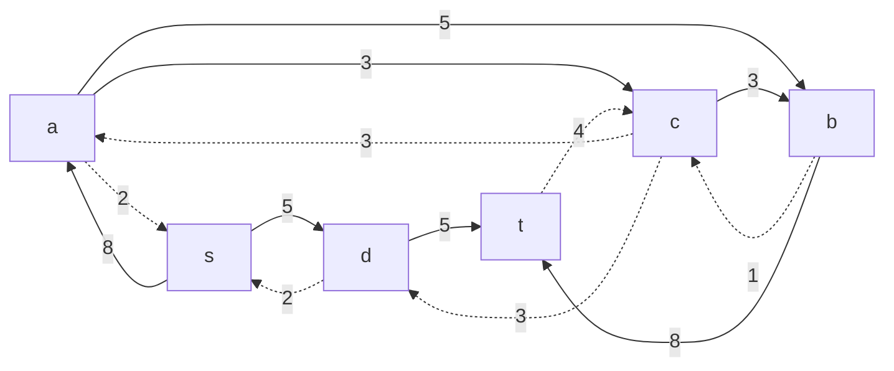
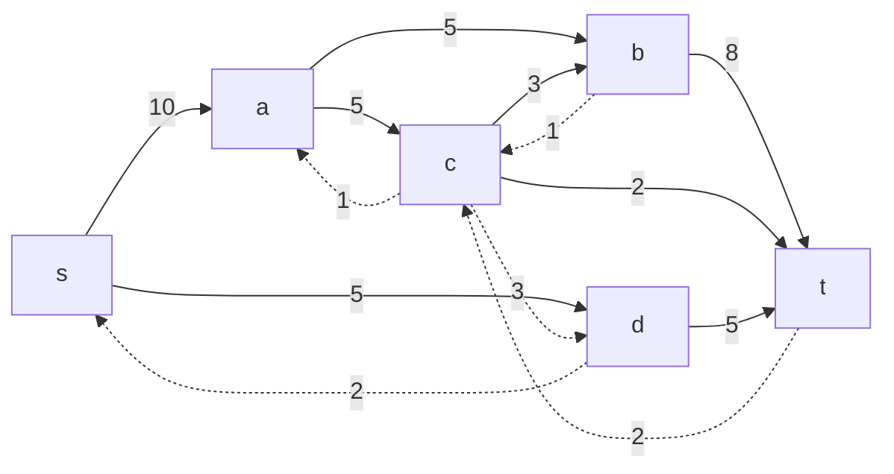
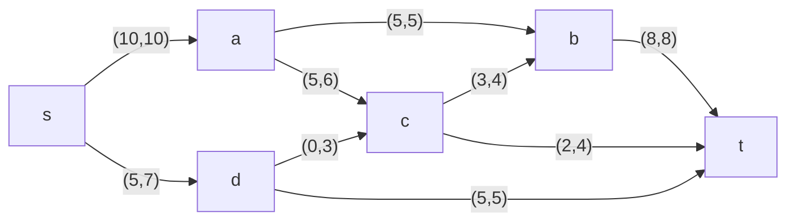
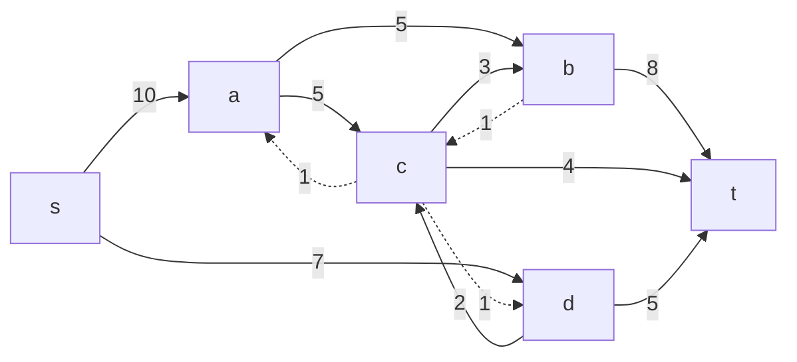

# Задание №9
# Задача о максимальном потоке. Вариант 9.
#### Пропускная способность дуг сети:

|          Дуги          | sa | ac | sd | ab | cb | dc | bt | ct | dt |
|:----------------------:|:--:|:--:|:--:|:--:|:--:|:--:|:--:|:--:|:--:|
| Пропускная способность | 10 | 6  | 7  | 5  | 4  | 3  | 8  | 4  | 5  |

## Строим сеть по таблице (источник s, сток t)

## Строим остаточную сеть
Так как изначально локальный поток в сети не задан, все дуги сети являются пустыми, соответственно в остаточную сеть необходимо вынести обратную дугу с весом равным пропускной способности.

## Начинаем поиск увеличивающего пути
Нам необходимо найти ориетвированный путь из t в s.
$$t->b->a->s$$
Такой путь нашелся. Минимальный вес дуг на этом пути равен 5.
Уменьшим вес дуг на найденном пути, дуги для которых вес стал нулевым удалим из остаточной сети.

## Приводим изначальную сеть к текущему варианту, добавляем локальные потоки

## Продолжаем искать увеличивающий путь
Нам необходимо найти ориетвированный путь из t в s.

$$t->d->s$$
Такой путь нашелся. Минимальный вес дуг на этом пути равен 5.
Уменьшим вес дуг на найденном пути, дуги для которых вес стал нулевым удалим из остаточной сети.

## Приводим  сеть к текущему варианту, добавляем локальные потоки

## Продолжаем искать увеличивающий путь
Нам необходимо найти ориетвированный путь из t в s.

$$t->b->c->a->s$$
Такой путь нашелся. Минимальный вес дуг на этом пути равен 3.
Уменьшим вес дуг на найденном пути, дуги для которых вес стал нулевым удалим из остаточной сети.

## Приводим  сеть к текущему варианту, добавляем локальные потоки

## Продолжаем искать увеличивающий путь
Нам необходимо найти ориетвированный путь из t в s.

$$t->c->a->s$$
Такой путь нашелся. Минимальный вес дуг на этом пути равен 2.
Уменьшим вес дуг на найденном пути, дуги для которых вес стал нулевым удалим из остаточной сети.

## Приводим  сеть к текущему варианту, добавляем локальные потоки

## Продолжаем искать увеличивающий путь
Нам необходимо найти ориетвированный путь из t в s.

$$t->c->d->s$$
Такой путь нашелся. Минимальный вес дуг на этом пути равен 2.
Уменьшим вес дуг на найденном пути, дуги для которых вес стал нулевым удалим из остаточной сети.

## Приводим  сеть к текущему варианту, добавляем локальные потоки

## Продолжаем искать увеличивающий путь
Нам необходимо найти ориетвированный путь из t в s.
Ориентированный путь из t в s не найден, это гвоорит о том что <ins>**поток величиной 17 является максимальным для данной сети**</ins>.
## Проверим значение максимального потока перебором всех разрезов сети.
Разрез сети - разбиение множества вершин на два подмножества V1 и V2, где во множество V1 входит источник, а в V2 входит сток.

Пропускная способность разреза - сумма пропускной способности дуг, начинающихся в вершинах из множества V1 и оканчивающихся в вершинах из V2.

Для сети из _n_ вершин существует 2n - 2 различных разрезов, так как две вершины из множества (источник и сток) "зафиксированы" в V1 и V2, остальные вершины можно различными способами распределять между множествами V1 и V2.

Для сети из 6 вершин нужно найти 26 - 2 = 24 = 16 разрезов. 

| №  | V1                        | V2       | Пропускная способность разреза |
|----|:-------------------------------------|:--------------------|:------------------------------:|
| 1  | s                                    | a, b, c, d, t       | 10 + 7 = **17**                |
|    | **s + одна вершина из a, b, c, d**   |                     |                                |
| 2  | s, a                                 | b, c, d, t          | 7 + 6 + 5 = 18                 |
| 3  | s, b                                 | a, c, d, t          | 7 + 10 + 8 = 25                |
| 4  | s, c                                 | a, b, d, t          | 10 + 7 + 4 + 4 = 25            |
| 5  | s, d                                 | a, b, c, t          | 10 + 3 + 5 = 18                |
|    | **s + пара вершин из a, b, c, d**    |                     |                                |
| 6  | s, a, b                              | c, d, t             | 7 + 6 + 8 = 21                 |
| 7  | s, a, c                              | b, d, t             | 7 + 5 + 4 + 4 = 20             |
| 8  | s, b, c                              | a, d, t             | 10 + 7 + 4 + 8 = 29            |
| 9  | s, a, d                              | b, c, t             | 5 + 6 + 3 + 5 = 19             |
| 10 | s, b, d                              | a, c, t             | 10 + 8 + 3 + 5 = 26            |
| 11 | s, c, d                              | a, b, t             | 10 + 5 + 4 + 4 = 23            |
|    | **s + три вершины из a, b, c, d**    |                     |                                |
| 12 | s, a, b, c                           | t, d                | 7 + 4 + 8 = 19                 |
| 13 | s, a, b, d                           | t, c                | 6 + 3 + 8 + 5 = 22             |
| 14 | s, a, c, d                           | t, b                | 5 + 4 + 5 + 4 = 18             |
| 15 | s, b, c, d                           | t, a                | 8 + 4 + 5 + 10 = 27            |
|    | **s + четыре вершины из a, b, c, d** |                     |                                |
| 16 | s, a, b, c, d                        | t                   | 8 + 4 + 5 = **17**             |

Минимальная пропускная способность разреза равна **17** ( {s} / {a, b, c, d, t} или {s, a, b, c, d} / {t} ), что совпадает с найденной величиной максимального потока в сети.

# Ответ
Максимальным потоком для данной сети является поток мощностью 17, картина сети имеет следующий вид:
