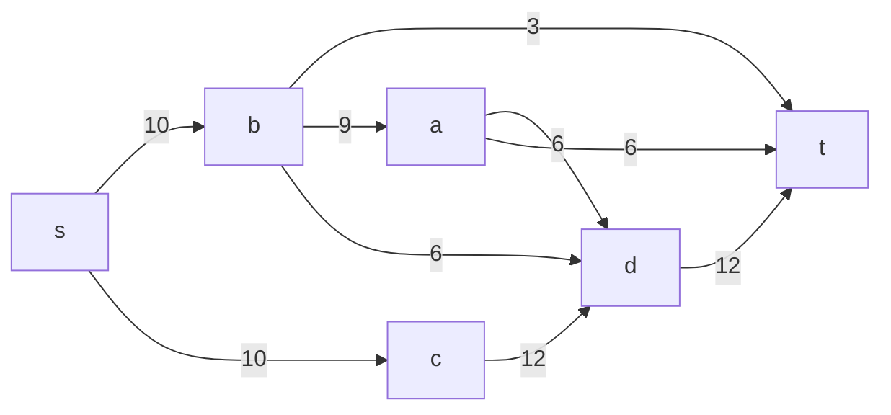
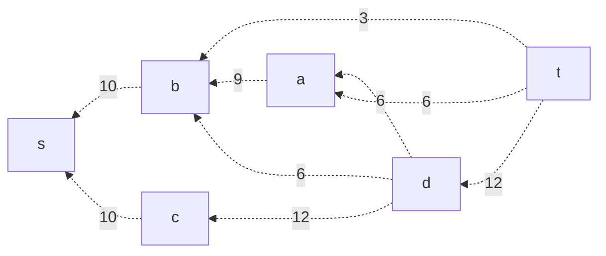
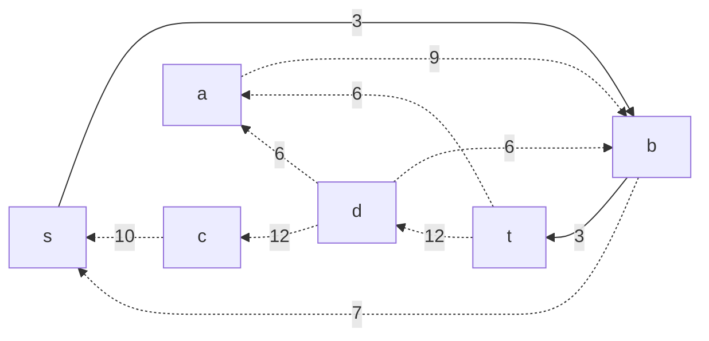
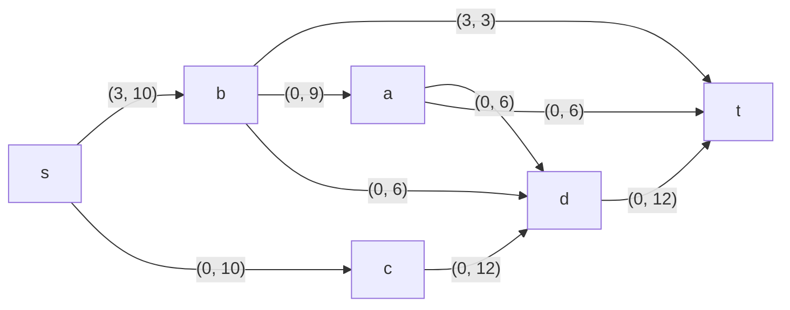
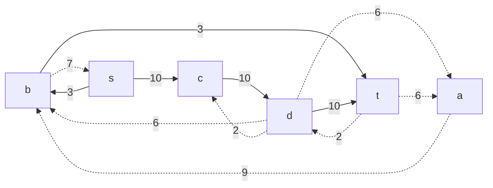
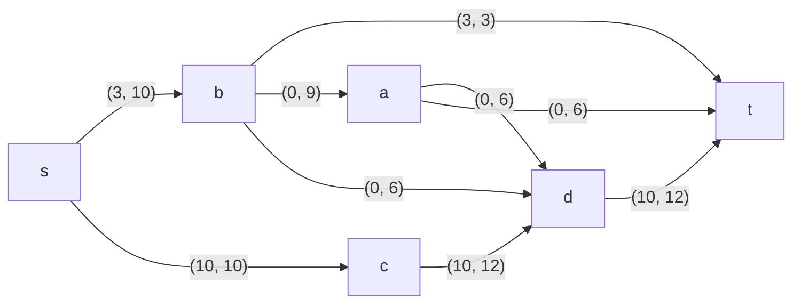
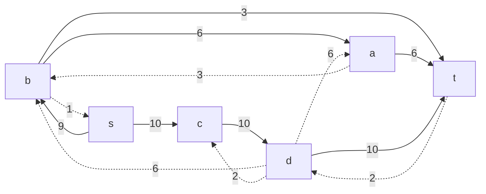
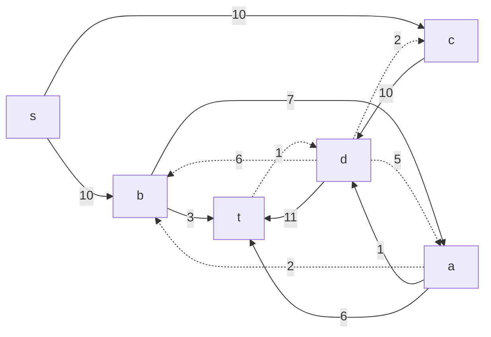
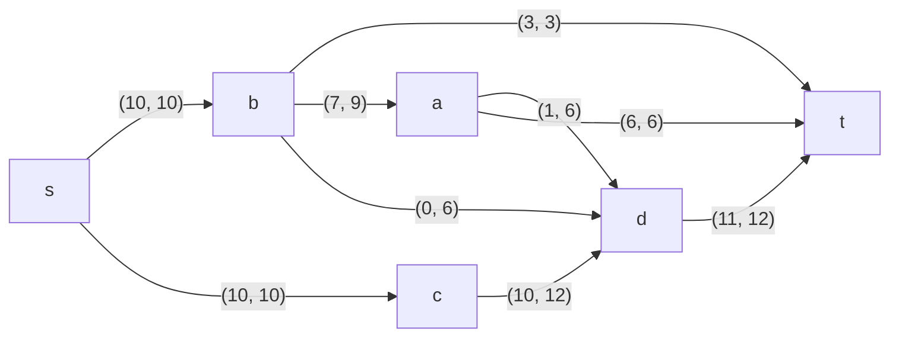

# Задание №9. Вариант 4
# Задача о максимальном потоке.

Пропускная способность дуг сети указана в таблице.

|          Дуги          | sb | sc | bt | ba | bd | cd | ad | at | dt |
|:----------------------:|:--:|:--:|:--:|:--:|:--:|----|----|----|----|
| Пропускная способность | 10 | 10 | 3  | 9  | 6  | 12 | 6  | 6  | 12 |

### 1. Построим сеть с источником **s**, стоком **t** и указанными пропускными способностями дуг.

Построим остаточную сеть. Так как изначально поток в сети не задан, все дуги сети являются пустыми (локальный поток равен нулю), соответственно в остаточную сеть необходимо вынести обратную дугу с весом равным пропускной способности. 

### 2. Проведем поиск увеличивающего пути в остаточной сети
В остаточной сети найден увеличивающий путь t -> b -> s. Минимальный вес дуг на этом пути равен 3.

Уменьшим вес дуг на найденном пути, дуги для которых вес стал нулевым удалим из остаточной сети.

Скорректируем соответствующим образом локальные потоки в исходной сети. Первым числом будем указывать локальный поток, вторым пропускную способность дуги. 

### 3. Продолжим поиск увеличивающего пути в остаточной сети

В остаточной сети найден увеличивающий путь t -> d -> c -> s. Минимальный вес дуг на этом пути равен 10.

Уменьшим вес дуг на найденном пути, дуги для которых вес стал нулевым удалим из остаточной сети.

Скорректируем соответствующим образом локальные потоки в исходной сети.

### 4. Продолжим поиск увеличивающего пути в остаточной сети

В остаточной сети найден увеличивающий путь t -> a -> b -> s. Минимальный вес дуг на этом пути равен 6.

Уменьшим вес дуг на найденном пути, дуги для которых вес стал нулевым удалим из остаточной сети.

Скорректируем соответствующим образом локальные потоки в исходной сети.

### 5. Продолжим поиск увеличивающего пути в остаточной сети

В остаточной сети найден увеличивающий путь t -> d -> a -> b -> s. Минимальный вес дуг на этом пути равен 1.

Уменьшим вес дуг на найденном пути, дуги для которых вес стал нулевым удалим из остаточной сети.

Скорректируем соответствующим образом локальные потоки в исходной сети.

### 6. Продолжим поиск увеличивающего пути в остаточной сети
В остаточной сети не найдено увеличивающих путей, следовательно, алгоритм завершил работу и найденный поток величиной 20 является максимальным для данной сети.

### 7. Проверим значение максимального потока перебором всех разрезов сети.

Для сети из 6 вершин нужно найти 26 - 2 = 24 = 16 разрезов. 

| № | V1                   | V2 | Пропускная способность разреза |
|---|:--------------------------------|:--------------|:------------------------------:|
| 1 | s                               | a, b, c, d, t |           10 + 10 = 20         |
|   | **s + одна вершина из a, b, c, d** |               |                                |
| 2 | s, a                            | b, c, d, t    |         10 + 6 + 6 + 10 = 32   |
| 3 | s, b                            | a, c, d, t    |         10 + 9 + 3 + 6 = 28    |
| 4 | s, c                            | a, b, d, t    |         10 + 12 = 22           |
| 5 | s, d                            | a, b, c, t    |         10 + 10 + 12 = 32      |
|   | **s + пара вершин из a, b, c, d**  |               |                                |
| 6 | s, a, b                         | c, d, t       |     3 + 10 + 6 + 6 + 6 = 31    |
| 7 | s, a, c                         | b, d, t       |         10 + 12 + 6 + 6 = 34   |
| 8 | s, a, d                         | b, c, t       |         10 + 10 + 6 + 12 = 38  |
| 9 | s, b, c                         | a, d, t       |         9 + 3 + 6 + 12 = 30    |
| 10 | s, d, c                         | a, b, t       |         10 + 12 = 22          |
| 11 | s, b, d                         | a, c, t       |         10 + 9 + 3 + 12 = 34  |
|    | **s + три вершины из a, b, c, d**  |               |                                |
| 12 | s, a, b, c                      | d, t            |      6 + 6 + 3 + 6 + 12 = 33   |
| 13 | s, a, c, d                      | b, t            |      10 + 6 + 12 = 28          |
| 14 | s, b, c, d                      | a, t            |      9 + 3 + 12 = 24           |
| 15 | s, a, b, d                      | c, t            |      10 + 3 + 6 + 12 = 31      |
|    | **s + 4 вершины из a, b, c, d** |               |                                |
| 16 | s, a, b, c, d                   |  t            |      3 + 6 + 12 = 21   |

Минимальная пропускная способность разреза равна 20, что совпадает с найденной величиной максимального потока в сети.

### Ответ:
Максимальный поток в сети равен 20, он реализуется следующим локальными потоками:

