# Задание №9. Команда Second.
### Постановка задачи:
1. Дана сеть (взвешенный ориентированный граф) с источником s и стоком t.
2. Для каждой дуги определена ее пропускная способность.
3. Необходимо найти максимальный поток для указанной сети. 

## Вариант 5:
#### Пропускная способность дуг сети:

|          Дуги          | sa | sс | aс | ba | cb | at | bt | ct |
|:----------------------:|:--:|:--:|:--:|:--:|:--:|:--:|:--:|:--:|
| Пропускная способность | 8  | 6  | 7  | 4  | 9  | 3  | 9  | 4  |

## Этап 1: Построение сети по таблице (источник s, сток t)

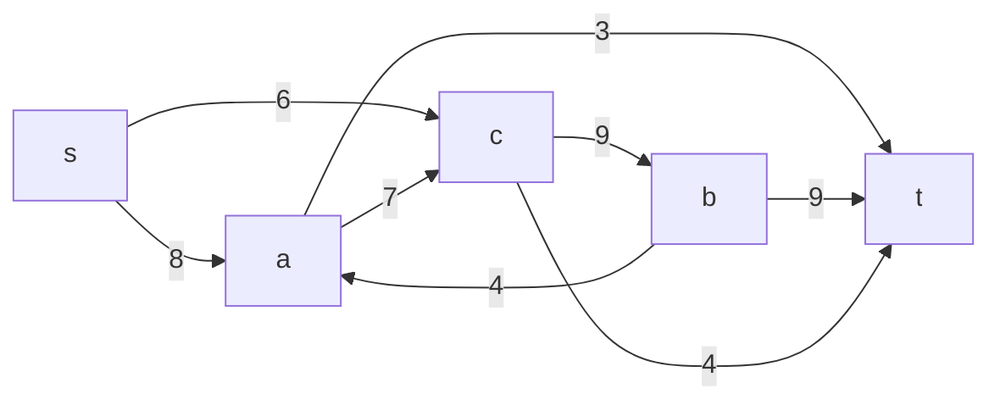

### Построение остаточной сети
Так как изначально локальный поток в сети не задан, все дуги сети являются пустыми, соответственно в остаточную сеть необходимо вынести обратную дугу с весом равным пропускной способности.

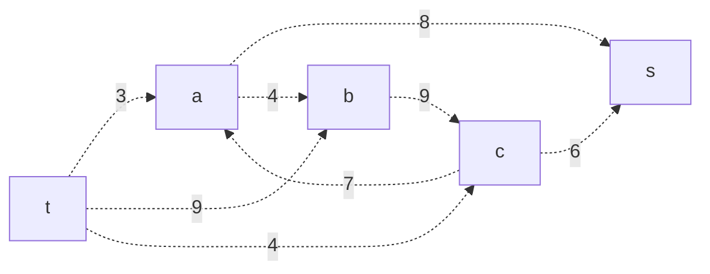

## Этап 2: Поиск увеличивающего пути

В остаточной сети найден увеличивающий путь t -> a -> s. Минимальный вес дуг на этом пути равен 3.

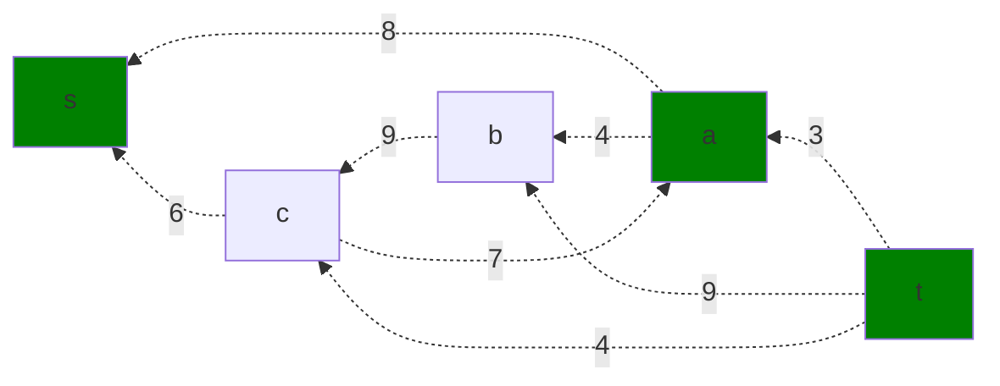

Уменьшим вес дуг на найденном пути, дуги для которых вес стал нулевым удалим из остаточной сети.

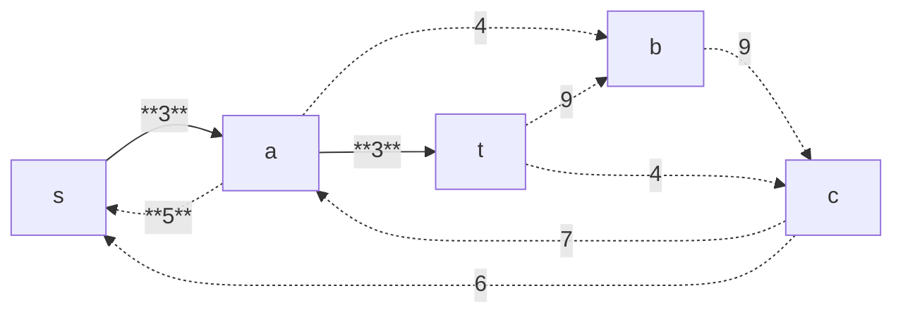

Скорректируем соответствующим образом локальные потоки в исходной сети. Первым числом будем указывать локальный поток, вторым пропускную способность дуги. 

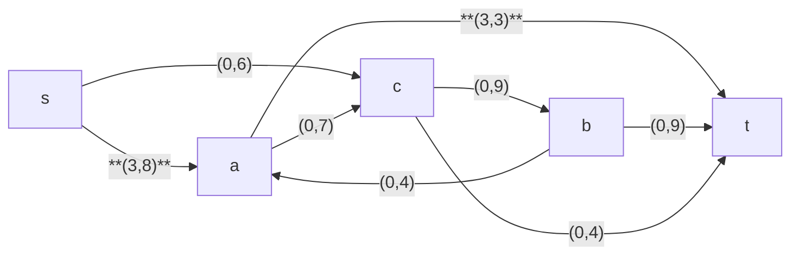

## 3. Продолжение поиска увеличивающего пути в остаточной сети

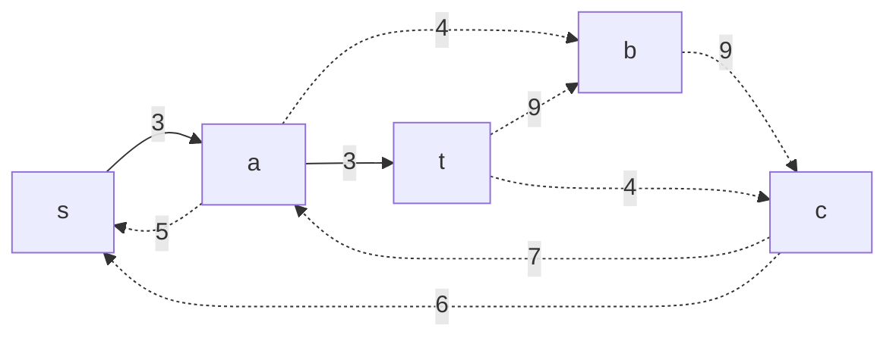

В остаточной сети найден увеличивающий путь t -> c -> s. Минимальный вес дуг на этом пути равен 4.

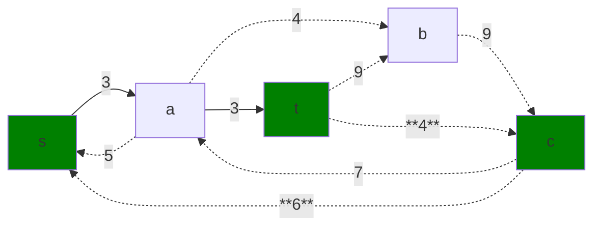

Уменьшим вес дуг на найденном пути, дуги для которых вес стал нулевым удалим из остаточной сети.

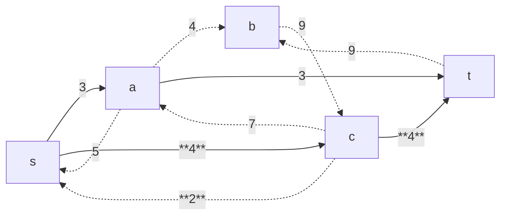

Скорректируем соответствующим образом локальные потоки в исходной сети.

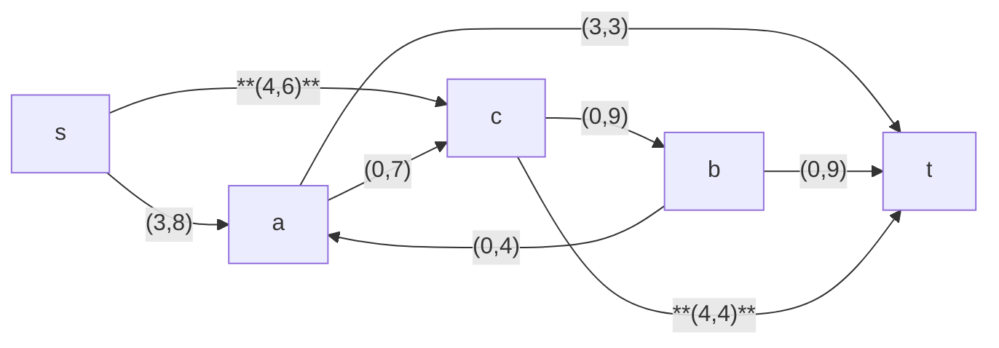

## 4. Продолжение поиска увеличивающего пути в остаточной сети

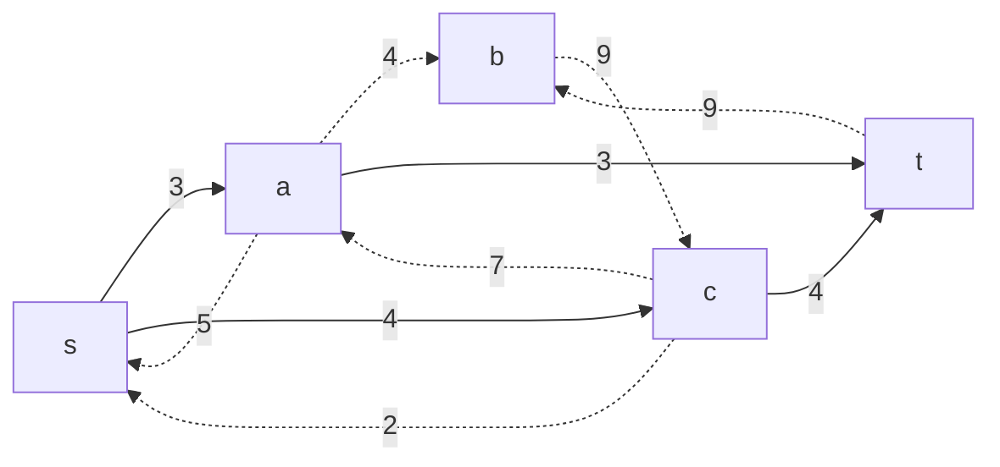

В остаточной сети найден увеличивающий путь t -> b -> c -> s. Минимальный вес дуг на этом пути равен 2.

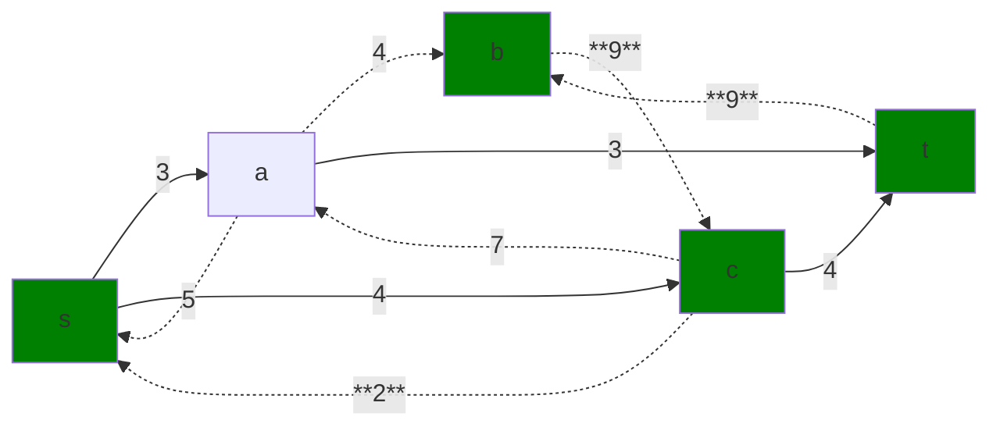

Уменьшим вес дуг на найденном пути, дуги для которых вес стал нулевым удалим из остаточной сети.

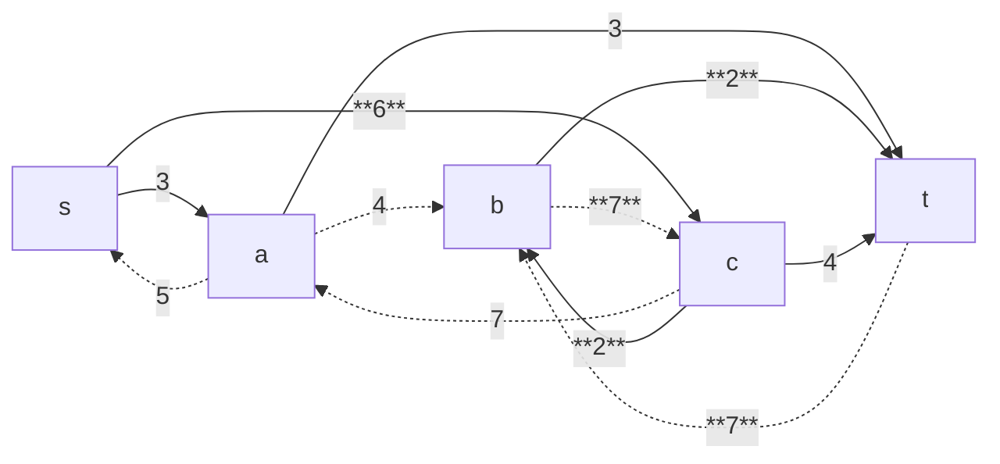

Скорректируем соответствующим образом локальные потоки в исходной сети.

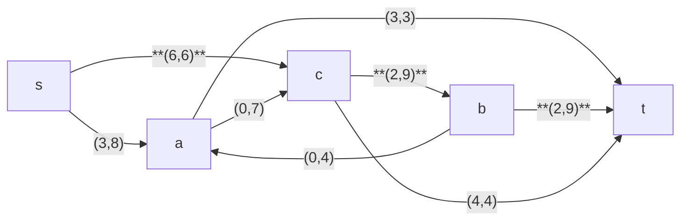

## 5. Продолжение поиска увеличивающего пути в остаточной сети

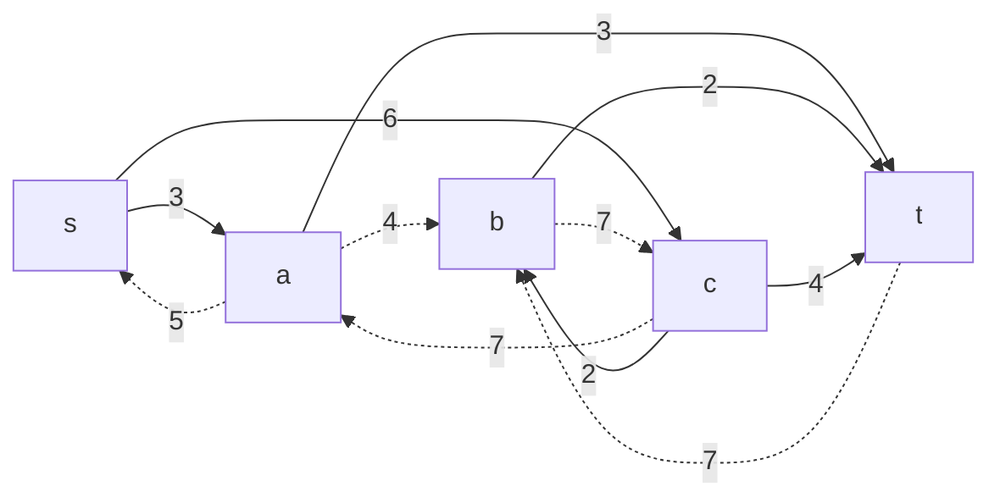

В остаточной сети найден увеличивающий путь t -> b -> c -> a -> s. Минимальный вес дуг на этом пути равен 5.

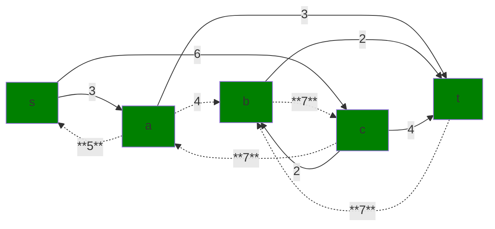

Уменьшим вес дуг на найденном пути, дуги для которых вес стал нулевым удалим из остаточной сети.

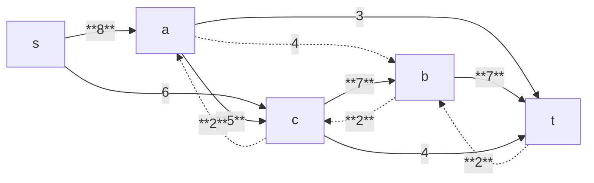

Скорректируем соответствующим образом локальные потоки в исходной сети.

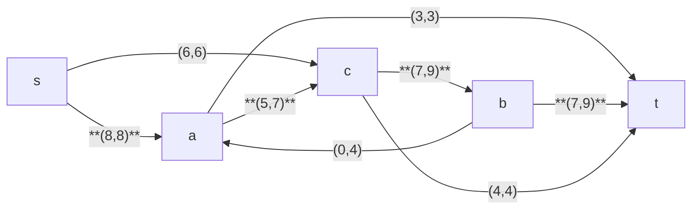

## Этап 6. Продолжение поиска увеличивающего пути в остаточной сети
В остаточной сети не найдено увеличивающих путей, следовательно, алгоритм завершил работу и найденный поток величиной **14** является максимальным для данной сети.

## Этап 7. Проверка значения максимального потока перебором всех разрезов сети.
Разрез сети - разбиение множества вершин на два подмножества V1 и V2, где во множество V1 входит источник, а в V2 входит сток.

Пропускная способность разреза - сумма пропускной способности дуг, начинающихся в вершинах из множества V1 и оканчивающихся в вершинах из V2.

Для сети из _n_ вершин существует 2n - 2 различных разрезов, так как две вершины из множества (источник и сток) "зафиксированы" в V1 и V2, остальные вершины можно различными способами распределять между множествами V1 и V2.

Для сети из 5 вершин нужно найти 25 - 2 = 23 = 8 разрезов. 

| № | V1                   | V2 | Пропускная способность разреза |
|---|:--------------------------------|:--------------|:------------------------------:|
| 1 | s                               | a, b, c, t    |           6 + 8 = **14**       |
|   | **s + одна вершина из a, b, c** |               |                                |
| 2 | s, a                            | b, c, t       |           6 + 7 + 3 = 16       |
| 3 | s, b                            | a, c, t       |           8 + 4 + 9 = 21       |
| 4 | s, c                            | a, b, t       |           8 + 9 + 4 = 21       |
|   | **s + пара вершин из a, b, c**  |               |                                |
| 5 | s, a, b                         | c, t          |           6 + 7 + 9 = 22       |
| 6 | s, a, c                         | b, t          |         9 + 8 + 3 + 4 = 24     |
| 7 | s, b, c                         | a, t          |           8 + 4 + 4 = 16       |
|   | **s + три вершины из a, b, c**  |               |                                |
| 8 | s, a, b, c                      | t             |           3 + 9 + 4 = 16       |

Минимальная пропускная способность разреза равна **14** ( {s} / { a, b, c, t} ), что совпадает с найденной величиной максимального потока в сети.

## Ответ:
Максимальный поток в сети равен **14**, он реализуется следующим локальными потоками:

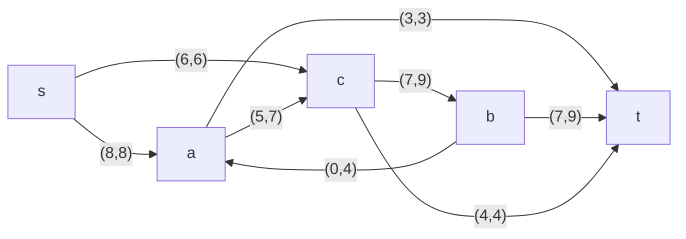