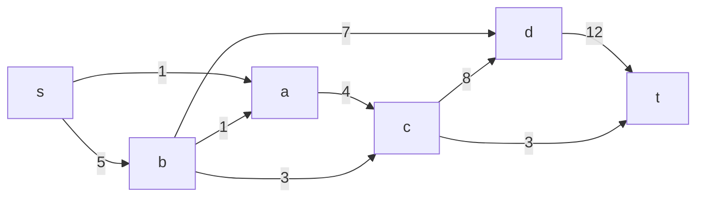
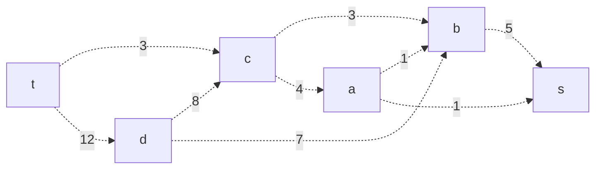
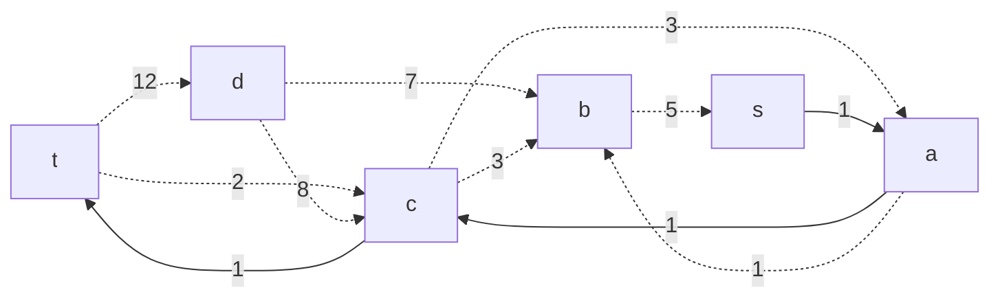
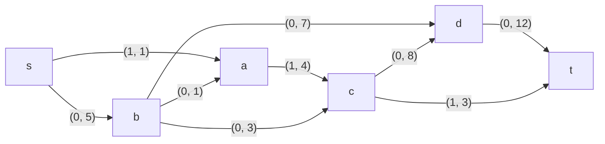
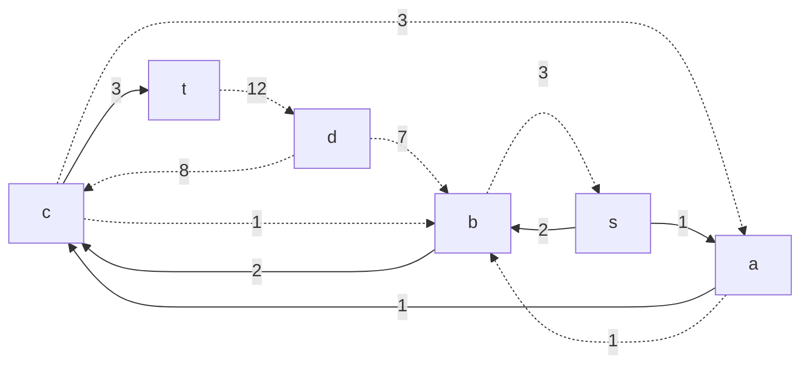
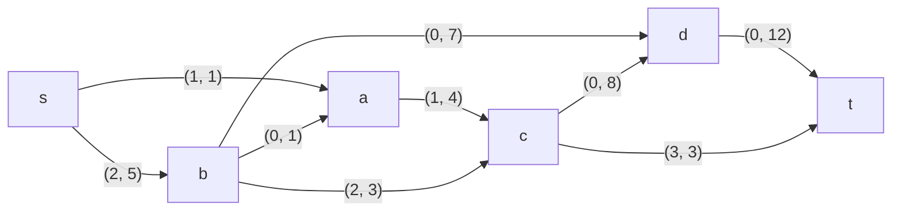
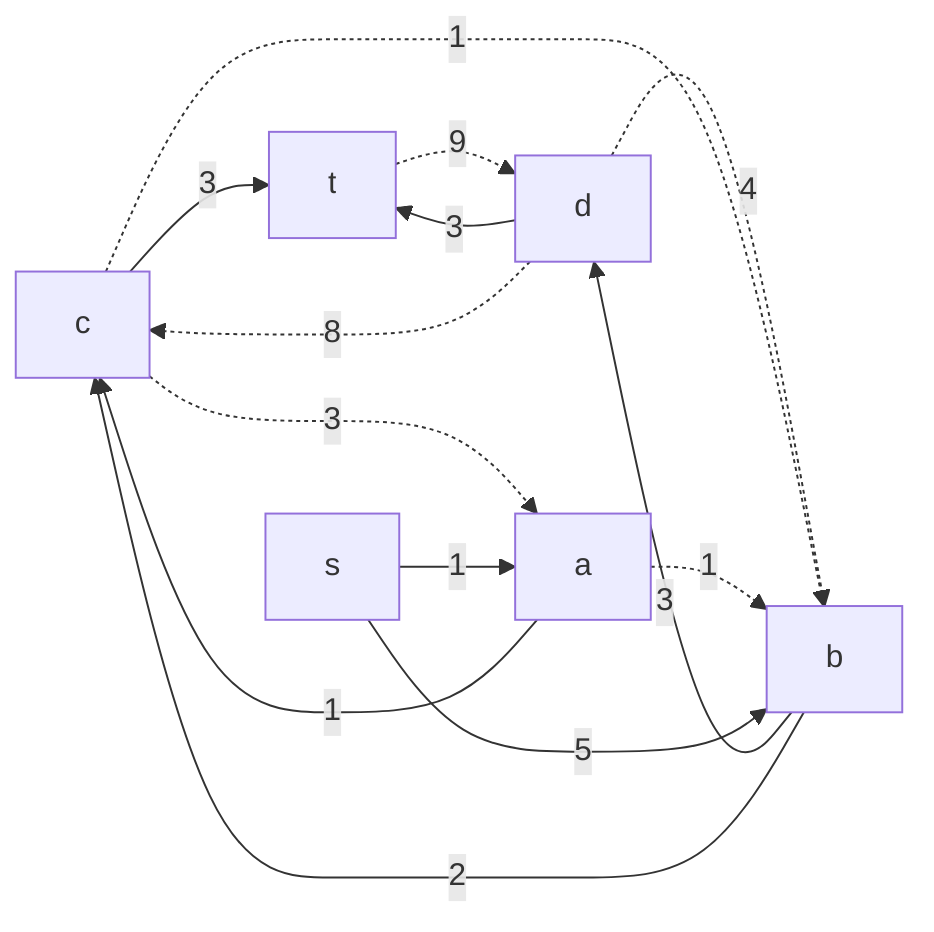
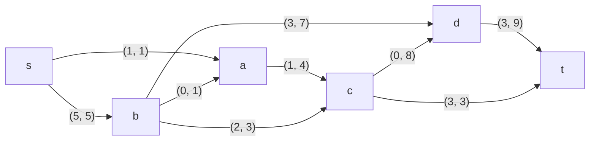

# Задание №9
# Задача о максимальном потоке. Вариант 3.
#### Пропускная способность дуг сети:
|          Дуги          | sa | sb | ac | ba | bc | bd | cd | dt | ct |
|:----------------------:|:--:|:--:|:--:|:--:|:--:|:--:|:--:|:--:|:--:|
| Пропускная способность | 1  | 5  | 4  | 1  | 3  | 7  | 8  | 12 |  3 |

## Строим сеть по таблице (источник s, сток t)

## Строим остаточную сеть

## Начинаем поиск увеличивающего пути
Нам необходимо найти ориетвированный путь из t в s.
$$t->c->a->s$$
Минимальный вес дуг на этом пути равен 1.

## Приводим исходную сеть к текущему варианту, добавляя локальные потоки

## Продолжаем поиск увеличивающего пути

Увеличивающйи путь $$t->c->b->s$$
Минимальный вес дуг на этом пути равен 2.
Дуги, для которых вес стал 0, удалим из остаточной сети.

## Приводим исходную сеть к текущему варианту, добавляя локальные потоки

## Продолжаем поиск увеличивающего пути

Увеличивающйи путь $$t->d->b->s$$
Минимальный вес дуг на этом пути равен 3.
Дуги, для которых вес стал 0, удалим из остаточной сети.

## Приводим исходную сеть к текущему варианту, добавляя локальные потоки

В остаточной сети не найдено увеличивающих путей, следовательно, алгоритм завершил работу и найденный поток величиной 6 является максимальным.

Проверим значение максимального потока перебором всех разрезов сети
Для сети из 6 вершин нужно найти \(2^(6-2) = 2^4 = 16\) разрезов

| №  | V1                        | V2       | Пропускная способность разреза |
|----|:-------------------------------------|:--------------------|:------------------------------:|
| 1  | s                                    | a, b, c, d, t       | 1 + 5 = 6                      |
| 2  | s, a                                 | b, c, d, t          | 5 + 4 = 9                      |
| 3  | s, b                                 | a, c, d, t          | 1 + 1 + 3 + 7 = 12             |
| 4  | s, c                                 | a, b, d, t          | 1 + 5 + 8 + 3 = 17             |
| 5  | s, d                                 | a, b, c, t          | 1 + 5 + 12 = 18                |
| 6  | s, a, b                              | c, d, t             | 4 + 3 + 7 = 14                 |
| 7  | s, a, c                              | b, d, t             | 5 + 8 + 3 = 16                 |
| 8  | s, a, d                              | b, c, t             | 5 + 4 + 12 = 21                |
| 9  | s, b, c                              | a, d, t             | 1 + 1 + 7 + 8 + 3 = 20         |
| 10 | s, b, d                              | a, c, t             | 1 + 1 + 3 + 12 = 17            |
| 11 | s, c, d                              | a, b, t             | 1 + 5 + 3 + 12 = 21            |
| 12 | s, a, b, c                           | d, t                | 7 + 8 + 3 = 18                 |
| 13 | s, a, b, d                           | c, t                | 4 + 3 + 12 = 19                |
| 14 | s, a, c, d                           | b, t                | 5 + 3 + 12 = 20                |
| 15 | s, b, c, d                           | a, t                | 1 + 1 + 3 + 12 = 17            |
| 16 | s, a, b, c, d                        | t                   | 3 + 12 = 15                    |

Максимальная пропускная способность разряда равна 6 (s / a, b, c, d, t), что совпадает с найденнной величиной максимального потока в сети
