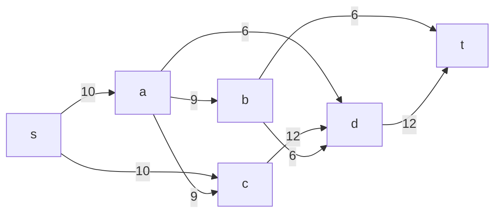
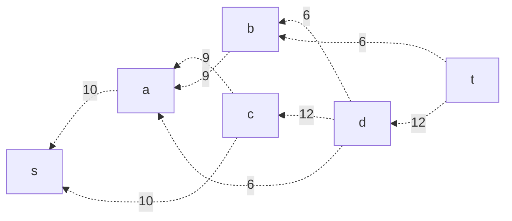
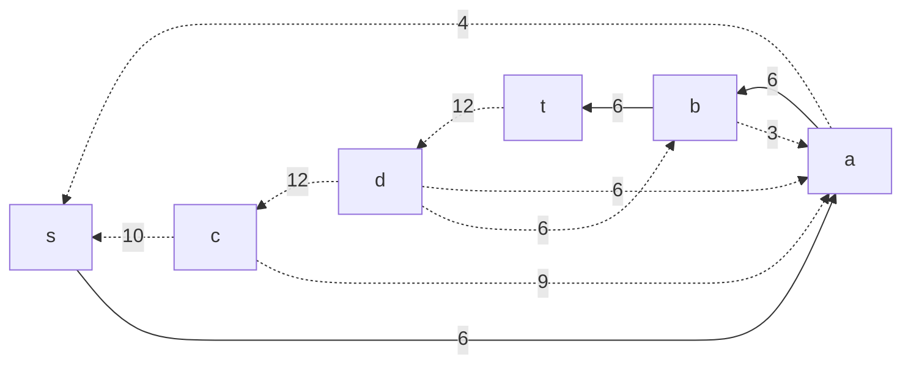
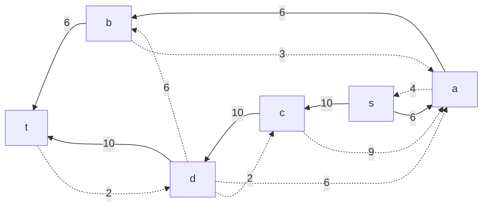
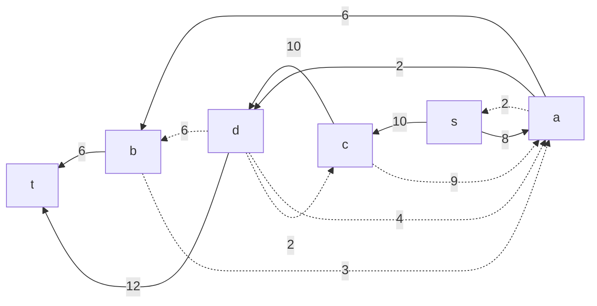
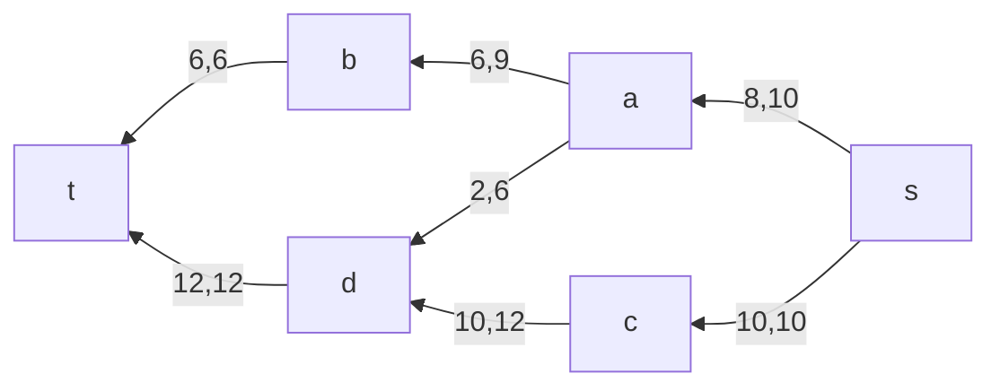

# Задание № 9
## Вариант 7
Состав команды: 
Долгих Юлия 
Осока Варвара
Шперкин Савва

### Постановка задачи
#### Пропускная способность дуг сети:
|          Дуги          | sa | sc | ac | ab | ad | cd | bd | bt | dt |
|:----------------------:|:--:|:--:|:--:|:--:|:--:|:--:|:--:|:--:|:--:|
| Пропускная способность | 10 | 10 | 9  | 9  | 6  | 12 | 6  | 6  | 12 |

Посчитать пропусную способность разрезов в сети. В сети 6 узлов, поэтому разрезов будет 
$$
2^{6-2} = 16 
$$

|1 множество |2 множество|Пропускная способность |
| -------- | -------- | -------- |
| s         | t,a,b,c,d | 10+10=20     |
| s,a       | t,b,c,d   | 10+9+6+9=34  |
| s,b       | t,a,c,d   | 10+10+6+6=32 |
| s,c       | t,a,b,d   | 10+12=22     |
| s,d       | t,a,b,c   | 10+10+12 = 32|
| s,a,b     | t,c,d     | 10+9+6+6+6=37|
| s,a,c     | t,b,d     | 9+6+12=27    |
| s,a,d     | t,b,c     | 10+9+9+12=40 |
| s,b,c     | t,a,d     | 10+6+6+12=34 |
| s,b,d     | t,a,c     | 10+10+6+12=38|
| s,c,d     | t,a,b     | 10+12=22     |
| s,a,b,c   | t,d       | 6+6+6+12=30  |
| s,a,b,d   | t,c       | 10+9+12+6=37 |
| s,a,c,d   | t,b       | 9+12=21      |
| s,b,c,d   | t,a       | 10+6+12=28   |
| s,a,b,c,d | t         | 6+12=18      |

Минимальная пропускная способность разреза 18 => максимальный поток в сети тоже будет 18.

## 1 Шаг 
Построить остаточную сеть, отвечающую текущему потоку в сети.

## 2 Шаг
В остаточной сети найти какой-нибудь увеличивающий путь (ориентированный путь) из t в s.
$$t->b->a->s$$
$$min=6$$
Такой путь есть, значит надо уменьшить веса всех дуг на минимальное значение и вернуться к шагу 1.

## 3 Шаг
Построить остаточную сеть

## 4 Шаг
В остаточной сети найти какой-нибудь увеличивающий путь (ориентированный путь) из t в s.
$$t->d->c->s$$
$$min=10$$
Такой путь есть, значит надо уменьшить веса всех дуг на минимальное значение и вернуться к шагу 1.
## 5 Шаг

## 6 Шаг
В остаточной сети найти какой-нибудь увеличивающий путь (ориентированный путь) из t в s.
$$t->d->a->s$$
$$min=2$$
Такой путь есть, значит надо уменьшить веса всех дуг на минимальное значение и вернуться к шагу 2.
## 7 Шаг

## 8 Шаг
В остаточной сети найти какой-нибудь увеличивающий путь (ориентированный путь) из t в s.
Если такого пути нет, то алгоритм завершает работу и текущий поток уже является максимальным.
#### Итоговый поток:

Итоговый поток = 18. Ура.
